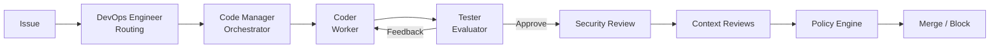

# .ai — Dark Factory Governance Platform

AI governance framework for autonomous software delivery. Provides personas, panels, policy enforcement, structured emissions, and audit manifests — distributed as a git submodule to any repository.

> **New here?** See the [Developer Quick Guide](DEVELOPER_GUIDE.md) for a TLDR onboarding.

## Goals

The Dark Factory Governance Platform exists to:

1. **Automate software delivery governance** — Replace manual code review gates with structured, auditable AI-driven review panels that produce deterministic merge decisions.
2. **Enforce policy without human bottlenecks** — Deterministic policy profiles (default, financial/PII, infrastructure-critical) evaluate every change programmatically. AI models never interpret policy rules.
3. **Maintain compliance at scale** — Embed SOC2, PCI-DSS, HIPAA, and GDPR compliance into the review pipeline so regulated changes are caught at intake, not after merge.
4. **Enable autonomous agentic operation** — A 4-agent prompt-chained pipeline (DevOps Engineer → Code Manager → Coder → Tester) orchestrates the full lifecycle (session management, issue triage, planning, implementation, evaluation, review, merge) with human oversight only where policy requires it.
5. **Distribute governance as infrastructure** — Ship as a git submodule so any repository gets personas, panels, policies, and CI workflows by adding a single dependency.
6. **Reach full Dark Factory** — Progress through defined maturity phases toward fully autonomous software delivery with runtime feedback loops and self-evolving governance.

See [GOALS.md](GOALS.md) for detailed phase tracking, completed work, and open enhancements.

## Governance Maturity Model

| Phase | Name | Description | Status |
|-------|------|-------------|--------|
| 3 | Agentic Orchestration | Personas, panels, workflows with human gates | Implemented |
| 4a | Policy-Bound Autonomy | Deterministic merge decisions, structured emissions | **Implemented** — CI enforcement live |
| 4b | Autonomous Remediation | Auto-fix, drift detection, remediation loops | **Implemented** — drift detection, auto-remediation, and incident-to-DI governance artifacts complete |
| 5 | Dark Factory | Full automation — decomposed into sub-phases 5a-5e with achievability assessment | 5a-5e governance artifacts complete; 5c and 5d runtime blocked by platform (session-based tooling, no multi-agent orchestrator) |

See [GOALS.md](GOALS.md) for detailed progress tracking, completed work, and open enhancements.

## Repository Structure

> **Note:** In consuming repositories, this content lives at `.ai/` as a git submodule. In this repository itself, the files are at the root.

```
.ai/  (or repo root when working on this repo directly)
  instructions.md              Base AI instructions (< 200 tokens, Tier 0)
  instructions/                Decomposed instruction modules (code-quality, security, testing, etc.)
  config.yaml                  Symlink and sync configuration
  bin/                         Executable scripts
    init.sh                    Bootstrap script for consuming repos (macOS/Linux)
    init.ps1                   Bootstrap script for consuming repos (Windows)
    issue-monitor.sh           Local issue monitor daemon (macOS/Linux)
    issue-monitor.ps1          Local issue monitor daemon (Windows)

  governance/                  All governance machinery (personas, policy, schemas, etc.)
    templates/                 Language-specific scaffolding
      go/                      Go conventions and project config
      python/                  Python conventions and project config
      node/                    Node.js/TypeScript conventions
      react/                   React conventions
      csharp/                  C#/.NET conventions
    personas/                  AI persona definitions (Markdown) — DEPRECATED, see prompts/reviews/
      architecture/            System design personas
      quality/                 Code review personas
      compliance/              Security, regulatory, accessibility personas
      documentation/           Content creation and review personas
      domain/                  Frontend, backend, data, ML, mobile personas
      engineering/             Testing, performance, debugging personas
      operations/              SRE, DevOps, infrastructure personas
      leadership/              Technical leadership, product, mentoring personas
      specialist/              Legacy, incidents, migrations personas
      governance/              Governance Auditor, Policy Evaluator
      agentic/                 DevOps Engineer, Code Manager, Coder, Tester
      panels/                  Multi-persona review panels — DEPRECATED, see prompts/reviews/
      index.md                 Persona and panel reference grid

    prompts/                   Reusable prompt templates
      reviews/                 19 consolidated review prompts (replaces personas/panels/)
      shared-perspectives.md   Canonical definitions for perspectives appearing in 2+ reviews
      startup.md               Agentic improvement loop entry point
      init.md                  Agentic bootstrap prompt (interactive install for consuming repos)
      retrospective.md         Post-merge process evaluation prompt
      governance-compliance-checklist.md  Required governance steps per PR (#176)
      cross-repo-escalation-workflow.md   Cross-repo escalation detect-dedup-escalate flow (#184)
      checkpoint-resumption-workflow.md    Session resumption from checkpoint files (Phase 5c)
      templates/               Reusable document templates
        plan-template.md       Standardized plan template for AI and humans
        runtime-di-template.md DI template for runtime-generated intents
      workflows/               Multi-phase orchestration (8 workflows)

    schemas/                   Enforcement artifacts (JSON Schema)
      panel-output.schema.json Structured emission standard for panel reviews
      panels.schema.json       Panel configuration validation
      panels.defaults.json     Default panel pass/fail thresholds
      run-manifest.schema.json Audit manifest for every merge decision
      baseline.schema.json     Baseline measurement definitions
      breaking-change.schema.json          Breaking change detection for backward compatibility
      remediation-action.schema.json       Auto-remediation action definitions (Phase 4b)
      remediation-verification.schema.json Remediation verification criteria (Phase 4b)
      runtime-di.schema.json               Runtime-generated Design Intent (Phase 4b)
      runtime-signal.schema.json           Runtime anomaly signal classification (Phase 5)
      autonomy-metrics.schema.json         Autonomy index and health thresholds (Phase 5)
      retrospective-aggregation.schema.json  Aggregated retrospective data (Phase 5b)
      project.schema.json                  Project configuration validation
      formal-spec.schema.json              Formal specification for Phase 5e Spec-Driven Interface
      conflict-detection.schema.json       Multi-agent conflict detection for Phase 5d
      governance-compliance.schema.json    Governance step compliance evidence (#176)
      persona-effectiveness.schema.json    Per-persona signal-to-noise ratio (Phase 5b)
      test-governance.schema.json          Test coverage expectations per policy profile (Phase 5a)
      cross-repo-escalation.schema.json    Cross-repo issue escalation records (#184)
      checkpoint.schema.json               Session checkpoint state for resumption (Phase 5c)
      orchestrator-config.schema.json      Mass parallelization orchestrator config (Phase 5e)
      integration-manifest.schema.json     Aggregated integration manifest (Phase 5e)
      session-state.schema.json            Cross-session governance state persistence (Phase 5c)

    policy/                    Deterministic policy profiles and supporting rules (YAML)
      default.yaml             Standard risk tolerance
      fin_pii_high.yaml        Financial/PII — SOC2, PCI-DSS, HIPAA, GDPR
      infrastructure_critical.yaml  Infrastructure-as-code, deployment configs
      reduced_touchpoint.yaml  Near-full autonomy — Phase 5e
      threshold-tuning.yaml    Auto-tuning rules for confidence threshold adjustment
      drift-policy.yaml        Drift detection thresholds and triggers
      drift-remediation.yaml   Drift remediation action rules
      autonomy-thresholds.yaml Autonomy metric health thresholds
      circuit-breaker.yaml     Safety circuit breaker rules
      deduplication.yaml       Signal deduplication rules
      rate-limits.yaml         Signal processing rate limits
      severity-reclassification.yaml  Runtime severity reclassification rules
      component-registry.yaml  Component ownership registry
      signal-panel-mapping.yaml  Signal-to-panel routing rules
      merge-sequencing.yaml    Multi-agent PR ordering rules — Phase 5d
      parallel-session-protocol.yaml  Parallel agent session coordination — Phase 5d
      collision-domains.yaml   Path-based collision domain definitions — Phase 5e
      integration-strategy.yaml  Staged integration strategy — Phase 5e
      signal-adapters/         Polling adapter configurations for runtime signals

    emissions/                 Panel emission outputs (structured JSON)
    manifests/                 Run manifests (audit trail, append-only)

  docs/                        Documentation (architecture, configuration, operations, research)
    README.md                    Navigation hub and documentation index
    architecture/                Architecture and design documents
      governance-model.md        Governance layers and decision authority
      runtime-feedback.md        Drift detection and incident-to-DI generation
      context-management.md      JIT loading and context reset protection
      cross-repo-escalation.md   Cross-repo escalation setup and architecture
      mass-parallelization.md    Mass parallelization model architecture (Phase 5e)
      session-state-persistence.md  Cross-session state storage strategy (Phase 5c)
      event-driven-triggers.md   Event-driven governance trigger setup (Phase 5c)
      formal-spec.md             Formal specification of governance invariants
    configuration/               Setup and integration guides
      repository-setup.md        Repository settings and CODEOWNERS setup
      ci-gating.md               CI checks, branch protection, auto-merge
      copilot-integration.md     Copilot auto-fix configuration guide
    decisions/                   Architectural decision records
      README.md                  ADR-001 through ADR-011
    governance/                  Governance processes
      artifact-classification.md Cognitive, Enforcement, Audit artifact types
      acceptance-verification.md Acceptance criteria verification
      naming-review.md           Persona/panel naming consistency review
    onboarding/                  Team onboarding guides
      developer-guide.md         Quick-start guide for developers
      architecture.html          Visual architecture overview (HTML)
      risks-mitigation.html      Risk assessment and mitigation (HTML)
      team-starter.html          Team onboarding starter kit (HTML)
    operations/                  Operational guides and metrics
      autonomy-metrics.md        Autonomy index and weekly reporting
      migration-summary.md       Migration steps and deliverable checklist
      threshold-tuning.md        Auto-tuning mechanism and safety bounds
      retrospective-aggregation.md  Aggregated retrospective data schema docs
    research/                    Research and evaluation
      README.md                  51-source research file (consolidation, MCP skills, multi-agent)
      technique-comparison.md    Technique comparison research deliverable
    tutorials/                   End-to-end guides
      end-to-end-walkthrough.md  Complete walkthrough of the governance pipeline

  governance/
    bin/
      policy-engine.py         Deterministic evaluation engine (Phase 4b)
      requirements.txt         Python dependencies for policy engine

  .plans/                      Implementation plans (archived to releases after merge)
  .checkpoints/                Context capacity checkpoints (session state)
  .github/
    workflows/
      dark-factory-governance.yml   Governance review CI (detect + policy engine + review)
      plan-archival.yml             Archives plans to releases on PR merge
      propagate-submodule.yml       Auto-propagation for consuming repos
      issue-monitor.yml                 Issue evaluation and agent dispatch (manual + event-driven)
      event-trigger.yml                 Event-driven governance session dispatch (Phase 5c)
      jm-compliance.yml             Enterprise-locked compliance checks
    ISSUE_TEMPLATE/
      feature-request.yml           Structured feature request form
      bug-report.yml                Structured bug report form
      config.yml                    Template chooser configuration
```

## How It Works

### Agentic Pipeline (4-Agent Prompt Chain)

The platform uses a 4-agent prompt-chained pipeline implementing Anthropic's orchestration patterns:

| Agent | Pattern | Role |
|-------|---------|------|
| **DevOps Engineer** | Routing | Session entry, pre-flight checks, issue triage, routing |
| **Code Manager** | Orchestrator-Workers | Intent validation, panel selection, review coordination, merge |
| **Coder** | Worker | Implementation, test coverage, structured output |
| **Tester** | Evaluator-Optimizer | Independent evaluation, test verification, structured feedback |



Inter-agent communication uses typed messages (`ASSIGN`, `STATUS`, `RESULT`, `FEEDBACK`, `ESCALATE`, `APPROVE`, `BLOCK`) per the [Agent Protocol](governance/prompts/agent-protocol.md).

### Governance Layers (Phase 4a)

```
Issue / Design Intent
        |
        v
Code Manager validates intent (Layer 1: Intent Governance)
        |
        v
Panel graph activated (Layer 2: Cognitive Governance)
  - Code Manager selects panels based on codebase type and change
  - Panels execute in parallel where possible
        |
        v
Panels emit structured JSON (Layer 3: Execution Governance)
  - Confidence scores, risk levels, policy flags
  - Validated against governance/schemas/panel-output.schema.json
        |
        v
Policy engine evaluates (deterministic, no prose)
  - Reads active policy profile (default, fin_pii_high, infrastructure_critical, reduced_touchpoint)
  - Produces decision: auto_merge | auto_remediate | human_review_required | block
        |
        v
Run manifest logged (governance/schemas/run-manifest.schema.json)
  - Complete audit trail for replay and compliance
```

### For Runtime Feedback (Phase 5 — Designed)

```
Runtime anomaly detected
        |
        v
Signal classified and deduplicated
        |
        v
Design Intent generated automatically
        |
        v
Feeds back into Layer 1 (closes the autonomous loop)
```

## Compliance and Security

Security, regulatory compliance, and code quality are embedded at every governance layer:

| Layer | Compliance Mechanism |
|-------|---------------------|
| Intent | Risk classification at intake; PII/financial flags trigger `fin_pii_high` profile |
| Cognitive | Security Auditor and Compliance Officer personas activated for regulated changes |
| Execution | Policy engine enforces compliance scores, blocks PII exposure, requires security panel |
| Runtime | Drift detection monitors compliance regression; incidents generate remediation DIs |
| Evolution | Backward compatibility checks; breaking changes require migration plans |

Policy profiles provide pre-configured compliance postures:
- **`fin_pii_high`** — SOC2, PCI-DSS, HIPAA, GDPR. Auto-merge disabled. 3-approver override.
- **`infrastructure_critical`** — Production stability. Mandatory architecture and SRE review.
- **`default`** — Standard internal applications. Balanced automation and oversight.
- **`reduced_touchpoint`** — Near-full autonomy. Human approval only for policy overrides, dismissed security-critical findings, or critical risk. Phase 5e.

## Context Management

The framework uses JIT (Just-In-Time) loading to minimize AI context window usage:

| Tier | Content | Budget | Survives Reset |
|------|---------|--------|----------------|
| 0 | Base instructions + project identity | ~400 tokens | Yes (pinned) |
| 1 | Language conventions + active personas | ~2,000 tokens | Session duration |
| 2 | Current workflow phase + panel context | ~3,000 tokens | Released per phase |
| 3 | Policies, schemas, docs | 0 tokens | Queried on-demand |

See `docs/architecture/context-management.md` for the full strategy including checkpoint-based reset protection and instruction decomposition.

## Repo Rename Recommendation

This repository is currently named `ai-submodule`. Given its evolution into a governance platform, a more descriptive name is recommended:

| Candidate | Rationale |
|-----------|-----------|
| **`dark-factory`** | Aligns with the governance model name and Phase 5 goal |
| **`ai-governance`** | Descriptive of current function |
| **`forge`** | Short, evocative of autonomous manufacturing |

The rename should be coordinated across all consuming repositories that reference the submodule URL.

## References & Industry Context

The Phase 5 roadmap and maturity model are informed by the following industry frameworks. See [GOALS.md](GOALS.md) for detailed sub-phase decomposition and achievability assessment.

| Source | Relevance |
|--------|-----------|
| [Dan Shapiro — 5 Levels of Agentic Coding](https://www.linkedin.com/pulse/5-levels-agentic-coding-dan-shapiro/) | Defines the L1-L5 progression that maps to Dark Factory's phase model |
| [Mars Shot — MSV-CMM](https://www.mars-shot.dev/) | Capability maturity model for machine-speed verification; informs self-proving systems (5a) |
| [Bessemer — Roadmap to AI Coding Agents](https://www.bvp.com/atlas/roadmap-to-ai-coding-agents) | Autonomy scale identifying the gap between assisted coding and full agency |
| [Addy Osmani — The 70% Problem](https://addyo.substack.com/p/the-70-problem-hard-truths-about) | Analysis of where AI coding agents stall; informs achievability assessments |

## Documentation Index

Quick navigation to all documentation in this repository.

### Core Documents

| Document | Purpose |
|----------|---------|
| [README.md](README.md) | This file — architecture, setup, and full reference |
| [GOALS.md](GOALS.md) | Phase tracking, completed work, and open enhancements |
| [DEVELOPER_GUIDE.md](DEVELOPER_GUIDE.md) | Quick-start onboarding for developers |
| [CLAUDE.md](CLAUDE.md) | AI tool instructions (Claude Code, Copilot, Cursor) |

### Architecture & Design

| Document | Topic |
|----------|-------|
| [Governance Model](docs/architecture/governance-model.md) | Five governance layers and decision authority |
| [Artifact Classification](docs/governance/artifact-classification.md) | Cognitive, Enforcement, and Audit artifact types |
| [Context Management](docs/architecture/context-management.md) | JIT loading tiers and checkpoint-based reset protection |
| [Runtime Feedback](docs/architecture/runtime-feedback.md) | Drift detection and incident-to-DI generation (Phase 4b/5) |
| [CI Gating Blueprint](docs/configuration/ci-gating.md) | CI checks, branch protection, and auto-merge |
| [Repository Configuration](docs/configuration/repository-setup.md) | Settings, CODEOWNERS, and branch protection setup |

### Operational Guides

| Document | Topic |
|----------|-------|
| [Autonomy Metrics](docs/operations/autonomy-metrics.md) | Autonomy index, health thresholds, and weekly reporting |
| [Retrospective Aggregation](docs/operations/retrospective-aggregation.md) | Aggregated retrospective data schema docs |
| [Threshold Tuning](docs/operations/threshold-tuning.md) | Auto-tuning mechanism and safety bounds |
| [Copilot Auto-Fix](docs/configuration/copilot-integration.md) | Configuring GitHub Copilot auto-fix in governance workflow |
| [Cross-Repo Escalation](docs/architecture/cross-repo-escalation.md) | Cross-repo issue escalation setup and architecture |
| [Event-Driven Triggers](docs/architecture/event-driven-triggers.md) | Event-driven governance session dispatch (Phase 5c) |
| [Mass Parallelization](docs/architecture/mass-parallelization.md) | Multi-agent orchestration with collision domains (Phase 5e) |
| [Session State Persistence](docs/architecture/session-state-persistence.md) | Cross-session governance state storage strategy (Phase 5c) |
| [Naming Review](docs/governance/naming-review.md) | Persona/panel naming consistency |

### Agentic Prompts

| Prompt | Purpose |
|--------|---------|
| [Startup Loop](governance/prompts/startup.md) | 5-phase agentic pipeline entry point |
| [Agent Protocol](governance/prompts/agent-protocol.md) | Inter-agent communication contract (typed messages) |
| [Interactive Bootstrap](governance/prompts/init.md) | Guided setup for consuming repos |
| [Retrospective](governance/prompts/retrospective.md) | Post-merge process evaluation |
| [Compliance Checklist](governance/prompts/governance-compliance-checklist.md) | Required governance steps per PR |
| [Cross-Repo Escalation](governance/prompts/cross-repo-escalation-workflow.md) | Escalation detect-dedup-escalate flow |
| [Checkpoint Resumption](governance/prompts/checkpoint-resumption-workflow.md) | Session resumption from checkpoints (Phase 5c) |
| [Plan Template](governance/prompts/templates/plan-template.md) | Standardized plan template for AI and humans |

### Personas & Panels

> **Note:** As of Issue #220, personas and panels have been consolidated into self-contained
> review prompts in `governance/prompts/reviews/`. The individual persona and panel files in
> `governance/personas/` are deprecated. See `docs/research/README.md` for the research
> supporting this decision.

| Resource | Description |
|----------|-------------|
| [Consolidated Review Prompts](governance/prompts/reviews/) | 19 self-contained review prompts (preferred) |
| [Shared Perspectives](governance/prompts/shared-perspectives.md) | Canonical definitions for cross-cutting perspectives |
| [Persona/Panel Index](governance/personas/index.md) | Legacy reference grid — 62 personas and 19 panels _(deprecated)_ |
| [DevOps Engineer](governance/personas/agentic/devops-engineer.md) | Routing agent — session lifecycle, pre-flight, issue triage |
| [Code Manager](governance/personas/agentic/code-manager.md) | Orchestrator agent — intent validation, panel selection, review coordination, merge |
| [Coder](governance/personas/agentic/coder.md) | Worker agent — implementation, tests, structured output |
| [Tester](governance/personas/agentic/tester.md) | Evaluator agent — independent evaluation, test coverage gate, feedback |

## Why a Git Submodule?

| Approach | Drawback |
|----------|----------|
| Copy-paste | Drifts immediately. No propagation across repos. |
| Package manager | Runtime dependency for static text. Overkill. |
| Monorepo | Forces all projects into one repo. |
| Template repo | One-time only. Updates don't flow. |
| Git subtree | Merges history into host repo. Hard to update cleanly. |

Submodules provide version-pinned, single-source-of-truth distribution with no toolchain requirement.

## Usage

### Adding to a Project

```bash
git submodule add git@github.com:SET-Apps/ai-submodule.git .ai
git commit -m "Add .ai submodule"
```

### Bootstrap (after adding submodule)

**macOS / Linux:**
```bash
bash .ai/bin/init.sh
```

**Windows (PowerShell):**
```powershell
powershell -ExecutionPolicy Bypass -File .ai\bin\init.ps1
```

The bootstrap script creates symlinks so Claude Code, GitHub Copilot, and Cursor all receive shared instructions. On Windows, if symlinks are unavailable (requires Developer Mode or admin), it falls back to file copies.

**Windows prerequisites:**
- **Python 3.12+** — required for the governance policy engine. Install from [python.org](https://www.python.org/downloads/) and ensure it's in your PATH.
- After installing Python: `pip install jsonschema pyyaml`

### Cloning with Submodule

```bash
git clone --recurse-submodules <PROJECT_URL>
```

### Updating

```bash
git submodule update --remote .ai
git add .ai
git commit -m "Update .ai submodule"
```

### Pinning a Version

```bash
cd .ai
git checkout v2.0.0
cd ..
git add .ai
git commit -m "Pin .ai submodule to v2.0.0"
```

### Project-Specific Configuration

> **Agentic mode:** The Code Manager auto-detects your repository's languages, frameworks, and infrastructure, and creates or updates `project.yaml` automatically. Manual setup is only needed if you want to customize before the first agentic session.

1. Copy a language template: `cp .ai/governance/templates/python/project.yaml project.yaml`
2. Customize personas, panels, and conventions
3. Set the governance policy profile:
   ```yaml
   governance:
     policy_profile: default
   ```

### Removing

```bash
git submodule deinit -f .ai
git rm -f .ai
rm -rf .git/modules/.ai
git commit -m "Remove .ai submodule"
```
