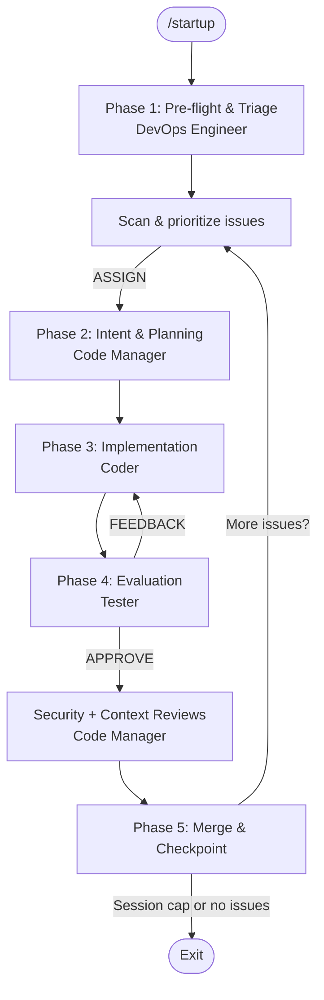

# Documentation

Navigation hub for all Dark Factory Governance Platform documentation.

## Quick Start

New to the platform? Start here:

1. [Developer Guide](onboarding/developer-guide.md) — Quick-start onboarding
2. [Governance Model](architecture/governance-model.md) — Understand the five governance layers
3. [Repository Setup](configuration/repository-setup.md) — Configure your project

## Architecture

Deep-dive into platform design and internals.

| Document | Topic |
|----------|-------|
| [Governance Model](architecture/governance-model.md) | Five governance layers, decision authority, and policy profiles |
| [Runtime Feedback](architecture/runtime-feedback.md) | Drift detection and incident-to-DI generation (Phase 4b/5) |
| [Context Management](architecture/context-management.md) | JIT loading tiers, context budgets, and checkpoint-based reset protection |
| [Cross-Repo Escalation](architecture/cross-repo-escalation.md) | Cross-repository issue escalation architecture |
| [Mass Parallelization](architecture/mass-parallelization.md) | Multi-agent orchestration with collision domains (Phase 5e) |
| [Session State Persistence](architecture/session-state-persistence.md) | Cross-session governance state storage strategy (Phase 5c) |
| [Event-Driven Triggers](architecture/event-driven-triggers.md) | Event-driven governance session dispatch (Phase 5c) |
| [Formal Specification](architecture/formal-spec.md) | Formal specification of governance invariants |

### Agentic Architecture

The agentic loop uses a 4-agent prompt-chained pipeline. Start it with `/startup` in your AI tool.

| Persona | Pattern | Role |
|---------|---------|------|
| [DevOps Engineer](../governance/personas/agentic/devops-engineer.md) | Routing | Session entry, pre-flight, triage, issue routing |
| [Code Manager](../governance/personas/agentic/code-manager.md) | Orchestrator-Workers | Intent validation, panel selection, review coordination, merge |
| [Coder](../governance/personas/agentic/coder.md) | Worker | Implementation, tests, documentation |
| [Tester](../governance/personas/agentic/tester.md) | Evaluator-Optimizer | Independent evaluation, test coverage gate, structured feedback |

Inter-agent communication: [Agent Protocol](../governance/prompts/agent-protocol.md) | Startup: [startup.md](../governance/prompts/startup.md) | Developer Guide: [DEVELOPER_GUIDE.md](../DEVELOPER_GUIDE.md)

## Configuration

Setup guides for repository and tool integration.

| Document | Topic |
|----------|-------|
| [Repository Setup](configuration/repository-setup.md) | Settings, CODEOWNERS, branch protection, and per-project overrides |
| [CI Gating](configuration/ci-gating.md) | CI checks, branch protection, and auto-merge configuration |
| [Copilot Integration](configuration/copilot-integration.md) | Configuring GitHub Copilot auto-fix in the governance workflow |

## Governance

Artifact classification and review processes.

| Document | Topic |
|----------|-------|
| [Artifact Classification](governance/artifact-classification.md) | Cognitive, Enforcement, and Audit artifact types and their handling |
| [Acceptance Verification](governance/acceptance-verification.md) | Acceptance criteria verification process |
| [Naming Review](governance/naming-review.md) | Persona and panel naming consistency proposals |

## Operations

Metrics, tuning, and operational guides.

| Document | Topic |
|----------|-------|
| [Autonomy Metrics](operations/autonomy-metrics.md) | Autonomy index, health thresholds, and weekly reporting |
| [Migration Summary](operations/migration-summary.md) | Migration steps and deliverable checklist |
| [Threshold Tuning](operations/threshold-tuning.md) | Auto-tuning mechanism and safety bounds |
| [Retrospective Aggregation](operations/retrospective-aggregation.md) | Aggregated retrospective data schema documentation |

## Research

Research and architectural decision records.

| Document | Topic |
|----------|-------|
| [Research](research/README.md) | 51-source research informing persona consolidation (ADR-010) |
| [Technique Comparison](research/technique-comparison.md) | Consolidation technique evaluation |

## Decisions

| Document | Topic |
|----------|-------|
| [Architectural Decisions](decisions/README.md) | ADR log — all recorded architectural decisions |

## Onboarding

| Document | Topic |
|----------|-------|
| [Developer Guide](onboarding/developer-guide.md) | Quick-start guide for developers adopting the platform |
| [Architecture Overview](onboarding/architecture.html) | Visual architecture overview (HTML) |
| [Risks & Mitigation](onboarding/risks-mitigation.html) | Risk assessment and mitigation strategies (HTML) |
| [Team Starter](onboarding/team-starter.html) | Team onboarding starter kit (HTML) |

## Tutorials

| Document | Topic |
|----------|-------|
| [End-to-End Walkthrough](tutorials/end-to-end-walkthrough.md) | Complete walkthrough of the governance pipeline |
