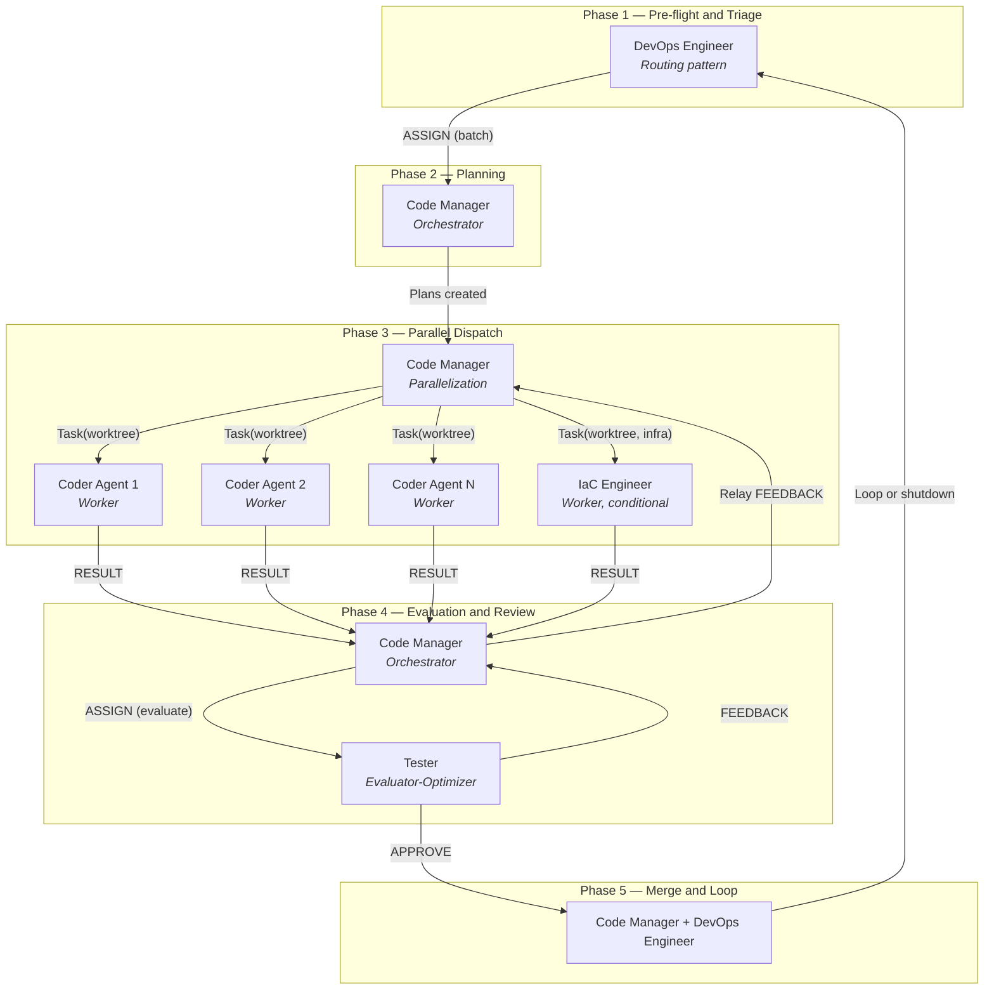
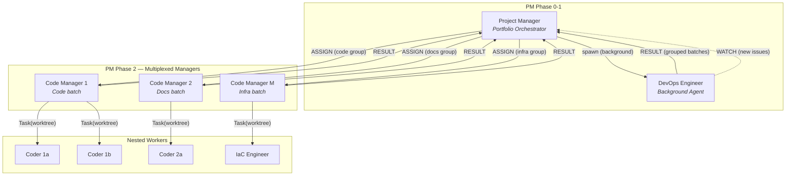
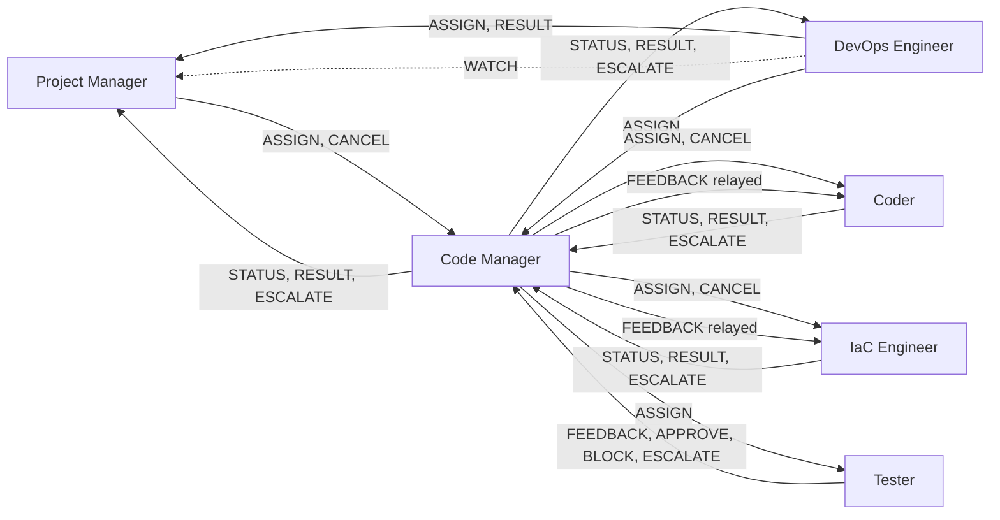
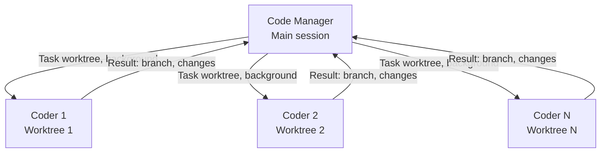
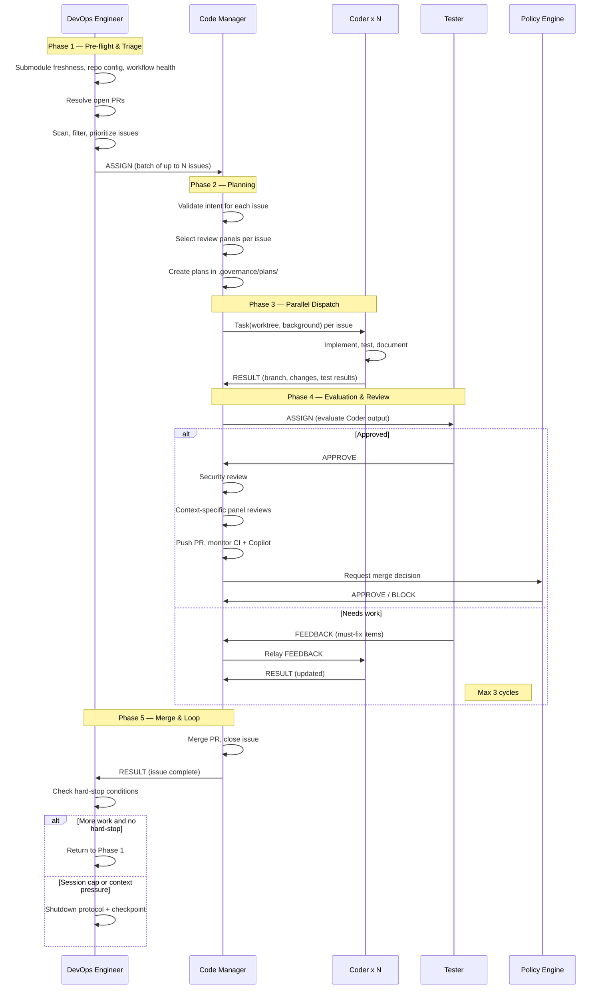

# Agent Architecture

## Overview

The Dark Factory Governance Platform uses a 7-agent prompt-chained architecture for autonomous software delivery. Each agent has a distinct role, bounded authority, and communicates via a structured protocol. The architecture implements three Anthropic agent patterns: Routing, Orchestrator-Workers with Parallelization, and Evaluator-Optimizer.

No agent can self-approve its own work. Every work item flows through at least three agents before merge.

The seven agents operate in two modes:
- **Standard mode** (default) — DevOps Engineer is the session entry point, dispatching to Code Manager, which orchestrates Coder, IaC Engineer (conditional), and Tester
- **Project Manager mode** (opt-in via `governance.use_project_manager: true`) — Project Manager replaces DevOps Engineer as entry point, multiplexing multiple Code Managers for higher throughput

---

## System Diagram

### Standard Mode (Default)



### Project Manager Mode (Opt-In)



---

## The Seven Agents

### 1. Project Manager (Opt-In)

**Pattern:** Anthropic's Orchestrator-Workers at portfolio level
**Source:** [`governance/personas/agentic/project-manager.md`](../../governance/personas/agentic/project-manager.md)
**Activation:** `governance.use_project_manager: true` in `project.yaml`

The Project Manager is an opt-in portfolio-level orchestrator that replaces the DevOps Engineer as the session entry point. It multiplexes multiple Code Managers for higher throughput.

**Responsibilities:**

- Session initialization and checkpoint recovery (PM-specific state)
- Spawn DevOps Engineer as a background agent for pre-flight and triage
- Receive grouped issue batches from DevOps Engineer
- Spawn M Code Managers (one per group, M = `governance.parallel_code_managers`, default 3)
- Coordinate cross-batch dependencies
- Process WATCH messages from DevOps Engineer for new issues discovered mid-session
- Manage lifecycle: CANCEL propagation, context capacity monitoring, checkpoint writing

**Authority boundaries:**

| Domain | Authority |
|--------|-----------|
| Session lifecycle | Full (supersedes DevOps Engineer in PM mode) |
| Code Manager spawning and assignment | Full |
| Cross-batch coordination | Full |
| CANCEL propagation | Full |
| Implementation, code review, merge | None (delegated to Code Managers) |

**Context thresholds:**

| Level | Tool Calls | Chat Turns | Active CMs | Token Usage |
|-------|-----------|------------|------------|-------------|
| Green | < 40 | < 60 | < M-1 | < 60% |
| Yellow | 40-55 | 60-100 | M-1 | 60-70% |
| Orange | 55-80 | 100-150 | M | 70-80% |
| Red | > 80 | > 150 | M | >= 80% |

**Key constraint:** The Project Manager never writes code, reviews PRs, or merges. It only spawns and coordinates Code Managers.

---

### 2. DevOps Engineer

**Pattern:** Anthropic's Routing pattern
**Source:** [`governance/personas/agentic/devops-engineer.md`](../../governance/personas/agentic/devops-engineer.md)

The DevOps Engineer is the session entry point. It owns session lifecycle and determines *what* work needs to be done, but never *how*.

**Responsibilities:**

- Session lifecycle management (context capacity enforcement, shutdown protocol, checkpoints)
- Pre-flight checks (submodule freshness, repository configuration, workflow health)
- Open PR resolution (existing PRs before new issues)
- Issue triage, filtering, and prioritization (P0-P4, bugs over enhancements)
- GOALS.md fallback when no issues remain
- Cross-repository escalation
- Checkpoint restore and issue state validation

**Authority boundaries:**

| Domain | Authority |
|--------|-----------|
| Session lifecycle | Full |
| Issue routing and prioritization | Full |
| Pre-flight checks | Full |
| Cross-repo escalation | Full |
| Implementation, code review, merge | None |

**Key constraint:** The DevOps Engineer never communicates directly with the Coder or Tester. All routing goes through the Code Manager.

---

In Project Manager mode, the DevOps Engineer runs as a background agent, continuously polling for new issues and emitting WATCH messages to the Project Manager when new actionable work is discovered.

---

### 3. Code Manager

**Pattern:** Anthropic's Orchestrator-Workers with Parallelization
**Source:** [`governance/personas/agentic/code-manager.md`](../../governance/personas/agentic/code-manager.md)

The Code Manager is the primary orchestrator. It manages the lifecycle of work from intent validation through merge, delegating execution to the Coder and evaluation to the Tester. It does not write code directly.

**Responsibilities:**

- Receive routed issues from DevOps Engineer
- Validate intent (completeness, clarity, acceptance criteria)
- Select context-appropriate review panels based on codebase analysis
- Create implementation plans for all issues before dispatch
- Spawn parallel Coder agents via the `Task` tool with `isolation: "worktree"`
- Collect results from Coder agents as they arrive
- Route Coder output to Tester for evaluation
- Relay Tester feedback back to the Coder
- Invoke security review after Tester approval
- Execute context-specific panel reviews
- Monitor CI checks, Copilot recommendations, and review threads
- Execute merge when policy engine approves
- Maintain `project.yaml` and run manifests

**Authority boundaries:**

| Domain | Authority |
|--------|-----------|
| Intent validation | Full |
| Coder and Tester assignment | Full |
| Parallel dispatch strategy | Full |
| Panel selection | Full |
| Recommendation disposition | Full |
| Merge execution | Full (after policy engine approval + Tester APPROVE + security review) |
| Override policy engine | None (escalates to human) |
| Session lifecycle | None (owned by DevOps Engineer) |

**Key constraint:** The Code Manager cannot merge without (1) Tester APPROVE, (2) a passing security review, and (3) policy engine approval. Maximum 3 review cycles per PR before human escalation.

---

### 4. Coder

**Pattern:** Worker in Anthropic's Orchestrator-Workers pattern
**Source:** [`governance/personas/agentic/coder.md`](../../governance/personas/agentic/coder.md)

The Coder is the execution agent. It implements changes as directed by the Code Manager, following established plans and conventions. Each Coder instance runs in its own git worktree with its own context window.

**Responsibilities:**

- Receive ASSIGN messages from Code Manager with plan, constraints, and acceptance criteria
- Create feature branches following naming conventions
- Implement changes according to the approved plan
- Write tests meeting coverage targets (80% minimum)
- Run the Test Coverage Gate before signaling completion
- Update documentation with every change
- Respond to Tester feedback (must-fix items)
- Implement Copilot and panel recommendations as directed
- Maintain atomic commits with conventional commit style
- Emit structured RESULT messages on completion

**Authority boundaries:**

| Domain | Authority |
|--------|-----------|
| Implementation approach (within plan) | Full |
| Technical decisions (with rationale) | Full |
| Branch creation | Full |
| Test strategy | Full |
| Self-approval | None |
| Push authorization | Conditional (requires Tester APPROVE) |
| Architectural changes | None (escalates to Code Manager) |
| Merge | None |

**Key constraint:** The Coder cannot self-approve and cannot push without Tester approval. It communicates only with the Code Manager, never directly with the DevOps Engineer or Tester.

---

### 5. IaC Engineer (Conditional)

**Pattern:** Worker in Anthropic's Orchestrator-Workers pattern
**Source:** [`governance/personas/agentic/iac-engineer.md`](../../governance/personas/agentic/iac-engineer.md)

The IaC Engineer is a conditional execution agent dispatched only for infrastructure changes. It follows JM Paved Roads standards for Azure resource provisioning.

**Dispatch trigger:** Issues involving `.bicep`, `.tf`, `infra/**`, `bicep/**`, `terraform/**`, `*.bicepparam`, `*.tfvars`.

**Responsibilities:**

- Implement infrastructure changes using Bicep or Terraform
- Follow JM Paved Roads naming conventions and module registry
- Apply security-first defaults and mandatory tagging (Application, Environment, ManagedBy)
- Configure per-environment parameter files
- Emit structured RESULT messages

**Authority boundaries:**

| Domain | Authority |
|--------|-----------|
| Infrastructure implementation | Full (within allowed paths) |
| Naming convention compliance | Full |
| Module registry selection | Full |
| Application code changes | None |
| Policy/schema/persona modification | None |

**Containment limits:** Max 20 files/PR, 800 lines/commit, 10 new files/PR, 15 commits/PR.

**Allowed paths:** `infra/**`, `bicep/**`, `terraform/**`, `*.bicep`, `*.bicepparam`, `*.tf`, `*.tfvars`, `parameters.json`, `.governance/plans/**`, `docs/**`.

---

### 6. Tester

**Pattern:** Anthropic's Evaluator-Optimizer pattern
**Source:** [`governance/personas/agentic/tester.md`](../../governance/personas/agentic/tester.md)

The Tester is the independent evaluator. It reviews the Coder's implementation, runs the Test Coverage Gate, verifies documentation, and provides structured feedback. The Tester never writes implementation code.

**Responsibilities:**

- Evaluate implementation against acceptance criteria and approved plan
- Execute the Test Coverage Gate independently
- Verify documentation completeness across all mandatory categories
- Provide structured feedback with file paths, line numbers, and priority classification
- Emit APPROVE when all must-fix items are resolved
- Emit BLOCK after 3 evaluation cycles without resolution
- Escalate to Code Manager when deadlocked

**Authority boundaries:**

| Domain | Authority |
|--------|-----------|
| Test execution and quality evaluation | Full |
| Push approval (gate) | Full |
| Documentation completeness | Full |
| Feedback priority classification | Full |
| Code changes | None |
| Merge decisions | None |
| Plan approval | None |

**Feedback priority levels:**

| Priority | Meaning |
|----------|---------|
| `must-fix` | Blocks approval; must be resolved before push |
| `should-fix` | Strongly recommended; requires documented rationale to skip |
| `nice-to-have` | Optional improvement; may be deferred |

**Key constraint:** Maximum 3 evaluation cycles. After 3 cycles with unresolved must-fix items, the Tester escalates to the Code Manager rather than continuing to reject.

---

### 7. Document Writer

**Pattern:** Worker in Anthropic's Orchestrator-Workers pattern
**Source:** [`governance/personas/agentic/document-writer.md`](../../governance/personas/agentic/document-writer.md)

The Document Writer is the documentation maintenance agent. It runs during Phase 4 (Collect & Review) to analyze code changes and update all affected documentation, ensuring documentation never drifts from implementation.

**Responsibilities:**

- Receive ASSIGN messages from Code Manager with branch diffs and staleness scope
- Analyze changed files and identify affected documentation
- Run `bin/check-doc-staleness.py` to detect stale numeric claims, path references, and descriptions
- Update stale references in all affected documentation files
- Verify counts match actual file counts (personas, prompts, policies)
- Verify path references point to existing files
- Emit structured RESULT messages on completion

**Authority boundaries:**

| Domain | Authority |
|--------|-----------|
| Documentation content | Full (within factual accuracy) |
| Staleness detection | Full |
| Path and count corrections | Full |
| Documentation structure | Limited (reorganize, not restructure) |
| Source code changes | None |
| Test changes | None |
| Push authorization | None (Code Manager controls push) |

**Containment limits:** Max 20 files/PR, 500 lines/commit, 10 new files/PR.

**Allowed paths:** `*.md`, `docs/**`, `CLAUDE.md`, `README.md`, `GOALS.md`, `CONTRIBUTING.md`, `.governance/plans/**`.

**Key constraint:** The Document Writer never modifies source code, tests, or governance infrastructure. All documentation updates must be grounded in actual repository state — no assertions without verification.

---

## Agent Protocol

Full specification: [`governance/prompts/agent-protocol.md`](../../governance/prompts/agent-protocol.md)

### Message Types

All inter-agent communication uses structured JSON messages with these types:

| Type | Purpose | Valid Senders |
|------|---------|---------------|
| `ASSIGN` | Delegate a work unit | Project Manager -> Code Manager, DevOps Engineer -> Code Manager, Code Manager -> Coder/IaC Engineer, Code Manager -> Tester |
| `STATUS` | Progress update | Coder -> Code Manager, Code Manager -> DevOps Engineer/Project Manager |
| `RESULT` | Report completion | Coder/IaC Engineer -> Code Manager, Code Manager -> DevOps Engineer/Project Manager, DevOps Engineer -> Project Manager |
| `FEEDBACK` | Structured evaluation feedback | Tester -> Code Manager (relayed to Coder/IaC Engineer) |
| `ESCALATE` | Escalate beyond authority | Any agent -> its orchestrator |
| `APPROVE` | Approve for next phase | Tester -> Code Manager |
| `BLOCK` | Reject; must fix before proceeding | Tester -> Code Manager |
| `CANCEL` | Stop work immediately | Any orchestrator -> its workers (cascading) |
| `WATCH` | Notify of new actionable work | DevOps Engineer -> Project Manager (background polling mode) |

### Message Schema

Every message includes:

```json
{
  "message_type": "ASSIGN | STATUS | RESULT | FEEDBACK | ESCALATE | APPROVE | BLOCK | CANCEL | WATCH",
  "source_agent": "project-manager | devops-engineer | code-manager | coder | iac-engineer | tester",
  "target_agent": "project-manager | devops-engineer | code-manager | coder | iac-engineer | tester",
  "correlation_id": "issue-42",
  "payload": {},
  "feedback": {}
}
```

### Valid Transition Map



Agents must not send message types not listed in their valid transitions. The DevOps Engineer never communicates directly with the Coder, IaC Engineer, or Tester. The Project Manager communicates only with DevOps Engineer and Code Managers.

---

## Transport Phases

The protocol defines three transport mechanisms with identical message semantics. Only the delivery mechanism changes.

### Phase A: Sequential Single-Session (Fallback)

All agents run sequentially within one context window. Messages are logged inline using markers:

```markdown
<!-- AGENT_MSG_START -->
{ "message_type": "ASSIGN", ... }
<!-- AGENT_MSG_END -->
```

The markers serve as structured logging for auditability. The "sending" and "receiving" agent are the same AI model switching personas.

### Phase A+: Parallel Single-Session (Default)

The Code Manager spawns multiple Coder agents using the `Task` tool with `isolation: "worktree"`. Each Coder runs in its own git worktree and context window.



Key properties:
- Each Coder gets its own git worktree (isolated file system copy)
- Up to N concurrent Coder agents (N = `governance.parallel_coders` from `project.yaml`, default 5)
- The Code Manager is notified as each agent completes; results are processed as they arrive
- Coders commit to their worktree branch; the Code Manager pushes after evaluation
- No inline markers needed; the `Task` tool handles transport

### Phase B: Multi-Session (Future -- Phase 5d)

When a multi-agent orchestrator exists, messages are written to the file system:

```
.governance/state/agent-messages/
  {correlation_id}/
    {timestamp}-{source}-{target}-{type}.json
```

Each file contains the full message schema as JSON. The orchestrator reads the directory to dispatch work and track state. This transport is defined but not yet implemented.

### Transport Comparison

| Capability | Sequential (Fallback) | Parallel (Default) | Multi-Session (Future) |
|------------|----------------------|-------------------|----------------------|
| Message logging | Inline markers | Task tool dispatch/return | File-based |
| Agent switching | Persona load in same context | Task tool with worktree isolation | Separate agent processes |
| Parallelism | One issue at a time | Up to N concurrent Coders | Fully concurrent |
| State sharing | Shared context window | Code Manager in main, Coders in worktrees | `.governance/state/` directory |
| Failure recovery | Checkpoint + resume | Code Manager retries or skips failed agents | Orchestrator retry with message replay |

---

## Pipeline Phases

The startup sequence (`governance/prompts/startup.md`) chains the seven agents through five phases (standard mode):

| Phase | Agent(s) | What Happens |
|-------|----------|--------------|
| 1 | DevOps Engineer | Pre-flight checks, resolve open PRs, triage and prioritize issues |
| 2 | Code Manager | Validate intent for all issues, select review panels, create plans |
| 3 | Code Manager + Coders + IaC Engineer | Parallel dispatch: spawn up to N Coder agents in worktrees; IaC Engineer for infrastructure changes |
| 4 | Code Manager + Tester | Collect results, Tester evaluates, security review, PR monitoring |
| 5 | Code Manager + DevOps Engineer | Merge PRs, retrospective, loop or shutdown |

### Phase Flow



---

## Failure Modes and Recovery

### Coder Agent Failure

If a Coder agent fails or times out during parallel dispatch:
1. The Code Manager logs the failure
2. Creates a follow-up issue for the failed work
3. Continues processing results from other Coder agents
4. The failed issue is picked up in the next session

### Tester Rejection Loop

If the Tester rejects a Coder's work repeatedly:
1. Cycles 1-3: Structured FEEDBACK is relayed to Coder for fixes
2. After cycle 3: Tester emits ESCALATE to Code Manager
3. Code Manager escalates to human review with full feedback history

### Context Capacity Exhaustion

When any context pressure signal is detected (80% threshold):
1. Stop all work immediately
2. Clean git state (commit, stash, or abort)
3. Write checkpoint to `.governance/checkpoints/`
4. Report to user and request `/clear`
5. Next session restores from checkpoint with issue state re-validation

### Worktree Unavailability

If the `Task` tool with `isolation: "worktree"` is unavailable:
1. The Code Manager falls back to sequential execution
2. Issues are processed one at a time through Phases 3-5
3. All protocol semantics remain identical; only parallelism is lost

### Policy Engine Block

If the policy engine blocks a merge:
1. Code Manager posts the block reason on the PR
2. Escalates to human reviewers
3. Does not override the policy engine decision

---

## Extension Points

### Adding a New Agent

To add a new agent to the pipeline:

1. Create a persona file in `governance/personas/agentic/` defining role, responsibilities, authority, and anti-patterns
2. Define its valid message transitions in `governance/prompts/agent-protocol.md`
3. Update `governance/prompts/startup.md` to include the new agent in the appropriate phase
4. Update this document and `CLAUDE.md` to reflect the new agent

### Custom Review Panels

The Code Manager dynamically selects review panels based on the change type and codebase analysis. To add a new panel:

1. Create a review prompt in `governance/prompts/reviews/`
2. Define the structured emission schema
3. The Code Manager will discover and invoke it when the codebase requires it

### Transport Migration

The protocol is transport-agnostic. To add a new transport:

1. Implement the message read/write mechanism
2. The message schema and valid transitions remain unchanged
3. Update the graceful degradation table to include the new transport mode

### Parallel Coder Configuration

The number of concurrent Coder agents is configurable via `project.yaml`:

```yaml
governance:
  parallel_coders: 5  # default
```

This controls the maximum number of `Task` tool dispatches in Phase 3.

### Coder Scaling: Min/Max Range

In addition to `parallel_coders`, fine-grained scaling is available via `coder_min` and `coder_max`:

```yaml
governance:
  coder_min: 1    # Minimum agents per batch (default: 1)
  coder_max: 5    # Maximum agents per batch (default: 5, -1 for unlimited)
  require_worktree: true  # Mandatory worktree isolation (default: true)
```

| Setting | Type | Default | Description |
|---------|------|---------|-------------|
| `coder_min` | integer (1-20) | 1 | Minimum number of Coder agents dispatched per batch. The orchestrator will not proceed with fewer tasks than this threshold. |
| `coder_max` | integer (-1 to 20) | 5 | Maximum number of Coder agents dispatched per batch. Set to -1 for unlimited (bounded only by context pressure). |
| `require_worktree` | boolean | true | When true, all Coder agents must run in isolated git worktrees. The primary repository always stays on the main branch. |

**Validation:** The orchestrator validates that `coder_min <= coder_max` at config load time (unless `coder_max` is -1 for unlimited). Invalid configurations raise a `ValueError` before any work begins.

**Worktree isolation enforcement:** When `require_worktree` is true (the default), Phase 3 dispatch includes `require_worktree: true` in the step result instructions. The LLM must use `isolation: worktree` for every Task tool call. If worktree isolation is unavailable at runtime, the Code Manager falls back to sequential execution but never modifies the primary repo working tree directly.

**Relationship to `parallel_coders`:** `coder_max` supplements `parallel_coders`. The `parallel_coders` field controls the capacity signal thresholds in the state machine, while `coder_min`/`coder_max` control the actual dispatch batch size in Phase 3. Both are read from the governance section of `project.yaml`.

---

## Related Documents

- [Agent Protocol](../../governance/prompts/agent-protocol.md) -- Full message schema and transport specification
- [Startup Loop](../../governance/prompts/startup.md) -- The 5-phase pipeline that chains the agents
- [Governance Model](governance-model.md) -- The five governance layers the agents operate within
- [Context Management](context-management.md) -- JIT loading tiers and shutdown protocol
- [Mass Parallelization](mass-parallelization.md) -- Multi-agent collision domains (Phase 5e)
- [Project Manager Persona](../../governance/personas/agentic/project-manager.md)
- [DevOps Engineer Persona](../../governance/personas/agentic/devops-engineer.md)
- [Code Manager Persona](../../governance/personas/agentic/code-manager.md)
- [Coder Persona](../../governance/personas/agentic/coder.md)
- [IaC Engineer Persona](../../governance/personas/agentic/iac-engineer.md)
- [Tester Persona](../../governance/personas/agentic/tester.md)
- [Document Writer Persona](../../governance/personas/agentic/document-writer.md)
- [Project Manager Architecture](project-manager-architecture.md)
