# CI Workflows

Complete reference for all GitHub Actions workflows in the Dark Factory Governance Platform.

## Overview

The platform includes 18 workflows organized into five categories: Governance, Agentic, Self-Repair, ADO Sync, and Publishing/Automation. Required workflows are copied to consuming repos by `init.sh`; optional workflows can be enabled per project.

---

## Workflow Dependency Diagram

```mermaid
flowchart TD
    subgraph "Event Sources"
        PUSH[push to main]
        PR[pull_request]
        ISSUE[issues.labeled]
        COMMENT[issue_comment]
        DEPLOY[deployment_status]
        SCHEDULE[schedule / cron]
        RELEASE[release.published]
        DISPATCH[workflow_dispatch]
    end

    subgraph "Governance"
        GOV[dark-factory-governance]
        JM[jm-compliance]
        ARCHIVE[plan-archival]
        EVAL[prompt-eval]
    end

    subgraph "Agentic"
        WORKER[agentic-issue-worker]
        LOOP[agentic-loop]
        EVENT[event-trigger]
        MONITOR[issue-monitor]
    end

    subgraph "Self-Repair"
        REBASE[auto-rebase]
        CLEANUP[branch-cleanup]
        LINT[self-repair-lint]
    end

    subgraph "ADO Sync"
        ADOSYNC[ado-sync]
        ADOREVERSE[ado-reverse-sync]
    end

    subgraph "Publishing & Automation"
        PROPAGATE[propagate-submodule]
        DOCS[deploy-docs]
        DASHBOARD[publish-dashboard]
        CATALOG[prompt-catalog]
        MCP[publish-mcp]
    end

    PR --> GOV
    PR --> JM
    PR --> EVAL
    PR -->|closed + merged| ARCHIVE

    ISSUE --> EVENT
    ISSUE --> ADOSYNC
    ISSUE -->|agentic-ready| WORKER
    COMMENT -->|/agentic-retry| WORKER
    DEPLOY --> EVENT
    EVENT -->|dispatch| MONITOR
    MONITOR -->|dispatch| LOOP
    WORKER -->|calls| LOOP
    DISPATCH --> ADOREVERSE

    PUSH --> REBASE
    PUSH --> LINT
    PUSH --> PROPAGATE
    PUSH --> DOCS
    PUSH --> DASHBOARD
    PUSH --> CATALOG

    SCHEDULE --> REBASE
    SCHEDULE --> CLEANUP

    RELEASE --> MCP
```

---

## Governance Workflows

### dark-factory-governance.yml

The core governance CI workflow. Evaluates panel emissions, runs the policy engine, and produces merge decisions.

| Field | Value |
|-------|-------|
| **Trigger** | `pull_request` (opened, synchronize) on `main` |
| **Permissions** | contents: read, pull-requests: write, actions: read, checks: read |

**Jobs:**

| Job | Purpose |
|-----|---------|
| `detect` | Auto-detect governance root, find panel emissions, check for PR-modified emissions |
| `test` | Run policy engine tests (80% coverage requirement) |
| `review` | Run policy engine, post reviews, approve/block/comment based on decision |
| `skip-review` | Block PR if required panels missing, or warn if opted out via `skip_panel_validation` |

**Decisions:** `auto_merge` (approve), `block` (request-changes), `human_review_required` (approve + notify), `auto_remediate` (comment).

---

### jm-compliance.yml

Enterprise-locked compliance scanning. **Never modify this file.**

| Field | Value |
|-------|-------|
| **Trigger** | `workflow_dispatch`, `workflow_call`, `pull_request` on `main` |

**Jobs:** `detect` (language/OS/scan requirements), `owasp` (dependency check), `dependency-review` (PR only), `code-scanning` (GHAS with detected languages).

---

### plan-archival.yml

Archives governance plans to GitHub Releases when PRs merge.

| Field | Value |
|-------|-------|
| **Trigger** | `pull_request` (closed) on `main` — merged PRs only, excludes github-actions[bot] |

**Jobs:** Detect plan files in merged PR, extract issue number, generate summary, create GitHub release with plan files as assets, post summary on issue, create cleanup PR to remove archived plans.

---

### prompt-eval.yml

Runs prompt evaluation tests when review prompts or eval files change.

| Field | Value |
|-------|-------|
| **Trigger** | `pull_request` on `main` — paths: `prompts/reviews/**`, `governance/evals/**`, `governance/schemas/panel-output.schema.json` |

**Jobs:** `eval` — runs `pytest governance/engine/tests/test_prompt_eval.py`.

---

## Agentic Workflows

### agentic-issue-worker.yml

CI-native issue-to-PR pipeline. Picks issues labeled `agentic-ready`, claims them, assesses complexity, generates plans, and delegates to `agentic-loop.yml`. Supports human feedback via `/agentic-retry: <feedback>` comments. Part of Phase 5c (Always-On Orchestration).

| Field | Value |
|-------|-------|
| **Trigger** | `issues.labeled` (`agentic-ready`), `issue_comment.created` (`/agentic-retry:`), `workflow_dispatch` |
| **Permissions** | contents: write, pull-requests: write, issues: write, actions: write |
| **Concurrency** | Per-issue (cancel-in-progress: false) |

**Inputs (workflow_dispatch):** `issue_number` (required), `model` (default: `claude-opus-4-6`).

**Jobs:**

| Job | Purpose |
|-----|---------|
| `select-issue` | Resolve issue, validate state, claim (add `agentic-in-progress`, remove `agentic-ready`), detect/create branch |
| `assess-complexity` | Classify issue as `simple` or `complex` using heuristics (skipped if plan exists or retry) |
| `create-plan` | Generate plan file for complex issues, commit to branch, post as issue comment |
| `run-agent` | Call `agentic-loop.yml` with task prompt, branch, and model |
| `handle-result` | Post success/failure comments, update labels, self-dispatch to next `agentic-ready` issue |
| `handle-retry` | Process `/agentic-retry:` feedback, re-dispatch workflow |

---

### agentic-loop.yml

Reusable convergence loop for AI agents. Iterates until a success condition is met or max iterations reached. Supports checkpoint/resume, branch management, optional PR creation, and judge evaluation.

| Field | Value |
|-------|-------|
| **Trigger** | `workflow_call` (reusable), `workflow_dispatch` |
| **Permissions** | contents: write, pull-requests: write, issues: write, actions: read |
| **Timeout** | 120 minutes |

**Inputs:**

| Input | Type | Default | Description |
|-------|------|---------|-------------|
| `task_prompt` | string | — | Task prompt for the AI agent |
| `success_command` | string | `""` | Command that must exit 0 for convergence |
| `validation_prompt` | string | `""` | Self-validation prompt (iterations > 1) |
| `max_iterations` | number | `15` | Maximum loop iterations |
| `model` | string | `claude-opus-4-6` | AI model to use |
| `backend` | string | `claude` | CLI backend: `claude` or `copilot` |
| `branch_name` | string | `""` | Branch to work on |
| `issue_number` | number | `0` | GitHub issue number |
| `create_pr` | boolean | `false` | Create PR after convergence |
| `human_feedback` | string | `""` | Human feedback for next iteration |
| `resume_from_checkpoint` | string | `""` | Checkpoint artifact to restore |

**Outputs:** `completed`, `iterations`, `has_changes`, `judge_feedback`.

**Loop behavior:** Each iteration runs the AI CLI, checks success_command, logs to `.agentic-state/manifest.jsonl`, saves incremental checkpoint. After convergence, a judge evaluates work quality (verdict: pass/fail/partial). Changes are committed and optionally pushed as a PR.

---

### event-trigger.yml

Event-driven governance session dispatch. Filters GitHub events and dispatches `issue-monitor.yml` for actionable issues. Part of Phase 5c (Always-On Orchestration).

| Field | Value |
|-------|-------|
| **Trigger** | `issues` (opened, labeled, unlabeled), `pull_request` (opened, synchronize), `deployment_status` |

**Filtering:** Skips bot-created issues/PRs, exclusion labels (`blocked`, `wontfix`, `duplicate`), draft PRs. Logs deployment failures.

---

### issue-monitor.yml

Evaluates individual issues for agentic actionability and dispatches AI agents.

| Field | Value |
|-------|-------|
| **Trigger** | `workflow_dispatch` with `issue_number` input |

**Actionability rules:** Skip if not open, has exclusion labels, assigned to human, updated by human in last 24h, or branch already exists.

**Jobs:** `evaluate` (check actionability), `dispatch-claude` (run Claude Code agent), `dispatch-copilot` (opt-in Copilot assignment).

---

## Self-Repair Workflows

### auto-rebase.yml

Keeps agent-created PRs up to date with `main` by automatically rebasing.

| Field | Value |
|-------|-------|
| **Trigger** | `push` to `main`, `workflow_dispatch`, `schedule` (every 6 hours) |
| **Permissions** | contents: write, pull-requests: write |

**Behavior:** Finds open PRs by `github-actions[bot]` or on `NETWORK_ID/*` branches. Checks if rebase needed (merge-base vs main HEAD). Rebases with `--force-with-lease`. Posts conflict comment if rebase fails.

---

### branch-cleanup.yml

Deletes merged and stale remote branches.

| Field | Value |
|-------|-------|
| **Trigger** | `schedule` (weekly, Sunday 2:00 UTC), `workflow_dispatch` |
| **Permissions** | contents: write |

**Inputs:** `stale_days` (default: 30), `dry_run` (default: false).

**Behavior:** Two passes — (1) delete branches merged into `main`, (2) delete branches with no commits in `stale_days`. Protects `main`, `develop`, `release/*`. Skips branches with open PRs.

---

### self-repair-lint.yml

Detects workflow lint errors and creates GitHub issues for remediation.

| Field | Value |
|-------|-------|
| **Trigger** | `push` to `main` (paths: `.github/workflows/**`), `workflow_dispatch` |
| **Permissions** | contents: read, issues: write |

**Behavior:** Runs `actionlint` against all workflow files. Parses errors into a markdown table. Creates or updates a GitHub issue with lint results. Deduplicates by checking for existing open lint issues. Avoids modifying enterprise-locked `jm-compliance.yml`.

---

## ADO Sync Workflows

### ado-sync.yml

Synchronizes GitHub issues to Azure DevOps work items. Creates, updates, and closes ADO work items when GitHub issues change.

| Field | Value |
|-------|-------|
| **Trigger** | `issues` (opened, edited, closed, reopened, labeled, unlabeled) |
| **Permissions** | contents: read, issues: read |

**Behavior:** Reads ADO configuration from `project.yaml`, maps GitHub issue fields to ADO work item fields (title, description, state, priority), maintains sync ledger at `.governance/state/ado-sync-ledger.json`, logs errors to `.governance/state/ado-sync-errors.json`.

---

### ado-reverse-sync.yml

Reverse-syncs Azure DevOps work item changes back to GitHub issues. Triggered by ADO webhooks via `repository_dispatch`.

| Field | Value |
|-------|-------|
| **Trigger** | `repository_dispatch` (type: `ado-webhook`) |
| **Permissions** | contents: read, issues: write |

**Behavior:** Receives ADO work item change events, maps state/field changes back to GitHub issue updates (state, labels, comments), prevents sync loops via ledger timestamp checks.

---

## Publishing & Automation Workflows

### propagate-submodule.yml

Propagates submodule updates to consuming repositories.

| Field | Value |
|-------|-------|
| **Trigger** | `push` to `main` |

**Jobs:** `changelog` (generate commit summary), `update-consumers` (disabled by default — updates `.ai` submodule in consuming repos, creates PRs, enables auto-merge). Uses matrix strategy for multiple repos.

---

### deploy-docs.yml

Builds and deploys documentation site.

| Field | Value |
|-------|-------|
| **Trigger** | `push` to `main` (paths: `docs/**`, `mkdocs.yml`), `workflow_dispatch` |

**Jobs:** Build with MkDocs + Material theme, deploy to GitHub Pages.

---

### publish-dashboard.yml

Generates governance catalog and publishes dashboard.

| Field | Value |
|-------|-------|
| **Trigger** | `push` to `main` (paths: `governance/prompts/reviews/**`, `governance/policy/**`, `docs/**`), `workflow_dispatch` |

**Jobs:** Run `governance/bin/generate-catalog.py`, build MkDocs, deploy to GitHub Pages.

---

### prompt-catalog.yml

Regenerates the prompt catalog from `prompts/` directory.

| Field | Value |
|-------|-------|
| **Trigger** | `push` to `main` (paths: `prompts/**`), `workflow_dispatch` |
| **Permissions** | contents: write |

**Behavior:** Runs `bin/generate-prompt-catalog.py --validate`, checks for diff against `catalog/prompt-catalog.json`, commits and pushes if changed.

---

### publish-mcp.yml

Builds, tests, and publishes the MCP server.

| Field | Value |
|-------|-------|
| **Trigger** | `release.published`, `workflow_dispatch` |
| **Permissions** | contents: read, packages: write, id-token: write |

**Inputs:** `dry_run` (default: false).

**Jobs:**

| Job | Purpose |
|-----|---------|
| `build-and-test` | Install, build, test MCP server |
| `publish-npm` | Publish to GitHub Package Registry (`npm.pkg.github.com`) |
| `publish-docker` | Build and push multi-arch image to `ghcr.io` (linux/amd64, linux/arm64) |

---

## Workflow Summary Table

| Workflow | Category | Trigger | Purpose |
|----------|----------|---------|---------|
| `dark-factory-governance` | Governance | PR | Panel evaluation, policy engine, merge decisions |
| `jm-compliance` | Governance | PR, dispatch | Enterprise compliance scanning (locked) |
| `plan-archival` | Governance | PR merged | Archive plans to GitHub Releases |
| `prompt-eval` | Governance | PR | Prompt evaluation tests |
| `agentic-issue-worker` | Agentic | Issue labeled, comment, dispatch | CI-native issue-to-PR pipeline |
| `agentic-loop` | Agentic | Reusable workflow | AI agent convergence loop |
| `event-trigger` | Agentic | Issues, PRs, deployments | Event-driven session dispatch |
| `issue-monitor` | Agentic | Dispatch | Issue actionability evaluation |
| `ado-sync` | ADO Sync | Issues | GitHub→ADO work item sync |
| `ado-reverse-sync` | ADO Sync | repository_dispatch | ADO→GitHub reverse sync |
| `auto-rebase` | Self-Repair | Push, schedule, dispatch | Keep agent PRs rebased on main |
| `branch-cleanup` | Self-Repair | Schedule, dispatch | Delete merged/stale branches |
| `self-repair-lint` | Self-Repair | Push, dispatch | Detect workflow lint errors |
| `propagate-submodule` | Automation | Push | Propagate updates to consumers |
| `deploy-docs` | Publishing | Push, dispatch | Build and deploy docs site |
| `publish-dashboard` | Publishing | Push, dispatch | Generate catalog, deploy dashboard |
| `prompt-catalog` | Automation | Push, dispatch | Regenerate prompt catalog |
| `publish-mcp` | Publishing | Release, dispatch | Publish MCP server (npm + Docker) |

---

## Related Documents

- [CI Gating Blueprint](../configuration/ci-gating.md) — CI checks, branch protection, auto-merge
- [Event-Driven Triggers](event-driven-triggers.md) — Phase 5c trigger architecture
- [Agent Architecture](agent-architecture.md) — How agentic workflows fit the agent pipeline
