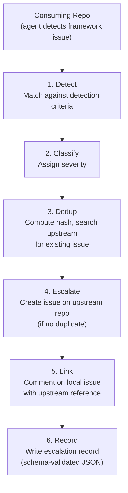

# Cross-Repo Issue Escalation

This document describes the cross-repository issue escalation system — a mechanism for consuming repositories to automatically detect framework-level issues in the `.ai` governance submodule and escalate them to the upstream `SET-Apps/ai-submodule` repository.

## Architecture Overview



The escalation flow runs inline during the agentic startup loop — it is not a separate process. When the agent encounters a framework-level error, it runs the escalation flow and then continues normal operation. Escalation failures are non-blocking.

## Detection Criteria

The system distinguishes between **framework-level** issues (escalate) and **project-local** issues (do not escalate):

### Framework-Level (Escalate)

| Criteria | Signal | Default Severity |
|----------|--------|-----------------|
| **Path-based** | Issue involves files under `.ai/governance/` | medium (high if panel/schema) |
| **Workflow failure** | `dark-factory-governance.yml` fails in framework code | high (critical if no merge decision possible) |
| **Policy gap** | Policy engine returns NO_MATCH | medium (high if security/compliance) |
| **Schema validation** | Governance schema rejects a valid-looking artifact | high (critical if core schema) |
| **Init failure** | `init.sh` fails due to missing governance files | low (medium if bootstrap impossible) |

### Project-Local (Do Not Escalate)

- Issues in project source code (not `.ai/` paths)
- CI failures in project tests
- Copilot recommendations on project code
- Missing project-level configuration

## Duplicate Prevention

Multiple consuming repos may encounter the same framework bug. The dedup mechanism prevents duplicate upstream issues:

1. **Compute dedup key** — SHA-256 hash of `{criteria_type}:{criteria_detail}`, truncated to 16 characters
2. **Embed in issue body** — The upstream issue body contains `<!-- dedup:{key} -->` as an HTML comment
3. **Search before creating** — `gh search issues --repo SET-Apps/ai-submodule "dedup:{key}" --state open`
4. **If duplicate found** — Record locally as `status: "duplicate"`, comment on the existing upstream issue noting the additional repo

## Setup for Consuming Repos

### Step 1: Enable Escalation

Add to your `project.yaml`:

```yaml
escalation:
  enabled: true
```

All other settings have sensible defaults. Override only what you need:

```yaml
escalation:
  enabled: true
  target_repository: "SET-Apps/ai-submodule"  # default
  auth_method: "GITHUB_TOKEN"                  # default
  rate_limit: 3                                # default: max 3 per session
  criteria:
    path_based: true       # default
    workflow_failure: true  # default
    policy_gap: true        # default
    schema_validation: true # default
    init_failure: true      # default
```

### Step 2: Configure Authentication

The agent needs permission to create issues on the upstream repository. Choose one:

#### Option A: GITHUB_TOKEN (Default, Recommended for Same-Org)

If both repos are in the same GitHub organization, the default `GITHUB_TOKEN` in GitHub Actions has sufficient permissions. No additional setup needed.

```yaml
escalation:
  enabled: true
  auth_method: "GITHUB_TOKEN"
```

#### Option B: Fine-Grained PAT (Cross-Org or Restricted Repos)

1. Create a fine-grained PAT at `github.com/settings/tokens`:
   - **Repository access:** Select `SET-Apps/ai-submodule`
   - **Permissions:** Issues → Read and write
2. Add as a repository secret: Settings → Secrets → Actions → `ESCALATION_TOKEN`
3. Configure:

```yaml
escalation:
  enabled: true
  auth_method: "PAT"
  token_secret: "ESCALATION_TOKEN"
```

#### Option C: GitHub App (Enterprise)

For organizations requiring App-based authentication:

1. Create a GitHub App with `Issues: Read & write` permission
2. Install on both source and target repositories
3. Store App ID and private key as repository secrets
4. Configure:

```yaml
escalation:
  enabled: true
  auth_method: "GITHUB_APP"
  app_id_secret: "ESCALATION_APP_ID"
  private_key_secret: "ESCALATION_APP_KEY"
```

### Step 3: Verify

Run the agentic startup loop. If the agent encounters a framework-level issue, it will:
1. Log the detection criteria match
2. Attempt to create an upstream issue
3. Comment on the local issue with the upstream link

Check the agent's session output for escalation records.

## Rate Limiting

To prevent runaway escalation from misconfigured repos:

- **Per session:** Maximum 3 escalations (configurable via `rate_limit`)
- **Per day:** Maximum 10 escalations (configured in `governance/policy/default.yaml`)
- **Cooldown:** 5 minutes between escalations

When rate-limited, the agent records the escalation locally with `status: "skipped"` and continues.

## Escalation Record Schema

Each escalation produces a JSON record conforming to `governance/schemas/cross-repo-escalation.schema.json`:

```json
{
  "escalation_id": "esc-a1b2c3d4",
  "source_repository": "MyOrg/my-app",
  "source_issue_number": 42,
  "target_repository": "SET-Apps/ai-submodule",
  "detection_criteria": {
    "type": "schema_validation",
    "detail": "panel-output.schema.json rejects emission with valid findings array",
    "affected_files": [".ai/governance/schemas/panel-output.schema.json"],
    "error_output": "Additional properties are not allowed ('extra_field' was unexpected)"
  },
  "dedup_key": "a1b2c3d4e5f67890",
  "severity": "high",
  "description": "Panel emission with valid structure is rejected by schema — possible schema regression",
  "upstream_issue_number": 195,
  "status": "escalated",
  "timestamp": "2026-02-24T10:30:00Z"
}
```

Records are saved to `.governance/panels/escalation-{id}.json` in the consuming repo (ephemeral, not committed).

## Upstream Issue Format

Escalated issues on `SET-Apps/ai-submodule` follow this format:

- **Title:** `escalation({source-repo-short}): {summary}`
- **Label:** `escalation`
- **Body:** Structured template with source repo, detection type, severity, description, error output, affected files, and the `<!-- dedup:{key} -->` marker

## Relationship to Other Components

| Component | Relationship |
|-----------|-------------|
| Governance compliance monitoring (#176) | Compliance step failures may trigger escalation |
| Agentic Monitor (#42) | Future always-on monitor could invoke escalation automatically |
| Policy engine | Policy gap detection feeds into escalation criteria |
| `startup.md` | Escalation runs inline during the startup loop at failure points |
| `default.yaml` | Escalation rules defined under `cross_repo_escalation` section |

## Governance Artifacts

| Artifact | Path | Type |
|----------|------|------|
| Escalation schema | `governance/schemas/cross-repo-escalation.schema.json` | Enforcement |
| Project config schema | `governance/schemas/project.schema.json` (escalation section) | Enforcement |
| Escalation workflow | `governance/prompts/cross-repo-escalation-workflow.md` | Cognitive |
| Policy rules | `governance/policy/default.yaml` (cross_repo_escalation section) | Enforcement |
| Default config | `config.yaml` (escalation section) | Enforcement |
