# Dark Factory Governance Model

## Phase 4: Policy-Bound Autonomy

**Version:** 1.0.0
**Status:** Foundational Specification
**Classification:** Governance Architecture
**Supersedes:** Implicit governance via workflow gates (Phase 3)

---

## Table of Contents

1. [Executive Summary](#1-executive-summary)
2. [Scope and Applicability](#2-scope-and-applicability)
3. [Definitions](#3-definitions)
4. [System Context](#4-system-context)
5. [Governance Layer 1: Intent Governance](#5-governance-layer-1-intent-governance)
6. [Governance Layer 2: Cognitive Governance](#6-governance-layer-2-cognitive-governance)
7. [Governance Layer 3: Execution Governance](#7-governance-layer-3-execution-governance)
8. [Governance Layer 4: Runtime Governance](#8-governance-layer-4-runtime-governance)
9. [Governance Layer 5: Evolution Governance](#9-governance-layer-5-evolution-governance)
10. [Inter-Layer Data Flow](#10-inter-layer-data-flow)
11. [Role Definitions](#11-role-definitions)
12. [Decision Authority Matrix](#12-decision-authority-matrix)
13. [Rationale Capture Requirements](#13-rationale-capture-requirements)
14. [Failure Taxonomy](#14-failure-taxonomy)
15. [Backward Compatibility](#15-backward-compatibility)
16. [Appendix A: Architecture Diagrams](#appendix-a-architecture-diagrams)
17. [Appendix B: Artifact Type Reference](#appendix-b-artifact-type-reference)
18. [Appendix C: Governance Layer Interaction Matrix](#appendix-c-governance-layer-interaction-matrix)

---

## 1. Executive Summary

The Dark Factory Governance Model defines the formal architecture for transitioning from Phase 3 (agentic orchestration with human gates) to Phase 4 (policy-bound autonomy with deterministic enforcement). This document establishes five governance layers that collectively control what enters the system, how the system reasons, what the system produces, how the system behaves in production, and how the system evolves.

The model is designed to operate within the existing `.ai/` submodule infrastructure. It preserves the cognitive flexibility of the current Markdown-based persona and panel system while introducing deterministic enforcement through structured emissions, policy evaluation, and versioned manifests. The goal is a system where the default path for well-understood work is autonomous execution with auditable decisions, and the exception path is human escalation with structured rationale.

### Design Principles

1. **Deterministic enforcement over implicit trust.** Every decision that affects code, configuration, or production must be traceable to a policy evaluation with a recorded outcome.
2. **Cognitive flexibility preserved.** Markdown personas and panels remain the reasoning substrate. Governance does not replace reasoning; it constrains and audits it.
3. **Structured emissions as the governance interface.** The boundary between cognitive (Markdown) and enforcement (JSON/YAML) artifacts is the structured emission. Governance layers consume structured data, not prose.
4. **Rationale is non-negotiable.** Every decision at every layer must produce a documented rationale. Decisions without rationale are governance failures.
5. **Backward compatibility by default.** All governance changes must be additive. Breaking changes require explicit migration plans and version bumps.

---

## 2. Scope and Applicability

This governance model applies to all repositories that consume the `.ai/` submodule. It governs:

- All Design Intent (DI) submissions and feature requests
- All persona and panel activations
- All code changes, test executions, and artifact emissions
- All production runtime monitoring and incident response
- All changes to the governance model itself

It does NOT govern:

- Human-only conversations outside the agentic system
- External CI/CD systems (though it defines the interface contract with them)
- Third-party tool behavior (MCP servers are treated as opaque tool providers)

---

## 3. Definitions

| Term | Definition |
|------|-----------|
| **Dark Factory** | An autonomous software delivery system where agentic processes handle the full lifecycle from intent to production, with policy-bound constraints replacing manual gates. |
| **Design Intent (DI)** | A structured request that describes a desired change to the system. The atomic unit of work intake. |
| **Persona** | A Markdown-defined cognitive role that constrains the reasoning approach of an agentic process. Defined in `governance/personas/`. |
| **Panel** | A multi-persona review panel where several personas evaluate an artifact from different perspectives. Defined in `governance/prompts/reviews/`. |
| **Panel** (governance context) | Panels produce structured emissions. The term "panel" is used in both the multi-persona review definition above and in the governance context. |
| **Structured Emission** | A JSON object conforming to `panel-output.schema.json` that accompanies the Markdown reasoning output of a panel. The machine-readable governance interface. |
| **Cognitive Artifact** | A Markdown document produced by persona reasoning. Human-readable, not machine-evaluated for governance decisions. |
| **Enforcement Artifact** | A JSON or YAML document conforming to a defined schema. Machine-evaluated for governance decisions. |
| **Audit Artifact** | A hybrid document containing both cognitive reasoning and structured data, used for post-hoc analysis. |
| **Intent Package** | The validated output of Layer 1. Contains a DI, acceptance criteria, scope boundaries, and routing metadata. |
| **Run Manifest** | A versioned record of every decision, persona activation, emission, and policy evaluation for a single unit of work. |
| **Policy Profile** | A YAML configuration that defines thresholds, weights, and rules for a specific risk context (e.g., `fin_pii_high.yaml`). |
| **Confidence Score** | A numerical value (0.0-1.0) emitted by panels indicating certainty in their assessment. |
| **Decision Gate** | A point in a workflow where progression requires explicit approval (human or policy-automated). |
| **Governance Failure** | Any condition where a governance layer cannot produce its required output or where enforcement constraints are violated. |

---

## 4. System Context

### 4.1 Current System Inventory

The governance model operates on the following existing components:

**Personas (60 across 13 categories):**

| Category | Count | Directory |
|----------|-------|-----------|
| Architecture | 3 | `governance/personas/architecture/` |
| Compliance | 4 | `governance/personas/compliance/` |
| Documentation | 2 | `governance/personas/documentation/` |
| Domain Specific | 6 | `governance/personas/domain/` |
| Engineering | 6 | `governance/personas/engineering/` |
| FinOps | 4 | `governance/personas/finops/` |
| Governance | 2 | `governance/personas/governance/` |
| Language Specific | 11 | `governance/personas/language/` |
| Leadership | 5 | `governance/personas/leadership/` |
| Operations & Reliability | 6 | `governance/personas/operations/` |
| Platform Specific | 2 | `governance/personas/platform/` |
| Code Quality | 3 | `governance/personas/quality/` |
| Special Purpose | 4 | `governance/personas/specialist/` |

> **Note:** As of Issue #220, personas and panels have been consolidated into self-contained
> review prompts in `governance/prompts/reviews/`. The persona files and panel files in
> `governance/personas/` are deprecated and will be removed in a future release.
> See `docs/research/README.md` for the research supporting this architectural decision.

**Panels (16 multi-persona panels):**

| Panel | Participants | Primary Governance Layer |
|-------|-------------|------------------------|
| AI Expert Review | 5 | Cognitive (L2) |
| API Design Review | 5 | Cognitive (L2) |
| Architecture Review | 5 | Cognitive (L2) / Execution (L3) |
| Code Review | 5 | Execution (L3) |
| Copilot Review | 5 | Execution (L3) |
| Cost Analysis | 6 | Execution (L3) |
| Data Design Review | 5 | Cognitive (L2) / Execution (L3) |
| Documentation Review | 5 | Execution (L3) |
| Incident Post-Mortem | 5 | Runtime (L4) |
| Migration Review | 5 | Execution (L3) / Evolution (L5) |
| Performance Review | 5 | Execution (L3) |
| Production Readiness | 5 | Runtime (L4) |
| Security Review | 5 | Execution (L3) |
| Technical Debt Review | 5 | Evolution (L5) |
| Testing Review | 5 | Execution (L3) |
| Threat Modeling | 5 | Cognitive (L2) / Execution (L3) |

**Workflows (8 end-to-end processes):**

| Workflow | Phases | Gates | Artifact Prefix |
|----------|--------|-------|-----------------|
| Feature Implementation | 6 | 3 | FEAT |
| Bug Fix | 7 | varies | BUG |
| Documentation | 5 | varies | DOC |
| Refactoring | 5 | varies | REF |
| API Design | 5 | varies | API |
| Migration | 6 | varies | MIG |
| Architecture Decision | 5 | varies | ADR |
| Incident Response | 6 | 4 | INC |

**Language Templates:** Go, Python, Node, React, C#

**MCP Servers:** ServiceNow, Gitignore (extensible)

### 4.2 Distribution Model

The system is distributed as a git submodule (`.ai/`) cloned into host repositories. Each host repository pins to a specific commit of the `.ai/` submodule, providing version-locked governance. Project-specific overrides are supported through local configuration files that extend (but do not replace) the shared governance baseline.

### 4.3 Phase Transition Context

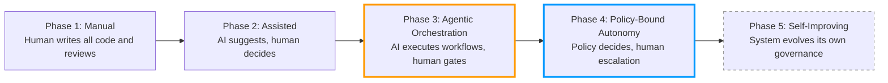

The transition from Phase 3 to Phase 4 replaces human decision gates with policy evaluation where confidence thresholds are met. Human gates remain as the escalation path when policy cannot determine an outcome or when risk thresholds are exceeded.

---

## 5. Governance Layer 1: Intent Governance

### 5.1 Purpose

Intent Governance controls what enters the system. It validates that all work requests -- Design Intents, issues, feature requests, bug reports, and remediation triggers -- are well-formed, unambiguous, and actionable before any agentic processing begins. This layer is the system's intake filter. Nothing proceeds to cognitive processing without passing through intent validation.

### 5.2 Inputs

| Input Type | Source | Format |
|-----------|--------|--------|
| Design Intent (DI) | Human author, automated DI generator (L4) | Markdown with required sections |
| GitHub Issue | Repository issue tracker | Issue template with structured fields |
| Feature Request | Product management, stakeholder input | Structured spec or freeform (requires normalization) |
| Bug Report | Incident response (L4), user reports | Bug template with reproduction steps |
| Remediation DI | Runtime Governance (L4) automated generation | Structured DI with incident linkage |

### 5.3 Outputs

**Primary Output: Validated Intent Package**

A validated intent package contains:

| Field | Type | Required | Description |
|-------|------|----------|-------------|
| `intent_id` | string | yes | Unique identifier (format: `DI-{YYYYMMDD}-{SEQ}`) |
| `intent_type` | enum | yes | `feature`, `bugfix`, `refactor`, `migration`, `incident_remediation`, `debt_reduction` |
| `title` | string | yes | Concise description (max 120 characters) |
| `problem_statement` | string | yes | What problem this solves |
| `acceptance_criteria` | array[string] | yes | Concrete, testable criteria (minimum 1) |
| `scope_boundaries` | object | yes | `in_scope` and `out_of_scope` arrays |
| `risk_indicators` | object | yes | `estimated_blast_radius`, `data_sensitivity`, `user_facing` |
| `routing_metadata` | object | yes | `suggested_workflow`, `required_panels`, `language_context` |
| `rationale` | string | yes | Why this work should be done now |
| `validation_timestamp` | ISO 8601 | yes | When validation was completed |
| `validation_status` | enum | yes | `accepted`, `rejected`, `needs_clarification` |

**Secondary Output: Rejection Feedback (on failure)**

| Field | Type | Description |
|-------|------|-------------|
| `rejection_reasons` | array[object] | Each containing `field`, `issue`, `suggestion` |
| `clarification_questions` | array[string] | Specific questions that must be answered |
| `examples` | array[string] | Examples of well-formed intents for reference |

### 5.4 Enforcement Authority

**Primary:** Code Manager persona

The Code Manager persona is the enforcement authority for Layer 1. It validates incoming intents against the intent schema, checks for ambiguity, and routes validated packages to the appropriate workflow. The Code Manager has the authority to:

- Reject malformed intents with structured feedback
- Request clarification before acceptance
- Assign priority and routing metadata
- Split over-scoped intents into multiple packages
- Merge duplicate or overlapping intents

**Secondary:** `project.yaml` configuration

Project-level configuration can define additional intent validation rules, such as required labels, mandatory fields beyond the base schema, or routing overrides.

### 5.5 Failure Conditions

| Failure ID | Condition | Severity | Response |
|-----------|-----------|----------|----------|
| L1-F001 | Missing required field in DI | Blocking | Reject with field-specific feedback |
| L1-F002 | Ambiguous acceptance criteria (no testable condition) | Blocking | Reject with examples of testable criteria |
| L1-F003 | Scope boundaries undefined | Blocking | Reject; require explicit in/out scope |
| L1-F004 | No rationale provided | Blocking | Reject; rationale is mandatory |
| L1-F005 | Intent duplicates existing open DI | Warning | Flag duplicate, request confirmation or merge |
| L1-F006 | Risk indicators suggest external review needed | Escalation | Route to human review before acceptance |
| L1-F007 | Automated DI from L4 fails validation | Critical | Log failure, alert human, halt remediation chain |

### 5.6 Validation Process

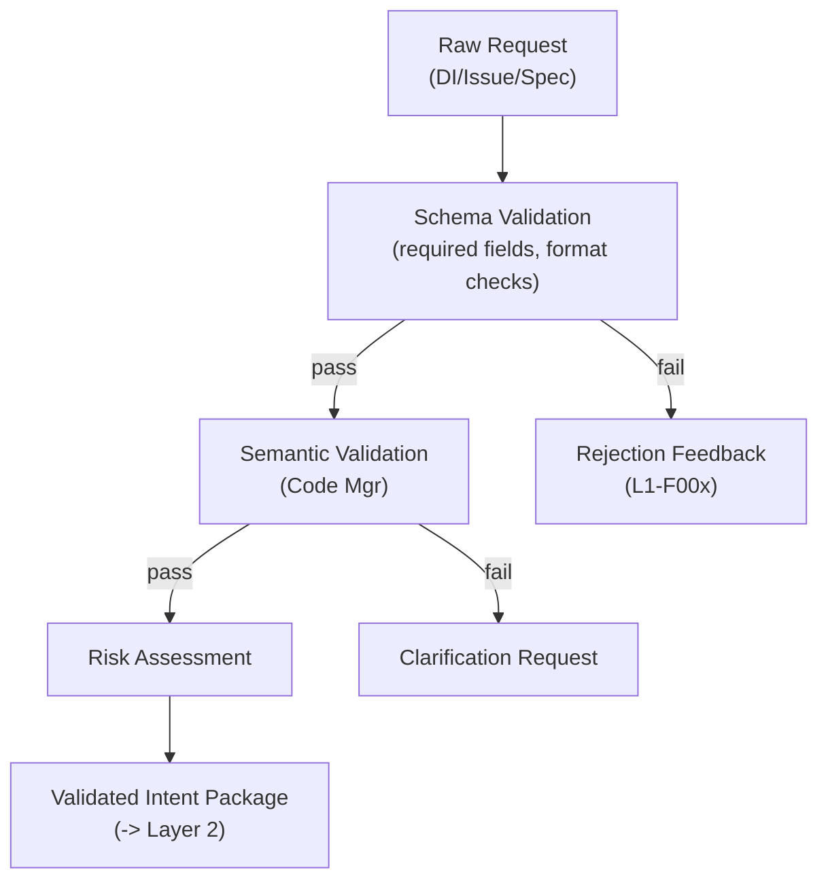

---

## 6. Governance Layer 2: Cognitive Governance

### 6.1 Purpose

Cognitive Governance controls how the system thinks. It ensures that the correct personas and panels are activated for a given task, that cognitive artifacts (Markdown reasoning documents) are produced at each required phase, and that the reasoning process follows the defined workflow structure. This layer maps intents to cognitive processes.

### 6.2 Inputs

| Input Type | Source | Format |
|-----------|--------|--------|
| Validated Intent Package | Layer 1 | Structured JSON (intent package schema) |
| Panel Graph Configuration | `project.yaml` | YAML panel routing rules |
| Persona Registry | `governance/prompts/reviews/` + `governance/personas/agentic/` | Review prompts and agentic persona definitions |
| Workflow Definitions | `governance/prompts/workflows/` | Markdown workflow specifications |

### 6.3 Outputs

**Primary Output: Cognitive Execution Plan**

| Field | Type | Required | Description |
|-------|------|----------|-------------|
| `plan_id` | string | yes | Unique identifier linked to `intent_id` |
| `workflow_selected` | string | yes | Workflow identifier (e.g., `feature-implementation`) |
| `phase_sequence` | array[object] | yes | Ordered list of phases with persona assignments |
| `panel_assignments` | array[object] | yes | Which panels are invoked and at which gates |
| `persona_activation_set` | array[string] | yes | Full list of personas that will be activated |
| `required_artifacts` | array[string] | yes | Artifact identifiers that must be produced |
| `gate_definitions` | array[object] | yes | Decision points with approval criteria |
| `rationale` | string | yes | Why this workflow and these panels were selected |

**Phase Sequence Entry:**

| Field | Type | Description |
|-------|------|-------------|
| `phase_number` | integer | Ordinal position |
| `phase_name` | string | Human-readable name |
| `persona` | string | Primary persona path (e.g., `governance/personas/architecture/architect.md`) |
| `secondary_personas` | array[string] | Additional personas if required |
| `prompts` | array[string] | Prompt templates to invoke |
| `output_artifact` | string | Expected artifact identifier |
| `is_gate` | boolean | Whether this phase includes a decision gate |

**Panel Assignment Entry:**

| Field | Type | Description |
|-------|------|-------------|
| `panel_name` | string | Panel identifier |
| `panel_path` | string | Path to panel definition |
| `invocation_point` | string | Workflow phase where panel is invoked |
| `required_participants` | array[string] | Minimum persona set |
| `emission_required` | boolean | Whether structured emission is mandatory |

### 6.4 Enforcement Authority

**Primary:** Panel graph configuration in `project.yaml`

The panel graph defines the mandatory routing rules for intent types. It specifies:

- Which workflows are valid for which intent types
- Which panels must be invoked for specific risk profiles
- Minimum persona activation sets per workflow phase
- Required artifact production at each stage

**Secondary:** Workflow definitions in `governance/prompts/workflows/`

Workflow files define the canonical phase sequence, including which personas are adopted and which panels are invoked. Deviations from the defined workflow are governance violations.

**Panel Graph Configuration Schema:**

```yaml
# project.yaml panel graph section
governance:
  panel_graph:
    intent_routing:
      feature:
        workflow: feature-implementation
        required_panels:
          - code-review          # at Phase 5
          - architecture-review  # at Phase 2 (if blast_radius >= medium)
        minimum_personas:
          - product-manager      # Phase 1
          - architect            # Phase 2
          - tech-lead            # Phase 3
          - test-engineer        # Phase 4
      bugfix:
        workflow: bug-fix
        required_panels:
          - code-review
          - testing-review       # if regression suspected
        minimum_personas:
          - debugger
          - test-engineer
      # ... additional intent types
    risk_overrides:
      high_data_sensitivity:
        additional_panels:
          - security-review
          - data-design-review
      user_facing:
        additional_panels:
          - performance-review
```

### 6.5 Failure Conditions

| Failure ID | Condition | Severity | Response |
|-----------|-----------|----------|----------|
| L2-F001 | No workflow matches intent type | Blocking | Return to L1 for re-classification |
| L2-F002 | Required persona not available in registry | Critical | Halt; governance integrity compromised |
| L2-F003 | Panel not invoked at required gate | Blocking | Workflow cannot proceed past gate |
| L2-F004 | Cognitive artifact not produced for phase | Blocking | Phase incomplete; cannot advance |
| L2-F005 | Panel graph configuration missing or malformed | Critical | Fall back to workflow-defined defaults with warning |
| L2-F006 | Risk override triggers additional panel but panel definition missing | Blocking | Halt; log governance gap |
| L2-F007 | Workflow deviation without documented rationale | Warning | Log deviation; flag for audit |

### 6.6 Cognitive Routing Process

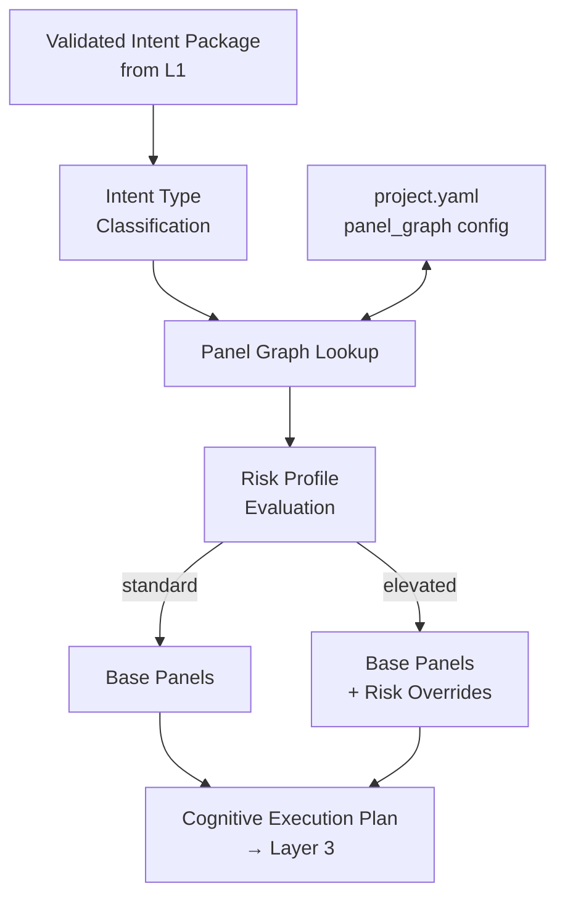

---

## 7. Governance Layer 3: Execution Governance

### 7.1 Purpose

Execution Governance controls what the system does. It ensures that code changes, test results, panel outputs, and all artifacts produced during workflow execution meet defined quality thresholds before the workflow can proceed or complete. This is the layer where Markdown reasoning is bridged to machine-enforceable policy through structured emissions.

### 7.2 Inputs

| Input Type | Source | Format |
|-----------|--------|--------|
| Code Changes | Coder persona execution | Git diff, file modifications |
| Test Results | Test execution (CI or local) | Test framework output (parsed) |
| Panel Outputs | Panel execution | Markdown reasoning + structured emission (JSON) |
| Cognitive Artifacts | Workflow phase outputs | Markdown documents (FEAT-N, BUG-N, etc.) |
| Policy Profile | `governance/policy/` directory | YAML policy configuration |
| Emission Schema | `governance/schemas/panel-output.schema.json` | JSON Schema |

### 7.3 Outputs

**Primary Output: Structured Emission Record**

Every panel execution must produce a structured emission conforming to `panel-output.schema.json`:

| Field | Type | Required | Description |
|-------|------|----------|-------------|
| `emission_id` | string | yes | Unique identifier |
| `panel_name` | string | yes | Which panel produced this emission |
| `panel_version` | string | yes | Version of the panel definition used |
| `intent_id` | string | yes | Linked DI identifier |
| `timestamp` | ISO 8601 | yes | When the emission was produced |
| `confidence_score` | float (0.0-1.0) | yes | Panel's confidence in its assessment |
| `risk_level` | enum | yes | `critical`, `high`, `medium`, `low`, `none` |
| `compliance_score` | float (0.0-1.0) | yes | Degree of compliance with applicable standards |
| `findings` | array[object] | yes | Individual findings with severity |
| `policy_flags` | array[string] | yes | Policy-relevant flags (e.g., `pii_detected`, `breaking_change`) |
| `requires_human_review` | boolean | yes | Whether the panel recommends human escalation |
| `recommendation` | enum | yes | `approve`, `request_changes`, `reject` |
| `rationale` | string | yes | Machine-readable summary of reasoning |
| `markdown_artifact_ref` | string | yes | Path to the full Markdown reasoning document |

**Finding Entry:**

| Field | Type | Description |
|-------|------|-------------|
| `finding_id` | string | Unique within emission |
| `severity` | enum | `critical`, `high`, `medium`, `low` |
| `category` | string | Finding category (e.g., `security`, `performance`, `correctness`) |
| `description` | string | What was found |
| `remediation` | string | How to fix it |
| `file_path` | string | Affected file (if applicable) |
| `line_range` | object | `start` and `end` line numbers (if applicable) |

**Secondary Output: Policy Evaluation Result**

| Field | Type | Description |
|-------|------|-------------|
| `evaluation_id` | string | Unique identifier |
| `policy_profile` | string | Which policy profile was applied |
| `aggregate_confidence` | float | Weighted average across all panel emissions |
| `aggregate_risk` | enum | Highest risk level across emissions |
| `decision` | enum | `auto_merge`, `auto_remediate`, `human_review_required`, `block` |
| `decision_rationale` | string | Why this decision was reached |
| `threshold_details` | object | Which thresholds were evaluated and their results |

### 7.4 Enforcement Authority

**Primary:** Structured emission schemas and policy engine

The enforcement mechanism is three-fold:

1. **Schema Validation:** Every panel emission must conform to `governance/schemas/panel-output.schema.json`. Emissions that fail schema validation are rejected; the panel must re-execute.

2. **Policy Engine:** The policy engine evaluates the aggregate set of emissions against the active policy profile. Policy evaluation is deterministic -- given the same emissions and policy profile, the same decision is always produced.

3. **CI Integration:** CI checks validate that all required emissions exist, pass schema validation, and that the policy engine decision permits the requested action (merge, deploy, etc.).

**Policy Decision Logic:**

```
IF any emission has risk_level == "critical"
    AND requires_human_review == true
    THEN decision = "block"

IF aggregate_confidence >= policy.auto_merge_threshold
    AND aggregate_risk <= policy.max_auto_merge_risk
    AND no findings with severity == "critical"
    AND no policy_flags in policy.block_flags
    THEN decision = "auto_merge"

IF aggregate_confidence >= policy.remediation_threshold
    AND findings exist with severity <= "high"
    AND all findings have remediation defined
    THEN decision = "auto_remediate"

IF any emission has requires_human_review == true
    OR aggregate_confidence < policy.human_review_threshold
    THEN decision = "human_review_required"

DEFAULT: decision = "human_review_required"
```

### 7.5 Failure Conditions

| Failure ID | Condition | Severity | Response |
|-----------|-----------|----------|----------|
| L3-F001 | Panel execution produces no structured emission | Blocking | Panel output rejected; must re-execute |
| L3-F002 | Structured emission fails schema validation | Blocking | Emission rejected; panel must re-emit |
| L3-F003 | Test suite fails (any test) | Blocking | Code changes cannot proceed; remediation required |
| L3-F004 | Confidence score below minimum threshold | Escalation | Route to human review |
| L3-F005 | Policy evaluation returns "block" | Blocking | Work item halted; requires human intervention |
| L3-F006 | Required panel emission missing for workflow gate | Blocking | Gate cannot be passed |
| L3-F007 | Emission `rationale` field empty or absent | Blocking | Emission rejected; rationale is mandatory |
| L3-F008 | Policy profile not found or malformed | Critical | Fall back to most restrictive default profile |
| L3-F009 | CI check cannot parse emission artifacts | Critical | Merge blocked; infrastructure failure logged |

### 7.6 Execution Flow

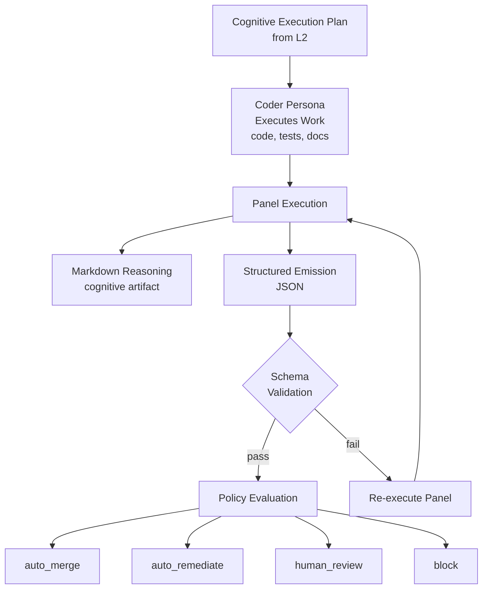

---

## 8. Governance Layer 4: Runtime Governance

### 8.1 Purpose

Runtime Governance controls the system in production. It monitors deployed systems for drift, anomalies, performance degradation, and incidents that should trigger re-evaluation by the agentic system. This layer closes the feedback loop between production behavior and the governance pipeline, enabling the Dark Factory to respond to runtime conditions without waiting for human observation.

### 8.2 Inputs

| Input Type | Source | Format |
|-----------|--------|--------|
| Runtime Metrics | Observability stack (metrics, logs, traces) | Prometheus/OpenTelemetry format |
| Incident Reports | Alerting systems, ServiceNow (via MCP) | Structured incident records |
| Drift Signals | Configuration drift detection, dependency scanners | Drift report format |
| SLO Violations | SRE monitoring | SLO burn rate alerts |
| Security Advisories | Dependency vulnerability scanners | CVE records |
| User Feedback | Support channels, error reports | Unstructured (requires normalization) |

### 8.3 Outputs

**Primary Output: Remediation DI**

When runtime conditions require system changes, Layer 4 generates Design Intents that feed back into Layer 1:

| Field | Type | Required | Description |
|-------|------|----------|-------------|
| `source` | string | yes | `runtime_governance` |
| `trigger_type` | enum | yes | `drift`, `incident`, `slo_violation`, `security_advisory`, `anomaly` |
| `trigger_id` | string | yes | Reference to the triggering event |
| `severity` | enum | yes | `critical`, `high`, `medium`, `low` |
| `proposed_remediation` | string | yes | Description of recommended fix |
| `affected_services` | array[string] | yes | Which services are affected |
| `evidence` | object | yes | Metrics, logs, or other data supporting the trigger |
| `auto_generated` | boolean | yes | Always `true` for L4-generated DIs |

**Secondary Output: Panel Re-Execution Trigger**

When runtime data invalidates a previous panel assessment (e.g., a performance review that assumed certain load patterns now disproven by production metrics), Layer 4 can trigger re-execution of specific panels:

| Field | Type | Description |
|-------|------|-------------|
| `panel_name` | string | Which panel to re-execute |
| `original_emission_id` | string | The emission being invalidated |
| `invalidation_reason` | string | What changed |
| `new_evidence` | object | Runtime data that contradicts original assessment |

### 8.4 Enforcement Authority

**Primary:** Drift detection thresholds and incident severity mapping

Runtime governance enforcement is configured through:

```yaml
# project.yaml runtime governance section
governance:
  runtime:
    drift_detection:
      configuration_drift:
        check_interval: 3600  # seconds
        threshold: any        # any drift triggers evaluation
      dependency_drift:
        check_interval: 86400
        threshold: minor_version  # minor+ version changes
      schema_drift:
        check_interval: 86400
        threshold: any
    incident_mapping:
      critical:
        auto_generate_di: true
        require_panel: incident-post-mortem
        escalate_to_human: true
      high:
        auto_generate_di: true
        require_panel: incident-post-mortem
        escalate_to_human: false
      medium:
        auto_generate_di: true
        require_panel: null  # DI goes through normal L1-L3 flow
        escalate_to_human: false
      low:
        auto_generate_di: false
        log_only: true
    slo:
      burn_rate_threshold: 2.0  # 2x normal burn rate triggers evaluation
      evaluation_window: 3600   # seconds
```

**Secondary:** Incident Commander persona (for critical incidents requiring immediate coordination)

The Incident Commander persona is activated for critical severity incidents and has the authority to bypass normal workflow sequencing to execute the Incident Response workflow directly.

### 8.5 Failure Conditions

| Failure ID | Condition | Severity | Response |
|-----------|-----------|----------|----------|
| L4-F001 | Drift detected but no DI generated | Critical | Alert human; governance loop broken |
| L4-F002 | Incident severity mapping undefined for event type | High | Default to highest severity; alert human |
| L4-F003 | Auto-generated DI fails L1 validation | Critical | Log failure; direct human escalation |
| L4-F004 | Panel re-execution trigger references nonexistent emission | High | Log inconsistency; generate new panel execution instead |
| L4-F005 | SLO burn rate exceeds threshold but monitoring data unavailable | Critical | Assume worst case; escalate to human |
| L4-F006 | Runtime metrics pipeline interrupted | Critical | Alert human; system operating without runtime governance |
| L4-F007 | Remediation DI creates circular dependency (fix causes new drift) | High | Halt remediation chain after 3 iterations; escalate |

### 8.6 Runtime Feedback Loop

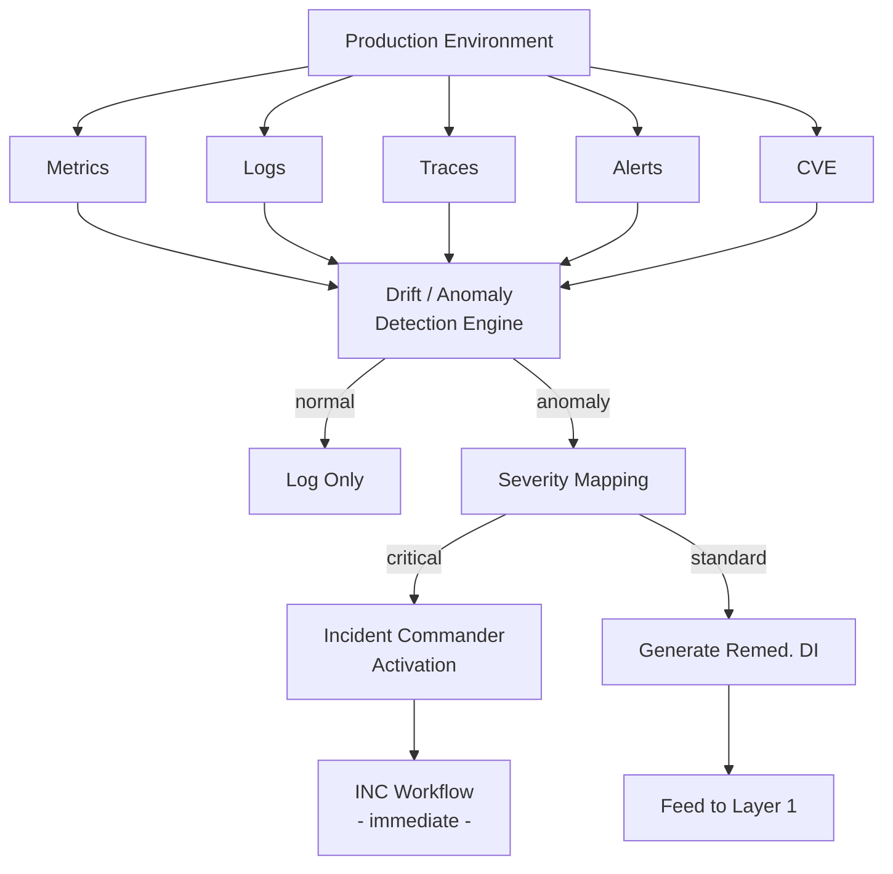

---

## 9. Governance Layer 5: Evolution Governance

### 9.1 Purpose

Evolution Governance controls how the system changes itself. It manages all modifications to personas, policies, schemas, workflow definitions, and the governance model itself. This layer ensures that changes to governance infrastructure are versioned, backward-compatible by default, and accompanied by migration plans when breaking changes are necessary.

### 9.2 Inputs

| Input Type | Source | Format |
|-----------|--------|--------|
| Proposed Persona Changes | Persona authors, automated suggestions | Markdown diff |
| Proposed Policy Changes | Policy authors, threshold adjustments | YAML diff |
| Proposed Schema Changes | Schema evolution requirements | JSON Schema diff |
| Proposed Workflow Changes | Process improvement, new workflow types | Markdown diff |
| Governance Model Changes | This document, layer definitions | Markdown diff |
| Technical Debt Review Outputs | Technical Debt Review panel | Structured emission |
| Autonomy Metrics | System performance data | Metrics report |

### 9.3 Outputs

**Primary Output: Versioned Governance Manifest**

| Field | Type | Required | Description |
|-------|------|----------|-------------|
| `manifest_version` | semver | yes | Version of the manifest format |
| `governance_version` | semver | yes | Version of the governance model |
| `persona_set_version` | string | yes | Git commit hash of persona definitions |
| `policy_set_version` | string | yes | Git commit hash of policy definitions |
| `schema_set_version` | string | yes | Git commit hash of schema definitions |
| `workflow_set_version` | string | yes | Git commit hash of workflow definitions |
| `changelog` | array[object] | yes | What changed and why |
| `migration_plan` | object | conditional | Required if breaking changes are present |
| `backward_compatible` | boolean | yes | Whether this version is backward compatible |
| `rationale` | string | yes | Why this evolution was necessary |

**Migration Plan (when required):**

| Field | Type | Description |
|-------|------|-------------|
| `breaking_changes` | array[object] | Each change with description and impact |
| `migration_steps` | array[object] | Ordered steps to migrate from previous version |
| `rollback_procedure` | object | How to revert if migration fails |
| `affected_repositories` | array[string] | Which repos consume the changed artifacts |
| `testing_requirements` | array[string] | What must be validated post-migration |
| `estimated_effort` | string | Human effort estimate for migration |

### 9.4 Enforcement Authority

**Primary:** Backward compatibility checks and manifest versioning

Evolution governance is enforced through:

1. **Semantic Versioning:** All governance artifacts follow semver. Patch versions are backward-compatible fixes. Minor versions add new capabilities without breaking existing behavior. Major versions may include breaking changes.

2. **Backward Compatibility Validation:** Every proposed change is evaluated against the existing artifact set. Changes that would cause existing valid inputs to produce different outputs are flagged as breaking.

3. **Migration Plan Requirement:** No breaking change can be merged without an accompanying migration plan that has been reviewed by the Technical Debt Review panel.

4. **Manifest Lineage:** Every governance version must reference its predecessor. The manifest chain provides a complete history of governance evolution.

**Secondary:** Technical Debt Review panel

The Technical Debt Review panel (Refactor Specialist, Systems Architect, Test Engineer, Tech Lead, Minimalist Engineer) is the review body for governance evolution proposals. It evaluates:

- Whether the change is necessary
- Whether the change is backward compatible
- Whether the migration plan is sufficient
- Whether the change increases or decreases system complexity

### 9.5 Failure Conditions

| Failure ID | Condition | Severity | Response |
|-----------|-----------|----------|----------|
| L5-F001 | Breaking change proposed without migration plan | Blocking | Change rejected until migration plan provided |
| L5-F002 | Governance artifact modified without version bump | Blocking | Change rejected; version required |
| L5-F003 | Manifest chain broken (version references nonexistent predecessor) | Critical | Halt; governance integrity compromised |
| L5-F004 | Persona removed that is referenced by active panel graph | Blocking | Change rejected; dependency exists |
| L5-F005 | Schema change invalidates existing stored emissions | High | Requires migration plan for historical data |
| L5-F006 | Policy change would alter past decisions if replayed | Warning | Acceptable if documented; flag for audit |
| L5-F007 | Workflow change removes a required gate | Blocking | Change rejected; gates are monotonically increasing |

### 9.6 Evolution Process

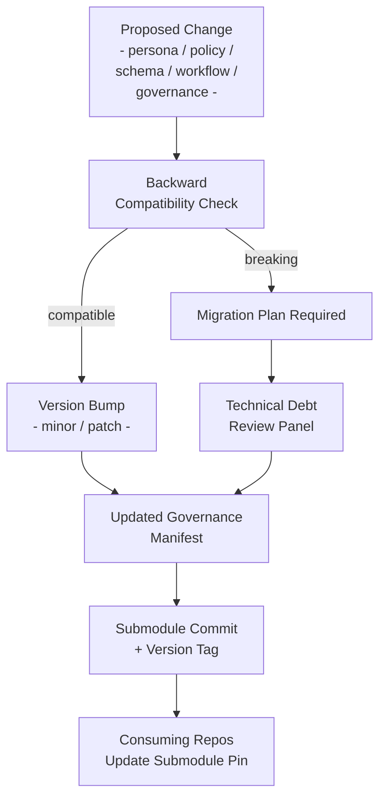

---

## 10. Inter-Layer Data Flow

### 10.1 Primary Flow (Normal Execution)

The five governance layers form a pipeline where the output of each layer becomes the input to the next. The primary flow for a standard unit of work is:

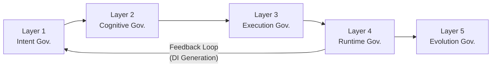

### 10.2 Data Flow Matrix

| From \ To | L1 Intent | L2 Cognitive | L3 Execution | L4 Runtime | L5 Evolution |
|-----------|-----------|-------------|-------------|-----------|-------------|
| **L1 Intent** | -- | Validated Intent Package | -- | -- | -- |
| **L2 Cognitive** | Rejection (reclassify) | -- | Cognitive Execution Plan | -- | -- |
| **L3 Execution** | -- | Re-routing request | -- | Emission records (for baseline) | Quality trend data |
| **L4 Runtime** | Remediation DIs | Panel re-execution triggers | -- | -- | Threshold adjustment proposals |
| **L5 Evolution** | Schema updates | Panel graph changes | Schema/policy changes | Threshold changes | -- |

### 10.3 Cross-Layer Interactions

**L4 to L1 (Feedback Loop):**
This is the most critical cross-layer interaction. When Runtime Governance detects an anomaly, it generates a Remediation DI that feeds back into Intent Governance. This closes the autonomous remediation loop. The DI carries `auto_generated: true` and `source: runtime_governance`, which Layer 1 uses to apply appropriate validation rules and priority escalation.

**L3 to L2 (Re-routing):**
If Execution Governance determines during panel execution that the cognitive plan is insufficient (e.g., a security finding reveals the need for a panel that was not in the original plan), it can request that Layer 2 re-route with additional panel requirements. This is a backward step in the pipeline and must be logged.

**L5 to All (Schema Propagation):**
When Evolution Governance produces a new governance version, the changes propagate to all layers through the submodule update mechanism. Each consuming repository pulls the updated submodule, receiving new personas, policies, schemas, and workflow definitions simultaneously.

**L3 to L5 (Quality Trends):**
Execution Governance emission data, aggregated over time, informs Evolution Governance about which personas, panels, and policies are effective. Consistently low confidence scores from a specific panel may indicate that the panel definition needs refinement. Consistently high auto-merge rates for a specific intent type may indicate that the governance overhead can be reduced.

### 10.4 Complete System Data Flow

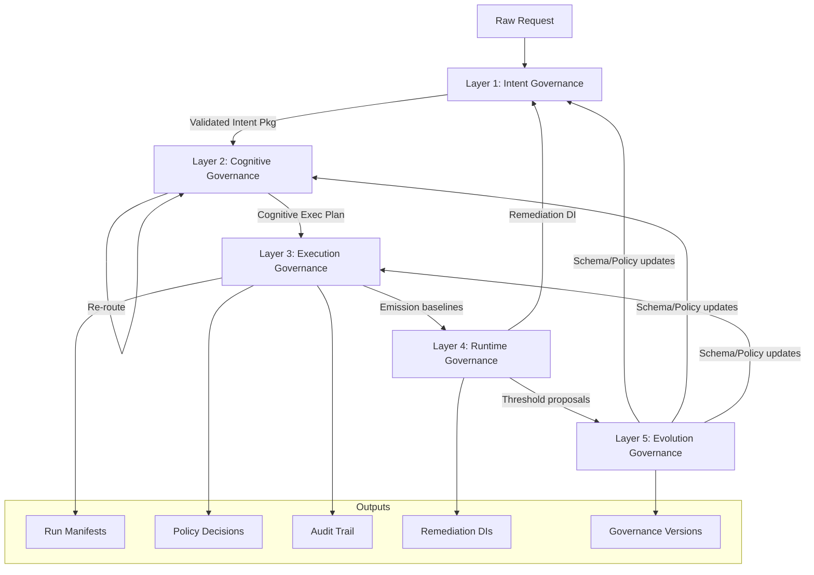

---

## 11. Role Definitions

The agentic pipeline uses a 6-agent prompt-chained architecture implementing Anthropic's orchestration patterns:

| Agent | Pattern | Role |
|-------|---------|------|
| DevOps Engineer | Routing | Session lifecycle, pre-flight, issue triage, routing |
| Code Manager | Orchestrator-Workers | Intent validation, panel selection, review coordination, merge |
| Coder | Worker | Implementation, test coverage, structured output |
| Tester | Evaluator-Optimizer | Independent evaluation, test verification, feedback |

See [Agent Protocol](../../governance/prompts/agent-protocol.md) for inter-agent communication contract and [startup.md](../../governance/prompts/startup.md) for the 5-phase pipeline.

### 11.0 DevOps Engineer Persona -- Session Entry Point

The DevOps Engineer is the session entry point for the Dark Factory agentic loop. It owns session lifecycle, infrastructure pre-flight, issue triage, and routing. It determines *what* work needs to be done and delegates *how* to the Code Manager. The DevOps Engineer never writes code, reviews implementations, or makes merge decisions.

This persona implements Anthropic's **Routing** pattern — classifying incoming work and directing it to the appropriate downstream agent.

**Responsibilities:**

| Responsibility | Description |
|----------------|-------------|
| Session Lifecycle | Context capacity enforcement, N-issue session cap (N = `parallel_coders`, default 5; disabled when N = -1), checkpoint on hard-stop, shutdown protocol |
| Pre-flight Checks | Submodule freshness (with pin support), repo configuration, workflow health |
| Issue Triage | Scan, filter, prioritize open issues; re-evaluate `refine` labels |
| PR Resolution | Resolve open PRs before scanning new issues |
| Routing | Emit ASSIGN messages to Code Manager with issue context and priority |
| GOALS.md Fallback | Convert unchecked GOALS.md items to issues when no actionable issues remain |

**Authority Boundaries:**

The DevOps Engineer can:
- Manage session lifecycle (context capacity, checkpoints, shutdown)
- Route issues to the Code Manager
- Run all pre-flight infrastructure verification
- Create issues for ad-hoc work and GOALS.md items
- Create cross-repo escalation issues

The DevOps Engineer cannot:
- Write or modify code
- Review implementations or make merge decisions
- Invoke governance panels
- Communicate directly with Coder or Tester (all routing goes through Code Manager)

See [devops-engineer.md](../../governance/personas/agentic/devops-engineer.md) for the full persona definition.

### 11.1 Code Manager Persona -- Primary Orchestrator

The Code Manager is the central orchestration authority in the Dark Factory. It operates across all five governance layers and is the only persona with system-wide coordination authority.

**Responsibilities by Layer:**

| Layer | Code Manager Responsibility |
|-------|-----------------------------|
| L1 - Intent | Validates incoming DIs. Rejects malformed intents. Routes validated packages. |
| L2 - Cognitive | Selects workflow. Assigns panels. Activates personas. Resolves routing conflicts. |
| L3 - Execution | Monitors emission quality. Triggers policy evaluation. Enforces gate requirements. |
| L4 - Runtime | Receives runtime signals. Generates remediation DIs. Activates Incident Commander when needed. |
| L5 - Evolution | Proposes governance changes. Manages version bumps. Coordinates submodule updates. |

**Authority Boundaries:**

The Code Manager can:
- Accept, reject, or request clarification on any intent
- Select and modify workflow routing (within panel graph constraints)
- Trigger panel re-execution when emissions are insufficient
- Generate remediation DIs from runtime signals
- Propose governance evolution changes

The Code Manager cannot:
- Override a policy engine "block" decision without human authorization
- Modify policy profiles without Evolution Governance review
- Skip required panels defined in the panel graph
- Suppress or alter structured emissions after they are produced
- Merge code without the required emission set

**Operational Model:**

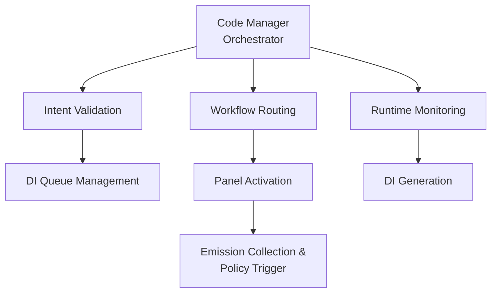

### 11.2 Coder Persona -- Execution Agent

The Coder is the primary execution agent. It operates under the direction of the Code Manager and within the constraints established by Layers 1, 2, and 3.

**Responsibilities:**

| Responsibility | Description |
|----------------|-------------|
| Branch Management | Creates and manages branches for assigned work items |
| Implementation | Writes code following repository standards and the cognitive execution plan |
| Plan Documentation | Produces implementation plans saved to `.governance/plans/` (consuming repos) or `governance/plans/` (Dark Factory Governance repo) for review |
| Standard Adherence | Follows language-specific templates and project conventions |
| Test Execution | Runs tests and ensures pass criteria are met |
| Artifact Production | Generates workflow artifacts (FEAT-N, BUG-N, etc.) at each phase |

**Authority Boundaries:**

The Coder can:
- Create branches and write code within the scope of assigned DIs
- Execute tests and report results
- Produce cognitive artifacts for workflow phases
- Request clarification from the Code Manager on ambiguous requirements

The Coder cannot:
- Self-assign work (all work is assigned through L1/L2)
- Skip workflow phases or gates
- Merge code (merge authority belongs to the policy engine or human reviewer)
- Modify governance artifacts (personas, policies, schemas)
- Override panel findings

**Relationship to Code Manager and Tester:**

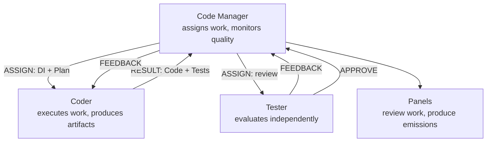

See [coder.md](../../governance/personas/agentic/coder.md) for the full persona definition.

### 11.3 Tester Persona -- Independent Evaluator

The Tester is the independent evaluator implementing Anthropic's **Evaluator-Optimizer** pattern. It assesses the Coder's output against acceptance criteria, test coverage requirements, and documentation standards. The Tester's approval is a mandatory gate before any review panels execute.

**Responsibilities:**

| Responsibility | Description |
|----------------|-------------|
| Test Verification | Run test suite, verify coverage thresholds, check for regressions |
| Acceptance Criteria | Evaluate implementation against the issue's acceptance criteria |
| Documentation Check | Verify that documentation matches the implementation |
| Structured Feedback | Emit typed FEEDBACK or APPROVE messages per Agent Protocol |

**Authority Boundaries:**

The Tester can:
- APPROVE or FEEDBACK on implementation quality
- Block progression to review panels until criteria are met
- Request specific changes or additional test coverage

The Tester cannot:
- Modify code directly
- Be overridden by the Coder (the Tester's judgment is independent)
- Skip evaluation (every implementation must be evaluated)
- Communicate directly with DevOps Engineer

**Feedback Loop:** The Tester can send up to 3 rounds of FEEDBACK before the Code Manager escalates to human review. This prevents infinite loops while ensuring quality.

See [tester.md](../../governance/personas/agentic/tester.md) for the full persona definition.

### 11.4 Panel Participants

Each panel consists of specialist personas that produce both Markdown reasoning and structured emissions. Panel participants operate within Layer 3 (Execution Governance) and have the authority to:

- Produce findings with severity ratings
- Recommend approval, changes, or rejection
- Flag policy-relevant conditions
- Request human review escalation
- Assign confidence scores to their assessments

Panel participants cannot:
- Block work unilaterally (the policy engine aggregates across panels)
- Modify the work under review
- Skip emission production
- Override another panel's findings

---

## 12. Decision Authority Matrix

### 12.1 Authority by Layer and Decision Type

| Decision | L1 Authority | L2 Authority | L3 Authority | L4 Authority | L5 Authority |
|----------|-------------|-------------|-------------|-------------|-------------|
| Accept/reject intent | Code Manager | -- | -- | -- | -- |
| Select workflow | -- | Panel Graph + Code Manager | -- | -- | -- |
| Assign personas | -- | Panel Graph + Code Manager | -- | -- | -- |
| Approve code changes | -- | -- | Policy Engine | -- | -- |
| Merge to main | -- | -- | Policy Engine OR Human | -- | -- |
| Deploy to production | -- | -- | Policy Engine + CI | -- | -- |
| Generate remediation DI | -- | -- | -- | Code Manager (automated) | -- |
| Activate Incident Commander | -- | -- | -- | Severity Mapping | -- |
| Modify persona definitions | -- | -- | -- | -- | Tech Debt Panel + Human |
| Modify policy profiles | -- | -- | -- | -- | Tech Debt Panel + Human |
| Modify schemas | -- | -- | -- | -- | Tech Debt Panel + Human |
| Override "block" decision | -- | -- | Human Only | -- | -- |
| Emergency production fix | -- | -- | Human + Incident Commander | Human + Incident Commander | -- |

### 12.2 Escalation Chain

When automated authority is insufficient, decisions escalate through this chain:

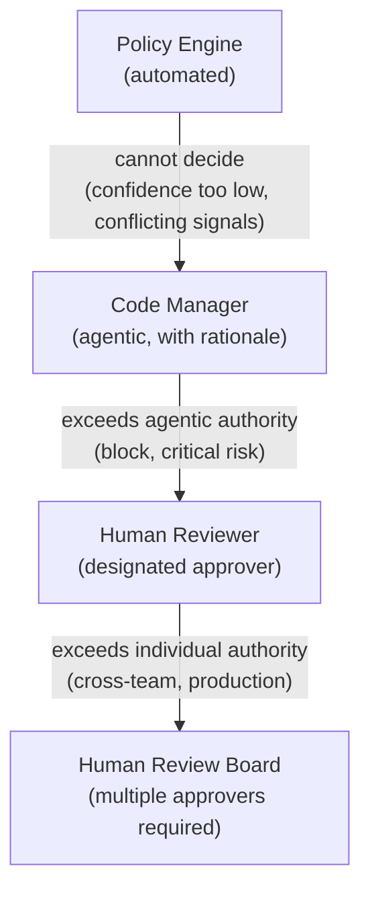

### 12.3 Auto-Merge Authority Conditions

The policy engine may approve an auto-merge ONLY when ALL of the following conditions are met:

| Condition | Threshold | Source |
|-----------|-----------|--------|
| All required panels executed | 100% | L2 panel assignments |
| All emissions pass schema validation | 100% | L3 schema validation |
| Aggregate confidence score | >= policy profile `auto_merge_threshold` | L3 policy evaluation |
| Maximum risk level | <= policy profile `max_auto_merge_risk` | L3 risk aggregation |
| Critical findings | 0 | L3 emission findings |
| Blocked policy flags | 0 | L3 policy flag check |
| Test suite | 100% pass | CI results |
| Human review requests from panels | 0 | L3 emission `requires_human_review` |
| Run manifest produced | yes | L3 manifest generation |

If ANY condition is not met, the decision falls through to `human_review_required` or `block` as appropriate.

---

## 13. Rationale Capture Requirements

### 13.1 Principle

Every decision made by the Dark Factory governance system -- whether by a persona, a panel, the policy engine, or a human -- must produce a documented rationale. Rationale is not optional commentary; it is a first-class governance artifact subject to the same schema validation and audit requirements as any other emission.

### 13.2 Rationale by Layer

| Layer | Decision Point | Rationale Requirement |
|-------|---------------|----------------------|
| L1 | Intent acceptance | Why this intent is valid and ready for processing |
| L1 | Intent rejection | Which validation rule failed and how to fix it |
| L1 | Intent prioritization | Why this priority level was assigned |
| L2 | Workflow selection | Why this workflow matches the intent type |
| L2 | Panel assignment | Why these panels are required (or why others are not) |
| L2 | Risk override activation | What risk indicators triggered additional panels |
| L3 | Panel findings | Why each finding was identified and at what severity |
| L3 | Confidence score | What factors contributed to the confidence level |
| L3 | Policy decision | Which thresholds were evaluated and their results |
| L3 | Human escalation | Why automated authority was insufficient |
| L4 | Drift detection | What drifted, from what baseline, by how much |
| L4 | DI generation | What runtime condition triggered the remediation need |
| L4 | Severity classification | Why this severity level was assigned to the event |
| L5 | Change proposal | Why the governance change is necessary |
| L5 | Compatibility assessment | How compatibility was evaluated and what the result was |
| L5 | Migration plan | Why each migration step is necessary |

### 13.3 Rationale Schema

Every rationale entry must contain:

| Field | Type | Required | Description |
|-------|------|----------|-------------|
| `rationale_id` | string | yes | Unique identifier |
| `decision_point` | string | yes | What decision was made |
| `layer` | enum | yes | Which governance layer (L1-L5) |
| `actor` | string | yes | Who/what made the decision (persona, policy engine, human) |
| `reasoning` | string | yes | The actual rationale text |
| `evidence` | array[string] | yes | References to data that informed the decision |
| `alternatives_considered` | array[object] | conditional | Required for L2 and L5 decisions |
| `timestamp` | ISO 8601 | yes | When the decision was made |

### 13.4 Rationale Completeness Validation

Rationale completeness is enforced at two points:

1. **Emission Validation (L3):** Structured emissions with empty or missing `rationale` fields fail schema validation and are rejected.

2. **Manifest Generation:** The run manifest aggregates all rationale entries for a unit of work. A manifest with missing rationale entries is flagged as incomplete and cannot support an `auto_merge` decision.

### 13.5 Rationale Anti-Patterns

The following are NOT valid rationale entries and will be rejected:

| Anti-Pattern | Example | Why Invalid |
|-------------|---------|-------------|
| Circular reasoning | "Approved because it looks good" | No evidence or criteria referenced |
| Absence of reasoning | "N/A" or empty string | Rationale is mandatory |
| Delegation without substance | "Per Code Manager direction" | Must include the Code Manager's reasoning |
| Tautological | "Risk is low because risk indicators are low" | Restates the conclusion without explaining why |
| Generic template | "Standard review completed, no issues found" | Must reference specific aspects reviewed |

---

## 14. Failure Taxonomy

### 14.1 Failure Severity Levels

| Severity | Definition | System Response |
|----------|-----------|----------------|
| **Critical** | Governance integrity compromised. System cannot guarantee correctness of decisions. | Full halt. Human intervention required. All in-flight work paused. |
| **Blocking** | Specific work item cannot proceed. Other work items unaffected. | Work item halted. Structured feedback provided. Remediation path defined. |
| **Escalation** | Automated authority insufficient. Decision requires higher authority. | Route to next level in escalation chain. Work item paused pending response. |
| **Warning** | Governance deviation detected but not blocking. | Log deviation. Flag for audit. Work may proceed with documented risk acceptance. |

### 14.2 Cross-Layer Failure Propagation

When a failure in one layer affects another:

```mermaid
flowchart TD
    subgraph L1_Fail["L1 Failure (bad intent)"]
        L1F1["L2 receives invalid input"]
        L1F2["L2-F001: Return to L1 for fix"]
        L1F1 --> L1F2
    end

    subgraph L2_Fail["L2 Failure (wrong routing)"]
        L2F1["L3 receives wrong plan"]
        L2F2["L3 detects mismatch via panel findings"]
        L2F3["L3 to L2: Re-route request with evidence"]
        L2F1 --> L2F2 --> L2F3
    end

    subgraph L3_Fail["L3 Failure (bad emission)"]
        L3F1["Manifest incomplete"]
        L3F2["auto_merge blocked\nhuman_review_required"]
        L3F1 --> L3F2
    end

    subgraph L4_Fail["L4 Failure (missed drift)"]
        L4F1["Undetected degradation"]
        L4F2["Incident occurs"]
        L4F3["L4 generates DI\n(reactive, not proactive)"]
        L4F1 --> L4F2 --> L4F3
    end

    subgraph L5_Fail["L5 Failure (breaking change without migration)"]
        L5F1["Consuming repos receive\nincompatible governance"]
        L5F2["L3 schema validation fails\nacross multiple repos"]
        L5F3["CRITICAL: System-wide halt\nRollback required"]
        L5F1 --> L5F2 --> L5F3
    end
```

### 14.3 Recovery Procedures

| Failure Category | Recovery Procedure |
|-----------------|-------------------|
| Intent validation failure | Re-submit with structured feedback applied |
| Cognitive routing failure | Re-classify intent; rebuild cognitive execution plan |
| Emission schema failure | Re-execute panel with corrected emission |
| Policy evaluation failure | Fall back to most restrictive policy; escalate to human |
| Runtime detection failure | Post-incident review; adjust thresholds; generate remediation DI |
| Evolution compatibility failure | Rollback submodule pin; apply migration plan; re-deploy |

---

## 15. Backward Compatibility

### 15.1 Compatibility Guarantees

This governance model is additive to the existing system. The following guarantees are maintained:

| Existing Component | Guarantee |
|-------------------|-----------|
| Markdown personas | Unchanged. Personas continue to function as cognitive roles. Governance adds structured emission requirements to panels, not to individual personas. |
| Panels | Unchanged in format. Governance adds the requirement to produce structured emissions alongside Markdown reasoning. |
| Workflow definitions | Unchanged in structure. Governance adds panel graph routing as a configuration layer above workflows. |
| Artifact naming (`[PREFIX-N]`) | Unchanged. Governance consumes these as cognitive artifacts. |
| Decision gates | Preserved. Governance adds the possibility of automated gate passage when policy conditions are met. Manual gates remain the fallback. |
| Submodule distribution | Unchanged. Governance artifacts are distributed through the same submodule mechanism. |
| Language templates | Unchanged. Templates are not governance artifacts. |
| MCP server integration | Unchanged. MCP servers are treated as opaque tool providers. |
| `project.yaml` | Extended, not replaced. Governance adds a `governance:` section. Existing configuration remains valid. |

### 15.2 Migration Path from Phase 3

The transition from Phase 3 to Phase 4 is incremental. Repositories can adopt governance capabilities progressively:

| Step | Change | Risk | Rollback |
|------|--------|------|----------|
| 1 | Add `governance:` section to `project.yaml` | None | Remove section |
| 2 | Add `governance/schemas/panel-output.schema.json` | None | Remove file |
| 3 | Update panels to produce structured emissions (alongside existing Markdown) | Low | Emissions are additive; remove JSON blocks |
| 4 | Add `governance/policy/` directory with policy profiles | None | Remove directory |
| 5 | Enable policy evaluation in CI | Medium | Disable CI check |
| 6 | Enable auto-merge for qualifying work items | Medium | Revert to manual gates |
| 7 | Enable runtime governance feedback loop | Low | Disable DI auto-generation |
| 8 | Enable evolution governance versioning | Low | Continue without versioning |

Each step can be adopted independently. Steps 1-4 are additive with zero risk. Steps 5-6 change merge behavior and should be adopted with monitoring. Steps 7-8 add autonomous capabilities.

---

## Appendix A: Architecture Diagrams

### A.1 Full Governance Pipeline

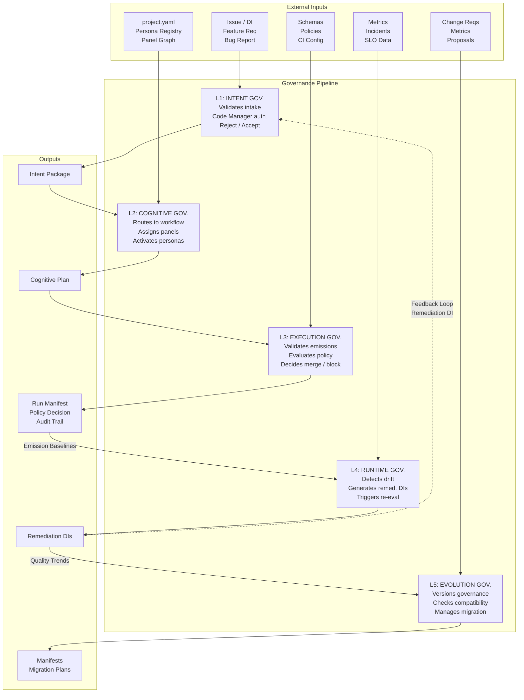

### A.2 Persona-to-Governance-Layer Mapping

| Governance Layer | Agentic Agents | Review Personas |
|-----------------|----------------|-----------------|
| **Session** (pre-pipeline) | DevOps Engineer (pre-flight, triage, routing) | — |
| **L1: Intent** | Code Manager (validation, routing) | Product Manager (requirements) |
| **L2: Cognitive** | Code Manager (panel selection, orchestration) | Architect, Tech Lead (via review prompts) |
| **L3: Execution** | Coder (implementation), Tester (evaluation) | All panel participants (21 panels), Policy Engine |
| **L4: Runtime** | Code Manager (DI generation) | Incident Commander, SRE, Observability Engineer |
| **L5: Evolution** | Code Manager (version management) | Refactor Specialist, Systems Architect, Tech Lead, Minimalist Engineer |

### A.3 Decision Flow for a Feature Request

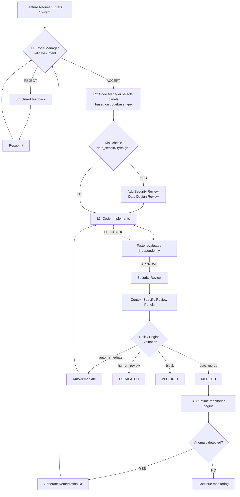

---

## Appendix B: Artifact Type Reference

### B.1 Artifact Classification

| Type | Format | Governance Role | Location | Versioned |
|------|--------|----------------|----------|-----------|
| **Cognitive** | Markdown | Human reasoning record. Not consumed by policy engine. | Workflow artifacts (`[FEAT-N]`, etc.) | By workflow execution |
| **Enforcement** | JSON/YAML | Machine-evaluated. Consumed by policy engine and CI. | `governance/schemas/`, `governance/policy/`, structured emissions | By schema version |
| **Audit** | Hybrid (JSON envelope + Markdown content) | Post-hoc analysis. Complete record of a governance decision. | `governance/manifests/`, run manifests | By manifest version |

### B.2 Directory-to-Artifact-Type Mapping

| Directory | Artifact Type | Description |
|-----------|--------------|-------------|
| `governance/personas/` | Cognitive | Persona definitions (Markdown) |
| `governance/prompts/reviews/` | Cognitive | Consolidated review prompts (Markdown) |
| `governance/prompts/` | Cognitive | Prompt templates (Markdown) |
| `governance/prompts/workflows/` | Cognitive | Workflow definitions (Markdown) |
| `governance/templates/` | Cognitive | Language-specific scaffolding |
| `governance/schemas/` | Enforcement | JSON Schema definitions |
| `governance/policy/` | Enforcement | Policy profiles (YAML) |
| `governance/manifests/` | Audit | Run manifests and governance version manifests |
| `docs/` | Cognitive | Architecture and specification documents |
| `governance/plans/` (Dark Factory Governance repo) / `.governance/plans/` (consuming repos) | Cognitive | Implementation plans |

### B.3 Required Emission Fields by Panel Type

| Panel Category | Base Fields | Additional Required Fields |
|---------------|-------------|---------------------------|
| Code Review panels | All base emission fields | `test_coverage_delta`, `regression_risk` |
| Architecture panels | All base emission fields | `scalability_assessment`, `reversibility` |
| Security panels | All base emission fields | `vulnerability_count`, `cve_references` |
| Performance panels | All base emission fields | `latency_impact`, `resource_impact` |
| Compliance panels | All base emission fields | `regulation_references`, `audit_status` |
| Operations panels | All base emission fields | `deployment_risk`, `rollback_viability` |

---

## Appendix C: Governance Layer Interaction Matrix

### C.1 Trigger Conditions Between Layers

| Triggering Layer | Receiving Layer | Trigger Condition | Data Passed |
|-----------------|-----------------|-------------------|-------------|
| L1 | L2 | Intent validated and accepted | Validated Intent Package |
| L2 | L1 | Intent cannot be routed (no matching workflow) | Rejection with reclassification request |
| L2 | L3 | Cognitive execution plan produced | Plan with persona assignments and panel schedule |
| L3 | L2 | Panel discovers need for additional review | Re-routing request with evidence |
| L3 | L4 | Work merged to production branch | Emission baselines for runtime monitoring |
| L4 | L1 | Runtime anomaly detected | Remediation DI |
| L4 | L3 | Previous emission invalidated by runtime data | Panel re-execution trigger |
| L5 | L1-L4 | Governance version updated | Updated schemas, policies, panel definitions |
| L3 | L5 | Emission quality trends over time | Aggregated quality metrics |
| L4 | L5 | Threshold adjustment needed | Threshold change proposal with evidence |

### C.2 Invariants

The following invariants must hold at all times:

1. **No work without intent.** Every code change must trace to a validated intent package (L1 output).
2. **No execution without plan.** Every code change must trace to a cognitive execution plan (L2 output).
3. **No merge without emission.** Every merge must have a complete set of structured emissions (L3 output).
4. **No merge without manifest.** Every merge must produce a run manifest (L3 output).
5. **No merge without rationale.** Every merge must have rationale entries for all decisions in its lineage.
6. **No governance change without version.** Every change to personas, policies, schemas, or workflows must produce a version bump.
7. **No breaking change without migration.** Every breaking governance change must have a migration plan reviewed by the Technical Debt Review panel.
8. **No suppressed emission.** Once produced, structured emissions cannot be modified or deleted. They are append-only.
9. **No circular remediation without halt.** Automated remediation chains (L4 -> L1 -> L2 -> L3 -> L4) must halt after a configurable maximum iteration count (default: 3).
10. **No unmonitored production.** Every merged change must have runtime governance baselines established within the L4 monitoring window.

---

*This document is a governance artifact subject to Evolution Governance (Layer 5). Changes to this document require a version bump, backward compatibility assessment, and review by the Technical Debt Review panel. The canonical location is `docs/architecture/governance-model.md` within the `.ai/` submodule.*

*Governance Model Version: 1.0.0*
*Document Classification: Foundational Specification*
*Enforcement: Effective upon adoption in `project.yaml` governance configuration*
