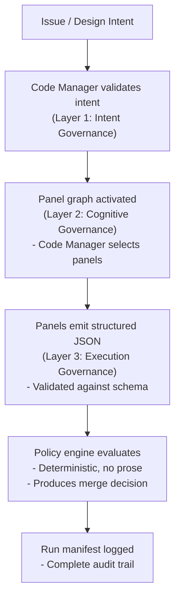

# Contributing to the Dark Factory Governance Platform

Welcome! We're glad you're interested in contributing to the Dark Factory Governance Platform. This guide will help you understand the project structure, development workflow, and contribution standards.

## What This Project Is

The Dark Factory Governance Platform is an **AI governance framework** for autonomous software delivery. It's distributed as a git submodule to consuming repositories and contains:

- **No application code** — only configuration, policy, schemas, and documentation
- **Governance artifacts** — personas, review prompts, policy profiles, and schemas
- **Agentic workflows** — six-agent pipeline for autonomous software delivery
- **Deterministic policy engine** — programmatic evaluation with no AI interpretation

Current maturity: **Phase 4b (Autonomous Remediation)** — all governance artifacts implemented. Phase 5 sub-phases (5a-5e) are defined with achievability assessments.

## What We Accept

We welcome contributions in these areas:

| Type | Examples |
|------|----------|
| **Governance artifacts** | New policy profiles, panel reviews, persona refinements |
| **Documentation** | Tutorials, architecture guides, onboarding improvements |
| **Policy engine** | Bug fixes, test coverage, schema validation |
| **Workflow improvements** | CI enhancements, automation, tooling |
| **Templates** | Language-specific conventions (Go, Python, Node, React, C#) |
| **Bug fixes** | Anything that's broken or behaving incorrectly |

We **do not accept**:

- Application code (this is a governance framework, not an app)
- Breaking changes without migration plans and version bumps
- Changes that bypass governance (e.g., modifying `jm-compliance.yml` — it's enterprise-locked)

## Getting Started

### Prerequisites

- **Git** — with submodule support
- **Python 3.12+** — for the policy engine (`governance/engine/`)
- **GitHub CLI (`gh`)** — for working with issues and PRs
- **MkDocs** — for previewing documentation (optional: `pip install mkdocs-material`)

### Fork and Clone

1. Fork the repository on GitHub
2. Clone your fork with submodules:

```bash
git clone --recurse-submodules git@github.com:YOUR_USERNAME/ai-submodule.git
cd ai-submodule
```

3. Add the upstream remote:

```bash
git remote add upstream git@github.com:SET-Apps/ai-submodule.git
```

### Install Dependencies

Run the bootstrap script to set up your environment:

```bash
bash bin/init.sh --install-deps
```

This will:
- Create a Python virtual environment at `.venv/`
- Install policy engine dependencies from `governance/engine/pyproject.toml`
- Validate your setup

**Manual installation:**

```bash
cd governance/engine
python -m venv .venv
source .venv/bin/activate  # or .venv\Scripts\activate on Windows
pip install -e ".[dev]"
```

## Development Workflow

Every contribution follows the governance pipeline. No exceptions.

### 1. Create an Issue

Before writing code, create a GitHub issue describing:

- **What** you want to change
- **Why** it's needed
- **How** you plan to implement it (high-level)

Use the issue templates:
- [Feature Request](.github/ISSUE_TEMPLATE/feature-request.yml)
- [Bug Report](.github/ISSUE_TEMPLATE/bug-report.yml)

### 2. Write a Plan

Every implementation requires a plan before code. Use the plan template:

```bash
cp governance/prompts/templates/plan-template.md .governance/plans/348-contributing-page.md
```

Fill in all sections:
- Objective, rationale, scope
- Approach, testing strategy, risk assessment
- Dependencies, backward compatibility, governance expectations

Plans are auditable decision records. They're archived to releases after merge.

### 3. Create a Branch

Branch naming convention:

```bash
git checkout -b NETWORK_ID/{type}/{issue-number}/{short-name}
```

Examples:
- `NETWORK_ID/feat/42/add-auth`
- `NETWORK_ID/fix/99/schema-validation`
- `NETWORK_ID/docs/348/contributing-page`

### 4. Implement the Change

Follow these standards:

**Commit style:** Conventional commits

```bash
feat: add new policy profile for healthcare compliance
fix: correct schema validation for panel emissions
docs: add contributing guide for the governance framework
refactor: consolidate persona definitions into review prompts
chore: update dependencies in policy engine
```

**Testing requirements:**

- Policy engine changes **must** include tests in `governance/engine/tests/`
- Run the test suite: `python -m pytest governance/engine/tests/`
- Aim for >80% coverage on new code

**Documentation updates:**

- Update affected docs in the same commit
- Check `CLAUDE.md`, `README.md`, and `GOALS.md` for references to changed behavior
- If adding a feature, document it in `docs/`

**Backward compatibility:**

- All changes must be additive
- Breaking changes require migration plans and version bumps
- Update `CHANGELOG.md` for user-facing changes

### 5. Test Locally

Run the policy engine test suite:

```bash
cd governance/engine
python -m pytest tests/ -v
```

Preview documentation changes:

```bash
mkdocs serve
# Open http://127.0.0.1:8000 in your browser
```

Validate schemas:

```bash
python governance/engine/policy_engine.py --validate
```

### 6. Create a Pull Request

Push your branch and create a PR:

```bash
git push origin NETWORK_ID/docs/348/contributing-page
gh pr create --title "docs: add contributing guide" --body "Closes #348"
```

**PR checklist:**

- [ ] Plan exists in `.governance/plans/`
- [ ] Tests pass locally
- [ ] Documentation updated
- [ ] CHANGELOG.md updated (if user-facing)
- [ ] Commit messages follow conventional commit format
- [ ] No breaking changes (or migration plan provided)

### 7. Governance Review

Your PR will trigger the Dark Factory Governance workflow (`.github/workflows/dark-factory-governance.yml`):

1. **Panel reviews execute** — code-review, security-review, documentation-review, and context-specific panels
2. **Structured emissions validated** — JSON output checked against `governance/schemas/panel-output.schema.json`
3. **Policy engine evaluates** — deterministic merge decision produced
4. **Result**: `auto_merge`, `auto_remediate`, `human_review_required`, or `block`

**What happens next:**

- **Auto-merge** — PR merges automatically after all checks pass and reviews are resolved
- **Human review** — A maintainer will review and decide
- **Block** — Critical issues found; address feedback and push updates

The governance workflow will comment on your PR with panel emissions and the merge decision.

### 8. Address Feedback

If panels request changes:

1. Read the panel emissions in the PR comment
2. Make the requested changes
3. Push to your branch — CI re-runs automatically
4. The process repeats until approval or 3 cycles (then escalates to human review)

## Code Standards

### Conventional Commits

Use these prefixes:

| Prefix | When to Use |
|--------|-------------|
| `feat:` | New feature or governance artifact |
| `fix:` | Bug fix |
| `docs:` | Documentation only |
| `refactor:` | Code restructure without behavior change |
| `test:` | Adding or fixing tests |
| `chore:` | Tooling, dependencies, non-code changes |

### Branch Naming

Pattern: `NETWORK_ID/{type}/{issue-number}/{short-name}`

- `{type}`: `feat`, `fix`, `docs`, `refactor`, `test`, `chore`
- `{issue-number}`: GitHub issue number
- `{short-name}`: kebab-case description (3-5 words max)

### File Organization

| Directory | Purpose | Mutability |
|-----------|---------|------------|
| `governance/prompts/reviews/` | 21 consolidated review prompts | Editable (cognitive artifacts) |
| `governance/personas/agentic/` | 6 agentic personas | Editable (cognitive artifacts) |
| `governance/policy/` | Deterministic policy profiles (YAML) | Versioned (enforcement artifacts) |
| `governance/schemas/` | JSON Schema definitions | Versioned (enforcement artifacts) |
| `governance/engine/` | Python policy engine + tests | Standard code (with tests) |
| `governance/templates/` | Language-specific project templates | Editable |
| `docs/` | Documentation (MkDocs) | Editable |
| `.governance/plans/` | Implementation plans | Append-only (archived on merge) |
| `governance/manifests/` | Run manifests | Append-only (audit artifacts) |

### Testing

**Policy engine tests:**

```bash
cd governance/engine
python -m pytest tests/ -v --cov=governance.engine --cov-report=term
```

Test categories:
- `test_policy_engine.py` — Core policy evaluation logic
- `test_policy_integration.py` — Cross-profile integration tests
- `test_schema_validation.py` — Schema validation tests
- `test_scenarios.py` — Real-world scenario tests
- `test_property_based.py` — Property-based fuzzing with Hypothesis

**Bootstrap script tests:**

```bash
bats tests/bats/test_init.bats
```

**Coverage expectations:**
- Policy engine: >80%
- Schemas: 100% (must validate correctly)
- Critical paths: 100% (merge decision logic, risk aggregation)

## Documentation

### Structure

Documentation lives in `docs/` and is built with MkDocs:

```
docs/
  onboarding/         # Getting started guides
  architecture/       # Design and architecture docs
  configuration/      # Setup and integration guides
  governance/         # Governance processes
  operations/         # Operational guides and metrics
  research/           # Research and evaluation
  decisions/          # Architectural decision records (ADRs)
  tutorials/          # End-to-end guides
```

### Adding Documentation

1. Create a new `.md` file in the appropriate subdirectory
2. Add it to `mkdocs.yml` under `nav:`
3. Preview locally: `mkdocs serve`
4. Commit with the change that requires the documentation

### Style Guidelines

- **Be concise** — developers scan docs, they don't read novels
- **Show, don't tell** — prefer code examples over prose
- **Use tables** — for comparisons, options, and structured info
- **Link liberally** — cross-reference related docs
- **Avoid emojis** — keep it professional

## Governance Pipeline

Every change flows through five governance layers:



### Required Panels

All PRs trigger these panels:
- `code-review` — Code quality, style, structure
- `security-review` — Security vulnerabilities, secrets exposure
- `documentation-review` — Docs completeness and accuracy
- `threat-modeling` — Security threats and mitigations
- `cost-analysis` — Resource usage and cost impact
- `data-governance-review` — PII, data classification, compliance

Context-specific panels (triggered by file paths or keywords):
- `architecture-review` — For structural changes
- `testing-review` — For test coverage changes
- `performance-review` — For performance-sensitive code
- `ai-expert-review` — For AI/ML changes

### Policy Profiles

Four deterministic profiles in `governance/policy/`:

| Profile | Use Case | Auto-Merge |
|---------|----------|------------|
| `default.yaml` | Standard repositories | Enabled with conditions |
| `fin_pii_high.yaml` | SOC2/PCI-DSS/HIPAA/GDPR | Disabled (3-approver override) |
| `infrastructure_critical.yaml` | Production stability | Enabled with mandatory reviews |
| `reduced_touchpoint.yaml` | Near-full autonomy (Phase 5e) | Enabled except overrides/dismissals |

This repository uses `default.yaml`.

### CI Workflow

The governance workflow (`.github/workflows/dark-factory-governance.yml`) runs on every PR:

1. **Detect** — Find governance root and check for panel emissions
2. **Policy Engine** — Evaluate emissions and produce merge decision
3. **Review** — Execute required panels via GitHub Copilot (optional)
4. **Comment** — Post merge decision and panel summaries to PR

The workflow blocks merges when:
- Required panel emissions are missing
- Policy engine returns `block` decision
- Critical security findings are unresolved
- Tests fail

## Directory Structure

Key directories for contributors:

```
.ai/  (or repo root when working on this repo directly)
  bin/                         Executable scripts (init.sh, issue-monitor.sh)
  governance/
    personas/agentic/          6 agentic personas (Project Manager, DevOps Engineer, Code Manager, Coder, IaC Engineer, Tester)
    prompts/
      reviews/                 21 consolidated review prompts (canonical)
      shared-perspectives.md   Canonical perspective definitions
      startup.md               Agentic loop entry point
      agent-protocol.md        Inter-agent communication protocol
      templates/               Reusable document templates (plan-template.md)
      workflows/               Multi-phase orchestration prompts
    policy/                    4 policy profiles + supporting rules (YAML)
    schemas/                   JSON Schema definitions (20+ schemas)
    engine/                    Python policy engine + test suite
      tests/                   pytest test suite (7 test modules)
    templates/                 Language-specific project templates (go/, python/, node/, react/, csharp/)
    manifests/                 Run manifests (audit trail, append-only)
  .governance/
    plans/                     Implementation plans (archived to releases on merge)
  docs/                        Documentation (MkDocs)
    architecture/              Design and architecture
    configuration/             Setup and integration
    governance/                Governance processes
    onboarding/                Getting started guides
    operations/                Operational guides
    research/                  Research and evaluation
    decisions/                 ADRs
    tutorials/                 End-to-end guides
  .github/
    workflows/                 CI workflows (governance, plan-archival, issue-monitor, propagate-submodule)
    ISSUE_TEMPLATE/            Structured issue forms
```

## Agentic Development

This repository uses the agentic pipeline for development. You can invoke it with:

```bash
# In Claude Code or GitHub Copilot:
/startup
```

This activates the 6-agent pipeline:

1. **DevOps Engineer** — Pre-flight checks, issue triage, routing
2. **Code Manager** — Intent validation, panel selection, review coordination
3. **Coder** — Implementation, tests, structured output
4. **IaC Engineer** — Infrastructure execution (conditional)
5. **Tester** — Independent evaluation, feedback, approval

The pipeline loops until the session cap is hit or no work remains. See [startup.md](governance/prompts/startup.md) for the full protocol.

## Getting Help

- **Documentation:** [Dark Factory Governance Docs](https://set-apps.github.io/ai-submodule)
- **Issues:** [Dark Factory Governance Issues](https://github.com/SET-Apps/ai-submodule/issues)
- **Pull Requests:** [Dark Factory Governance PRs](https://github.com/SET-Apps/ai-submodule/pulls)

**Common questions:**

- **How do I preview my changes?** Run `mkdocs serve` for docs, `python -m pytest` for tests.
- **Why was my PR blocked?** Check the governance workflow comment for panel emissions and policy decision.
- **Can I skip the governance pipeline?** No. It applies to all changes. You can opt out at the project level with `governance.skip_panel_validation: true` in `project.yaml`, but this is not recommended.
- **How do I test the policy engine?** `cd governance/engine && python -m pytest tests/ -v`
- **Where do I add documentation?** In `docs/` with a link in `mkdocs.yml`.

## License

This project is licensed under the MIT License. By contributing, you agree to license your contributions under the same license.

## Code of Conduct

- **Be respectful** — Treat all contributors with respect.
- **Be constructive** — Provide actionable feedback.
- **Be patient** — Everyone is learning.
- **Be collaborative** — We're building this together.

## Thank You

Your contributions make this project better. Thank you for taking the time to contribute to the Dark Factory Governance Platform.
