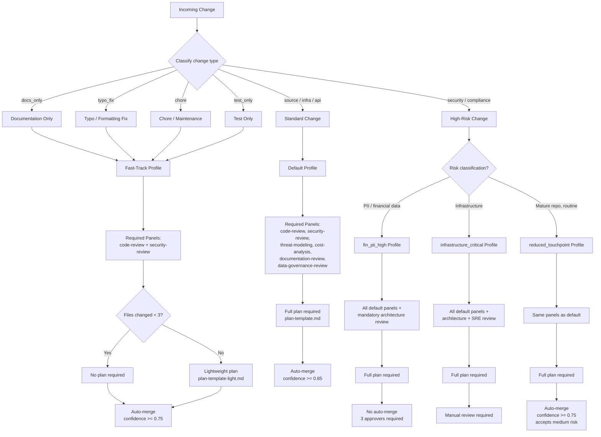

# Ceremony Decision Tree

This guide shows how change type determines the governance ceremony level: which policy profile applies, which panels are required, and whether a formal plan is needed.

## Decision Flowchart

## Change Type Classification

| Change Type | Description | Example |
|-------------|-------------|---------|
| `docs_only` | Only documentation files changed (`.md`, `docs/`) | README update, guide addition |
| `typo_fix` | Typo or formatting corrections | Fix spelling in comments |
| `chore` | Maintenance tasks with no behavior change | Dependency bump, CI config tweak |
| `test_only` | Only test files added or modified | New unit test, test refactor |
| Standard | Application source, libraries, packages | Feature implementation, bug fix |
| High-risk | Security, compliance, infrastructure, data | Auth changes, DB migrations, IaC |

## Panel Requirements by Profile

| Panel | fast-track | default | reduced_touchpoint | fin_pii_high | infrastructure_critical |
|-------|:----------:|:-------:|:------------------:|:------------:|:----------------------:|
| code-review | Required | Required | Required | Required | Required |
| security-review | Required | Required | Required | Required | Required |
| threat-modeling | -- | Required | Required | Required | Required |
| cost-analysis | -- | Required | Required | Required | Required |
| documentation-review | Optional | Required | Required | Required | Required |
| data-governance-review | -- | Required | Required | Required | Required |

## Panel Overrides by Change Type (default profile)

When using the default profile, the required panels can be narrowed based on change type:

| Change Type | Required Panels | Optional Panels |
|-------------|-----------------|-----------------|
| `docs_only` | documentation-review, security-review | code-review |
| `chore` | code-review, security-review | documentation-review |
| `test_only` | testing-review, code-review, security-review | -- |

These overrides are defined in `governance/policy/default.yaml` under `panel_overrides_by_change_type`.

## Plan Requirements

| Profile | Plan Required | Template |
|---------|:------------:|----------|
| fast-track (< 3 files) | No | -- |
| fast-track (>= 3 files) | Yes | `plan-template-light.md` |
| default | Yes | `plan-template.md` |
| reduced_touchpoint | Yes | `plan-template.md` |
| fin_pii_high | Yes | `plan-template.md` |
| infrastructure_critical | Yes | `plan-template.md` |

## Auto-Merge Thresholds

| Profile | Confidence Threshold | Accepts Medium Risk | Human Approval |
|---------|:-------------------:|:-------------------:|:--------------:|
| fast-track | 0.75 | Yes | No |
| default | 0.85 | No | On escalation |
| reduced_touchpoint | 0.75 | Yes | Override only |
| fin_pii_high | -- | -- | Always required |
| infrastructure_critical | -- | -- | Always required |

## Security-Review Is Non-Negotiable

Regardless of change type, profile, or ceremony level, `security-review` is **always required**. This is enforced at every level:

- All policy profiles include `security-review` in `required_panels`
- All `panel_overrides_by_change_type` entries include `security-review`
- The fast-track profile requires `security-review` even for documentation-only changes
