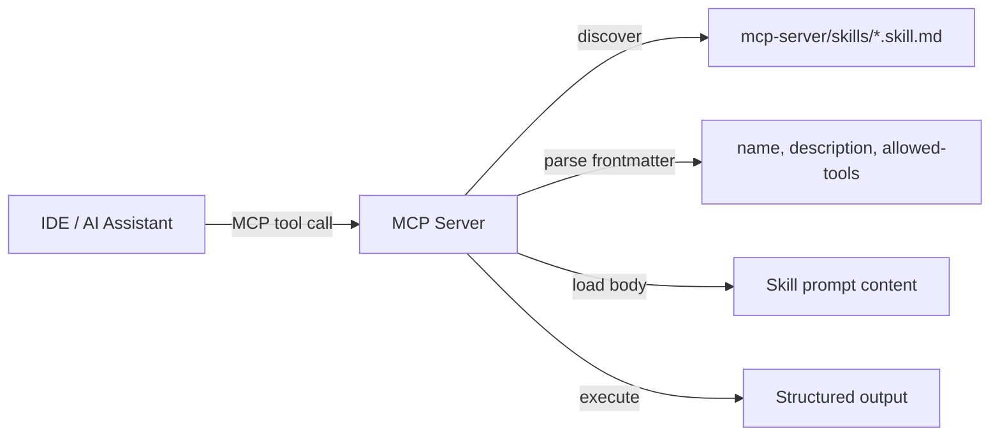

# Skills Development Guide

Skills are self-contained, composable capabilities exposed by the MCP server as tools. Each skill is a Markdown file with structured frontmatter that defines its scope, allowed tools, and execution instructions.

## How Skills Work

1. Skill files (`.skill.md`) are placed in `mcp-server/skills/`
2. The MCP server discovers skill files at startup, parses frontmatter, and registers each as an MCP tool
3. When invoked, the skill's Markdown body is loaded as the prompt, with Zod-validated input parameters
4. Tool access is restricted to the `allowed-tools` whitelist in the frontmatter



## Frontmatter Schema

```yaml
---
name: governance-review                # Machine-readable skill name (kebab-case)
description: Run a governance panel    # Short description (one line)
  review against code changes
allowed-tools:                         # Tools this skill can invoke
  - Read
  - Glob
  - Grep
  - Bash
---
```

| Field | Type | Required | Description |
|-------|------|----------|-------------|
| `name` | string | Yes | Skill identifier (kebab-case). Used in MCP tool registration |
| `description` | string | Yes | Human-readable description of what the skill does |
| `allowed-tools` | array of strings | Yes | Whitelist of tools the skill is permitted to use. Restricts execution scope for safety |

## Skill Tool Input Schema

When a skill is invoked via MCP, it accepts the following parameters:

| Parameter | Type | Required | Description |
|-----------|------|----------|-------------|
| `task` | string | Yes | The specific task to perform (e.g., "Review PR #42") |
| `context` | string | No | Additional context for the skill execution |
| `output_format` | string | No | Desired output format (e.g., "json", "markdown") |

## Existing Skills

| Skill | File | Description | Allowed Tools |
|-------|------|-------------|---------------|
| governance-review | `mcp-server/skills/governance-review.skill.md` | Run governance panel reviews against code changes | Read, Glob, Grep, Bash |

### governance-review

The governance-review skill instructs the AI to:

1. Identify changes in the current repository
2. Select appropriate review panels from `governance/prompts/reviews/`
3. Execute required panels: code-review, security-review, threat-modeling, cost-analysis, documentation-review, data-governance-review
4. Produce structured emission JSON between `<!-- STRUCTURED_EMISSION_START -->` and `<!-- STRUCTURED_EMISSION_END -->` markers
5. Validate emissions against `governance/schemas/panel-output.schema.json`

## Creating a New Skill

### Step 1: Create the skill file

Create a new `.skill.md` file in `mcp-server/skills/`:

```bash
touch mcp-server/skills/my-skill.skill.md
```

### Step 2: Add frontmatter

Define the skill metadata and allowed tools:

```yaml
---
name: my-skill
description: Short description of what this skill does
allowed-tools:
  - Read
  - Glob
  - Grep
---
```

**Tool selection guidelines:**
- Use the minimum set of tools needed for the skill's purpose
- `Read`, `Glob`, `Grep` — safe for read-only analysis skills
- `Bash` — needed for skills that run commands (tests, linters, generators)
- `Edit`, `Write` — needed for skills that modify files (use with caution)

### Step 3: Write the skill body

Below the frontmatter, write the skill prompt in Markdown. This becomes the instruction set when the skill is invoked.

```markdown
---
name: my-skill
description: Analyze code complexity metrics
allowed-tools:
  - Read
  - Glob
  - Grep
---

# Code Complexity Analysis

Analyze the codebase and report complexity metrics.

## Instructions

1. Use Glob to find all source files matching the project's language
2. Use Read to examine each file
3. Calculate cyclomatic complexity, function length, and nesting depth
4. Report findings in a structured format

## Output Format

Return a JSON object with:
- `files_analyzed`: number of files
- `findings`: array of `{file, function, complexity, recommendation}`
- `summary`: overall complexity assessment
```

### Step 4: Rebuild the MCP server

```bash
cd mcp-server
npm run build
```

The skill will be automatically discovered and registered on the next server start.

### Step 5: Test the skill

```bash
# Start the MCP server
node dist/index.js --governance-root /path/to/repo

# The skill should appear in the MCP tool list
```

## Best Practices

- **Single responsibility** — Each skill should do one thing well
- **Minimal tool access** — Only whitelist the tools the skill actually needs
- **Structured output** — Define clear output formats in the skill body
- **Idempotent** — Skills should produce the same output for the same input
- **Documentation** — Include clear instructions and examples in the skill body

## Related Documents

- [MCP Server Usage](mcp-server-usage.md) — MCP server setup and configuration
- [Prompt Library](prompt-library.md) — Developer prompts (different from skills)
- [MCP Security Guidelines](mcp-security-guidelines.md) — Security considerations for MCP tools
