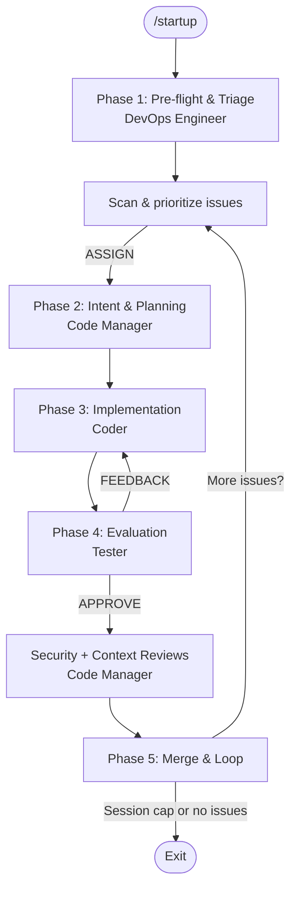

# Dark Factory Governance Framework

AI governance framework for autonomous software delivery.

---

## What is Dark Factory?

Dark Factory is a governance platform distributed as a git submodule that provides structured oversight for AI-driven software delivery. It enforces policy, manages multi-agent orchestration, and produces auditable decision records -- all without containing application source code.

**Current maturity: Phase 4b (Autonomous Remediation)**

## Quick Start

New to the platform? Start here:

1. **[Simple Explainer](onboarding/eli5.md)** -- Plain-language overview of what this is and why it exists
2. **[Developer Guide](onboarding/developer-guide.md)** -- Quick-start onboarding for engineers
3. **[Repository Setup](configuration/repository-setup.md)** -- Configure your project
4. **[End-to-End Walkthrough](tutorials/end-to-end-walkthrough.md)** -- Complete pipeline walkthrough

## Five Governance Layers

Every code change flows through these layers in order:

| Layer | Name | Purpose |
|-------|------|---------|
| 1 | **Intent** | Design Intent intake, completeness validation, risk classification |
| 2 | **Cognitive** | Persona-based reasoning via multi-persona panels producing structured emissions |
| 3 | **Execution** | Deterministic policy engine evaluates panel emissions, produces merge decisions |
| 4 | **Runtime** | Drift detection, incident-to-DI generation |
| 5 | **Evolution** | Self-improvement loops with backward compatibility checks |

## Agentic Architecture

The agentic loop uses a multi-agent prompt-chained pipeline. Start it with `/startup` in your AI tool.

| Persona | Pattern | Role |
|---------|---------|------|
| DevOps Engineer | Routing | Session entry, pre-flight, triage, issue routing |
| Code Manager | Orchestrator-Workers | Intent validation, panel selection, review coordination, merge |
| Coder | Worker | Implementation, tests, documentation |
| IaC Engineer | Worker | Infrastructure execution (Bicep/Terraform) |
| Tester | Evaluator-Optimizer | Independent evaluation, test coverage gate, structured feedback |



## Policy Profiles

Four deterministic YAML profiles control governance behavior:

- **default** -- Standard risk tolerance, auto-merge enabled with conditions
- **fin_pii_high** -- SOC2/PCI-DSS/HIPAA/GDPR, auto-merge disabled, 3-approver override
- **infrastructure_critical** -- Mandatory architecture and SRE review
- **reduced_touchpoint** -- Near-full autonomy, human approval only for policy overrides

## Documentation Sections

| Section | What You'll Find |
|---------|-----------------|
| [Architecture](architecture/governance-model.md) | Governance layers, agent design, context management, formal specs |
| [Configuration](configuration/repository-setup.md) | Repository setup, CI gating, Copilot integration |
| [Governance](governance/artifact-classification.md) | Artifact classification, acceptance verification, manifest lifecycle |
| [Operations](operations/autonomy-metrics.md) | Autonomy metrics, threshold tuning, token costs |
| [Research](research/README.md) | Research backing persona consolidation and technique comparison |
| [Decisions](decisions/README.md) | Architectural Decision Records (ADRs) |

## Bootstrap

```bash
# From your consuming repository:
git submodule add git@github.com:SET-Apps/ai-submodule.git .ai
bash .ai/bin/init.sh --install-deps
```
