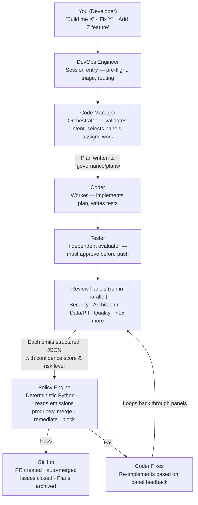
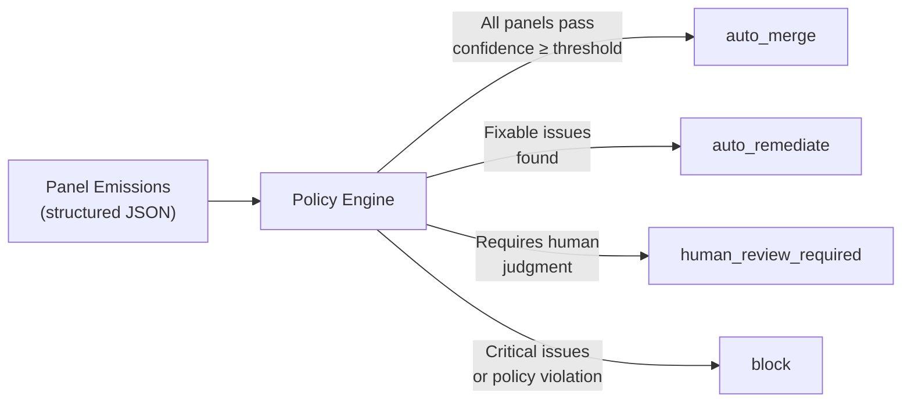

# Architecture — Visual Overview

How a developer request becomes governed, tested, merged code.

---

## Pipeline Flow

---

## Agent Roles

| Agent | Role | Pattern |
|-------|------|---------|
| **You (Developer)** | Initiates requests via natural language or `/startup` | Human in the loop |
| **DevOps Engineer** | Session entry — pre-flight checks, submodule freshness, issue triage, routing | Anthropic's Routing pattern |
| **Code Manager** | Orchestrator — validates intent, selects review panels, assigns Coder agents, coordinates merge | Orchestrator-Workers pattern |
| **Coder** | Worker — implements plan, writes tests, produces structured output. Runs in isolated git worktrees for parallel execution | Worker pattern |
| **IaC Engineer** | Worker — infrastructure execution (Bicep/Terraform), security-first defaults. Dispatched only for infrastructure changes | Worker pattern |
| **Tester** | Independent evaluator — test coverage gate, documentation verification, structured feedback | Evaluator-Optimizer pattern |

---

## Review Panels

21 consolidated review prompts execute in parallel on every change. Each panel emits structured JSON validated against `panel-output.schema.json`:

| Panel Category | What It Reviews |
|---------------|----------------|
| **Security** | Vulnerabilities, OWASP top 10, dependency risks, secrets exposure |
| **Architecture** | Design patterns, separation of concerns, backward compatibility |
| **Data / PII** | PII exposure, data classification, GDPR/HIPAA compliance |
| **Quality** | Code quality, test coverage, documentation completeness |
| **Cost** | Cloud resource costs, performance implications |
| **Threat Modeling** | Attack surface analysis, trust boundaries |

---

## Policy Engine Decision Flow

The policy engine is **deterministic Python** — no AI interprets policy rules. It reads panel emissions and produces one of four outcomes:

---

## Audit Trail

Every decision is recorded:

| Artifact | Location | Mutability |
|----------|----------|------------|
| **Plans** | `.governance/plans/` | Written before implementation, archived to GitHub Releases on merge |
| **Panel Emissions** | `.governance/panels/` | Latest per panel type (overwrite strategy) |
| **Run Manifests** | `governance/manifests/` | Immutable — complete audit trail for replay and compliance |
| **Checkpoints** | `.governance/checkpoints/` | Session state for resumption across context resets |

---

## Legend

| Color | Meaning |
|-------|---------|
| **Blue** | DevOps Engineer (session entry) / Developer |
| **Purple** | Code Manager (orchestrator) |
| **Green** | Tester (evaluator) / GitHub (remote mode) |
| **Orange** | Review Panels (21 total, dynamically selected) |
| **Yellow** | Policy Engine (deterministic) |
| **Dashed** | Audit trail artifacts |

---

*See the [Windows Onboarding](windows-onboarding.md) guide for step-by-step setup, or the [Governance Model](../architecture/governance-model.md) for the full five-layer architecture.*
