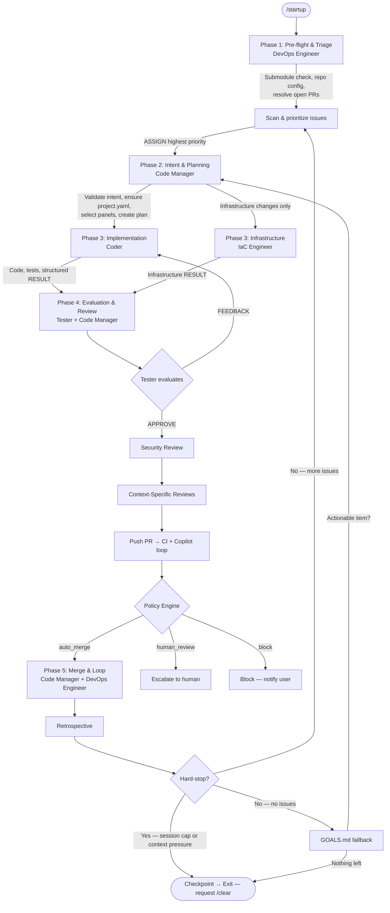

# Developer Quick Guide

TLDR for developers adopting the Dark Factory Governance Platform.

## What Is This?

A git submodule (`.ai/`) that gives your repository AI-powered governance: automated code review panels, deterministic merge policies, structured audit trails, and agentic workflows. No application code — just configuration, personas, policies, and schemas.

## Quick Start

### 1. Add to your repo

```bash
git submodule add git@github.com:SET-Apps/ai-submodule.git .ai
bash .ai/bin/init.sh   # macOS/Linux — creates symlinks for Claude Code and GitHub Copilot
git commit -m "Add .ai governance submodule"
```

**Windows (PowerShell):**
```powershell
git submodule add git@github.com:SET-Apps/ai-submodule.git .ai
powershell -ExecutionPolicy Bypass -File .ai\bin\init.ps1
git commit -m "Add .ai governance submodule"
```

> Windows requires Python 3.12+ for the policy engine. Install from [python.org](https://www.python.org/downloads/), then run `pip install jsonschema pyyaml`.

### 2. Configure for your stack

```bash
cp .ai/governance/templates/python/project.yaml project.yaml   # or go/, node/, react/, csharp/
# Or skip this — the Code Manager auto-generates project.yaml during /startup
```

Edit `project.yaml` to set your project name, language, and policy profile. If you skip this step, the Code Manager will analyze your repo and create `project.yaml` automatically during the first `/startup` session. See [policy profiles](../architecture/governance-model.md) for guidance on which profile fits your use case.

### 3. Update when the submodule changes

```bash
git submodule update --remote .ai
git add .ai && git commit -m "Update .ai submodule"
```

## Starting the Agentic Loop

Run `/startup` in your AI tool (Claude Code or GitHub Copilot). This activates the 6-agent pipeline:

```
/startup
```

The pipeline chains six agents through five phases, looping until the session cap is hit. An optional Project Manager mode (`governance.use_project_manager: true`) enables multiplexed Code Managers for higher throughput.



**What happens when you run `/startup`:**

1. **DevOps Engineer** checks submodule freshness, verifies repo configuration, resolves any open PRs, then scans and prioritizes issues
2. **Code Manager** validates the issue's intent, auto-manages `project.yaml`, selects review panels based on codebase type, and creates a plan
3. **Coder** implements the plan, writes tests, and emits a structured RESULT. **IaC Engineer** handles infrastructure changes (conditional — infrastructure changes only)
4. **Tester** independently evaluates the work — sends FEEDBACK (up to 3 cycles) or APPROVE
5. **Code Manager** runs security review, context-specific panels, pushes the PR, monitors CI/Copilot
6. After merge, loops back to Phase 1 for the next batch — checkpoints only on hard-stop (max 5 per session)

See [startup.md](../../governance/prompts/startup.md) for the full protocol and [agent-protocol.md](../../governance/prompts/agent-protocol.md) for inter-agent communication.

## Common Operations

**Write a plan before coding** — Every non-trivial change needs a plan:
```bash
cp .ai/governance/prompts/templates/plan-template.md .governance/plans/42-my-feature.md
```

**Branch naming:** `NETWORK_ID/{type}/{issue-number}/{short-name}` (e.g., `NETWORK_ID/feat/42/add-auth`)

**Commit style:** Conventional commits — `feat:`, `fix:`, `refactor:`, `docs:`, `chore:`

**Apply repo settings:** `bash .ai/bin/init.sh` — creates symlinks, copies workflows, configures GitHub settings. See [repository configuration](../configuration/repository-setup.md) for details and per-project overrides.

**Context management:** Stop at 80% context capacity. Checkpoint. Request `/clear`. See [context management](../architecture/context-management.md) for the full strategy.

## Where Things Live

Emitted output (plans, panels, checkpoints, state) uses identical `.governance/` paths in both the Dark Factory Governance repository and consuming repos. Read-only governance sources (personas, prompts, policies, schemas) differ — consumers access them via the `.ai/` submodule prefix.

For a complete breakdown of the project structure, see [Project Structure](project-structure.md).

## Recovery & Re-Entry Patterns

When the agentic loop stops — context reset, crash, stuck PR, dirty git state — use these patterns to get back in.

### Resume from a checkpoint

```bash
ls -t .governance/checkpoints/*.json | head -1   # find the most recent checkpoint
cat .governance/checkpoints/<latest>.json         # see where things left off
```

Then tell the agent: `continue` or `Resume from checkpoint: .governance/checkpoints/<file>`. See [checkpoint resumption workflow](../../governance/prompts/checkpoint-resumption-workflow.md) for the full protocol.

### No checkpoint exists

```bash
git status && git branch --show-current   # what branch, is it clean?
gh pr list --state open --author @me      # open PRs from the agent?
gh issue list --state open --limit 10     # what was being worked on?
```

Then tell the agent: `/startup`. It will run a fresh scan — open PRs first, then open issues. In-progress branches are picked up automatically.

### Dirty git state

```bash
git add -A && git commit -m "wip: recovery"   # Option A: commit what's there
git stash push -m "recovery stash"             # Option B: stash for later
git merge --abort                              # Option C: abort in-progress merge
git rebase --abort                             # Option C: abort in-progress rebase
```

Once `git status` shows clean, run `/startup` to re-enter the loop.

### Stuck or failed PR

```bash
gh pr checks <pr-number>                                              # check CI failures
gh pr view <pr-number> --json state,statusCheckRollup,reviews         # full PR status
```

Tell the agent: `Resume PR #<number>`. It enters the review loop. After 3 failed cycles, it escalates to human review.

### Context loss mid-session

If the agent repeats itself, forgets decisions, or re-reads files it already read — context is under pressure. Tell it: `Write a checkpoint and stop`, then `/clear` and resume.

### Manual re-entry at specific steps

| Situation | What to Say |
|-----------|-------------|
| Open PRs need resolution | `Start at Phase 1 — resolve open PRs` |
| Fresh issue scan | `Start at Phase 1 — scan open issues` |
| Specific issue | `Work on issue #N` |
| PR needs review cycle | `Resume PR #N at Phase 4` |
| Fall back to GOALS.md | `Check GOALS.md for open work items` |

## Diagnostic Commands

| What | Command |
|------|---------|
| Git state | `git status` |
| Current branch | `git branch --show-current` |
| Recent checkpoints | `ls -t .governance/checkpoints/*.json \| head -5` |
| Open PRs | `gh pr list --state open` |
| Open issues | `gh issue list --state open --limit 20` |
| Issue state | `gh issue view <N> --json state --jq '.state'` |
| PR checks | `gh pr checks <N>` |
| Governance health | `gh workflow list` |
| Submodule status | `git submodule status .ai` |
| Agent branches | `git branch -r \| grep NETWORK_ID` |

## Troubleshooting

**PR never merges** — All CI checks must pass + all review threads resolved. Check `gh pr checks <N>`. After 3 review cycles, the agent escalates to human review.

**Agent skips my issue** — Check for `blocked`/`wontfix`/`duplicate` labels, existing branches, human assignment, or `refine` label. Run `gh issue view <N> --json labels,assignees`.

**Issue labeled `refine`** — The agent needs clearer acceptance criteria. Update the issue body or add a comment. The agent re-evaluates `refine` issues next session.

**Governance workflow not running** — `gh workflow list` to check status. Re-enable with `gh workflow enable dark-factory-governance.yml` or run `bash .ai/bin/init.sh`.

**Stale checkpoint (>24h)** — The agent treats these as stale and runs a fresh scan. This is expected.

**Agent stops after N issues** (N = `governance.parallel_coders`, default 5) — Hard safety limit. Checkpoint → `/clear` → resume from checkpoint.

**Auto-merge fails** — Verify `allow_auto_merge` is enabled and CODEOWNERS is populated. Run `bash .ai/bin/init.sh` to apply settings.

## Developer Prompt Library

12 production-ready prompts are available in `prompts/global/` for common tasks: code review, debugging, PR creation, refactoring, test writing, and more. Use them via the MCP server or read directly from the filesystem. See [Prompt Library Guide](../guides/prompt-library.md).

## MCP Server Quick Start

The MCP server exposes governance prompts, panels, and tools to any MCP-compatible IDE:

```bash
bash mcp-server/install.sh --governance-root /path/to/repo   # Auto-configure Claude Code, VS Code, Cursor
```

See [MCP Server Usage](../guides/mcp-server-usage.md) for details.

## Slash Commands

Three slash commands are available when the `.claude/commands/` symlink is correctly configured:

| Command | Purpose | Usage |
|---------|---------|-------|
| `/startup` | Begin the agentic improvement loop | Chains 6 agents through a 5-phase pipeline: pre-flight, planning, implementation, review, merge. Processes open issues autonomously until the session cap is hit. |
| `/checkpoint` | Save session state and stop | Writes a checkpoint to `.governance/checkpoints/` with current progress, remaining work, and git state. Use when context capacity is high or you need to pause. Follow with `/clear` to reset context. |
| `/threat-model` | Run threat model analysis | Modes: `/threat-model` (current PR), `/threat-model system` (full platform), `/threat-model pr=N` (specific PR). Outputs markdown and structured JSON to `.governance/panels/`. |

### Verifying Installation

After any installation method, verify everything is correctly set up:

```bash
bash .ai/bin/init.sh --verify
```

This runs a read-only diagnostic that checks: project.yaml, symlinks, slash commands, governance directories, workflows, and CODEOWNERS. Any failures include remediation instructions.

## Skills System

Skills (`.skill.md` files) are self-contained capabilities registered as MCP tools. The `governance-review` skill runs panel reviews against code changes. See [Skills Development Guide](../guides/skills-development.md).

## Further Reading

- [README.md](../../README.md) — Full architecture, governance layers, file structure, and [Documentation Index](../../README.md#documentation-index)
- [GOALS.md](../../GOALS.md) — Phase status and completed work
- [governance/prompts/reviews/](../../governance/prompts/reviews/) — 21 consolidated review prompts (preferred, replaces individual persona/panel files)
- [governance/personas/agentic/](../../governance/personas/agentic/) — 6 agentic personas (Project Manager, DevOps Engineer, Code Manager, Coder, IaC Engineer, Tester)
- [docs/architecture/governance-model.md](../architecture/governance-model.md) — Governance layers, policy profiles, and how changes flow through the system
- [docs/guides/project-yaml-configuration.md](../guides/project-yaml-configuration.md) — Complete project.yaml configuration reference
- [docs/architecture/ci-workflows.md](../architecture/ci-workflows.md) — All 18 GitHub Actions workflows
- [docs/guides/prompt-library.md](../guides/prompt-library.md) — Developer prompt library and catalog system
- [docs/guides/skills-development.md](../guides/skills-development.md) — MCP skills system
- [docs/configuration/repository-setup.md](../configuration/repository-setup.md) — Repository settings, CODEOWNERS, per-project overrides
- [docs/architecture/context-management.md](../architecture/context-management.md) — Context tiers, capacity detection, shutdown protocol
- [governance/prompts/startup.md](../../governance/prompts/startup.md) — Agentic loop entry point (full protocol)
- [governance/prompts/checkpoint-resumption-workflow.md](../../governance/prompts/checkpoint-resumption-workflow.md) — Checkpoint recovery protocol
