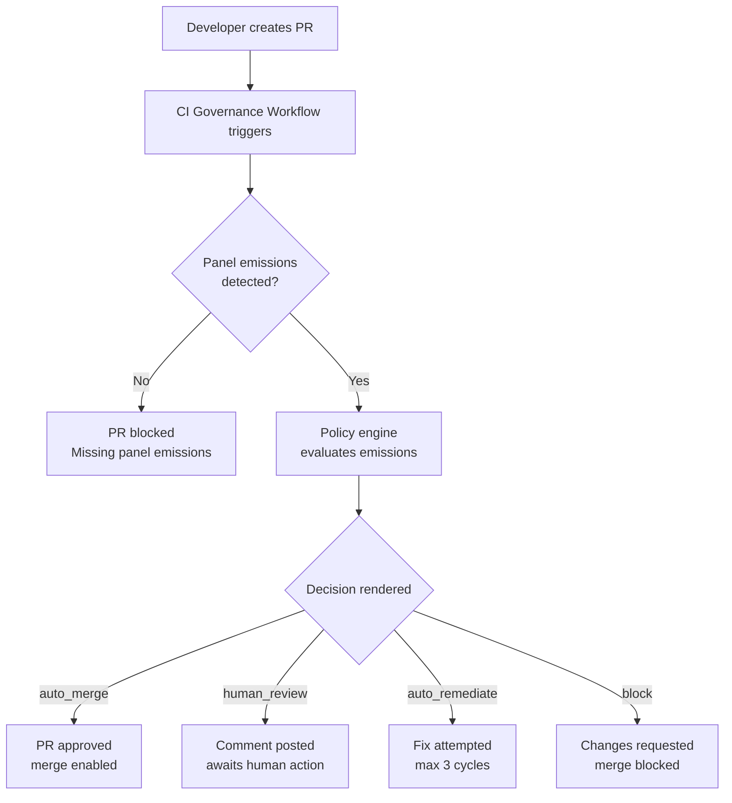
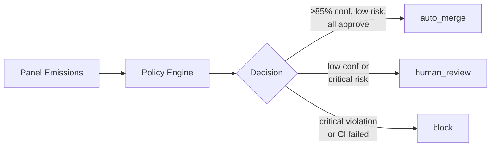

# End-to-End Walkthrough: Dark Factory Governance Platform

> **Artifact Type:** Cognitive — Documentation  
> **Audience:** Developers, Tech Leads, DevOps Engineers adopting the governance framework  
> **Prerequisites:** Git, GitHub CLI (`gh`), Python 3.12+, a GitHub repository with write access

This walkthrough demonstrates the complete lifecycle of adopting and using the Dark Factory Governance Platform with a remote origin. It covers installation, governance processes, the issue workflow, the merge workflow, and GOALS.md project tracking.

---

## Table of Contents

1. [Installation & Setup](#1-installation--setup)
2. [Governance Processes](#2-governance-processes)
3. [Issue Process](#3-issue-process)
4. [Merge Process](#4-merge-process)
5. [GOALS.md Process](#5-goalsmd-process)
6. [Quick Reference](#6-quick-reference)

---

## 1. Installation & Setup

### 1.1 Add the Submodule to Your Repository

From your project root, add the governance framework as a git submodule at the `.ai` path:

```bash
# Add the submodule
git submodule add git@github.com:SET-Apps/ai-submodule.git .ai

# Verify it was added
ls .ai/
# Expected: bin/  config.yaml  governance/  instructions.md  ...

# Commit the submodule reference
git add .ai .gitmodules
git commit -m "feat: add Dark Factory governance submodule"
git push origin main
```

### 1.2 Run the Bootstrap Script

The bootstrap script (`bin/init.sh`) configures your repository for governance. It is idempotent and safe to re-run.

```bash
# Basic bootstrap (symlinks and structure only)
bash .ai/bin/init.sh

# Full bootstrap (includes Python dependencies for policy engine)
bash .ai/bin/init.sh --install-deps
```

**What the bootstrap does:**

| Step | Action | Result |
|------|--------|--------|
| 1 | Detects platform | Identifies macOS, Linux, or Windows environment |
| 2 | Checks Python availability | Verifies Python 3.12+ for policy engine |
| 3 | Checks submodule freshness | Auto-updates `.ai` if behind `origin/main` |
| 4 | Converts SSH to HTTPS URLs | Ensures CI compatibility with `GITHUB_TOKEN` |
| 5 | Creates AI tool symlinks | `CLAUDE.md`, `.github/copilot-instructions.md` → `instructions.md` |
| 6 | Copies issue templates | Bug report and feature request templates to `.github/ISSUE_TEMPLATE/` |
| 7 | Links governance workflows | `dark-factory-governance.yml` and optional workflows to `.github/workflows/` |
| 8 | Creates GOALS.md | Copies template if file does not exist |
| 9 | Validates panel emissions | Warns if required panels lack baseline emissions |
| 10 | Creates project directories | `.governance/plans/`, `.governance/panels/`, and `.governance/checkpoints/` with `.gitkeep` files |
| 11 | Installs dependencies | (with `--install-deps`) Creates Python venv, installs `jsonschema` and `pyyaml` |
| 12 | Configures repository settings | (if `gh` authenticated) Applies merge strategies, CODEOWNERS, rulesets |

**Expected output:**

```
[INFO] Platform detected: linux
[INFO] Python found: python3 (3.12.x)
[INFO] .ai submodule is up to date
[INFO] Creating symlink: CLAUDE.md -> .ai/instructions.md
[INFO] Creating symlink: .github/copilot-instructions.md -> .ai/instructions.md
[INFO] Copying issue templates...
[INFO] Linking governance workflows...
[INFO] Creating GOALS.md from template
[INFO] Creating directory: .governance/plans/
[INFO] Creating directory: .governance/panels/
[INFO] Bootstrap complete!
```

### 1.3 Interactive Bootstrap (Alternative)

For a guided setup experience, tell your AI assistant to read and execute the interactive bootstrap:

```
Please read and execute .ai/governance/prompts/init.md
```

This walks through each option interactively:
1. **Language template selection** — Choose Python, Node, React, Go, C#, generic, or skip
2. **Symlink creation** — Confirm AI tool configuration links
3. **Repository configuration** — Set auto-merge, branch deletion, merge strategies
4. **Issue templates** — Copy structured templates for bugs and features
5. **CODEOWNERS** — Define default code owners and path-specific rules
6. **Python dependencies** — Optionally install policy engine requirements

### 1.4 Verify Installation

After bootstrap, your repository should contain:

```
your-repo/
├── .ai/                              # Governance submodule
├── .github/
│   ├── ISSUE_TEMPLATE/
│   │   ├── bug-report.yml            # Structured bug intake
│   │   ├── feature-request.yml       # Agent-ready feature specs
│   │   └── config.yml                # Template configuration
│   ├── copilot-instructions.md       # Symlink → .ai/instructions.md
│   └── workflows/
│       └── dark-factory-governance.yml  # Required CI governance pipeline
├── .governance/
│   ├── plans/                        # Implementation plans (accumulated)
│   └── panels/                       # Panel review reports (latest per type)
├── CLAUDE.md                         # Symlink → .ai/instructions.md
├── GOALS.md                          # Project tracking and maturity status
└── CODEOWNERS                        # Code ownership rules
```

### 1.5 Keeping the Submodule Updated

The submodule updates independently from your project:

```bash
# Pull latest governance updates
git submodule update --remote .ai

# Re-run bootstrap to apply any new configurations
bash .ai/bin/init.sh

# Commit the updated submodule reference
git add .ai
git commit -m "chore: update governance submodule"
git push origin main
```

Optional: The `propagate-submodule.yml` workflow automates this process, creating PRs when the submodule has updates.

---

## 2. Governance Processes

### 2.1 The Three Artifact Types

The governance platform operates through three distinct artifact types:

| Type | Format | Purpose | Mutability |
|------|--------|---------|------------|
| **Cognitive** | Markdown | Personas, prompts, workflows — interpreted by AI | Editable |
| **Enforcement** | JSON Schema / YAML | Policies, schemas — evaluated programmatically | Versioned (semver) |
| **Audit** | JSON + Markdown | Run manifests — immutable decision records | Append-only |

**Key principle:** AI models interpret cognitive artifacts (personas, prompts). AI models never interpret enforcement artifacts (policies, schemas) — those are evaluated deterministically by the policy engine.

### 2.2 Personas and Panels

**Review prompts** are consolidated, self-contained review definitions in `governance/prompts/reviews/`. There are 21 review prompts implementing Anthropic's Parallelization (Voting) pattern. Each prompt inlines its participant perspectives with full evaluation criteria, scoring, and output schema. Additionally, 6 agentic personas (Project Manager, DevOps Engineer, Code Manager, Coder, IaC Engineer, Tester) in `governance/personas/agentic/` drive the autonomous pipeline.

**Panels** (review prompts) coordinate multiple perspectives into review workflows. Each panel:
1. Activates relevant perspectives for the review type
2. Evaluates changes against perspective-specific criteria
3. Emits structured JSON between `<!-- STRUCTURED_EMISSION_START -->` and `<!-- STRUCTURED_EMISSION_END -->` markers
4. Conforms to `governance/schemas/panel-output.schema.json`

**Required panels** (every PR):
- `code-review` — Code quality, patterns, maintainability
- `security-review` — Vulnerability analysis, dependency risks
- `threat-modeling` — Attack surface and threat vectors
- `cost-analysis` — Resource and cost implications
- `documentation-review` — Documentation completeness
- `data-governance-review` — Data handling and privacy

**Optional panels** (triggered by file patterns):
- `ai-expert-review` — When governance files change
- `architecture-review` — When `src/`, `lib/`, or workflow files change
- `performance-review` — When benchmark files change
- `testing-review` — When test files change

### 2.3 Policy Engine

The policy engine evaluates panel emissions deterministically using YAML profiles in `governance/policy/`:

| Profile | Use Case | Auto-Merge | Key Constraints |
|---------|----------|------------|-----------------|
| `default.yaml` | Standard projects | Enabled (with conditions) | ≥85% confidence, low risk, all panels approve |
| `fin_pii_high.yaml` | Financial/PII data | Disabled | 3-approver override, SOC2/PCI-DSS/HIPAA/GDPR |
| `infrastructure_critical.yaml` | Infrastructure | Disabled | Mandatory architecture and SRE review |
| `reduced_touchpoint.yaml` | Near-full autonomy | Enabled (with conditions) | Human approval only for policy overrides and dismissed security-critical findings |

**Decision outcomes:**

```
auto_merge         → PR approved, ready for merge
human_review       → Comment posted, needs human action
auto_remediate     → Automated fix attempted (max 3 attempts)
block              → Request changes, merge blocked
```

**Auto-merge requires ALL conditions:**
- Aggregate confidence ≥ 85%
- Risk level: low or negligible
- No critical or high policy flags
- All panels approve
- No human review required
- CI passed

### 2.4 Structured Emissions

Every panel output must include valid JSON wrapped in markers:

```markdown
<!-- STRUCTURED_EMISSION_START -->
{
  "panel": "code-review",
  "version": "1.0.0",
  "confidence": 0.92,
  "risk_level": "low",
  "decision": "approve",
  "findings": [],
  "recommendations": []
}
<!-- STRUCTURED_EMISSION_END -->
```

Missing markers or invalid JSON means the panel execution failed and the PR will be flagged.

### 2.5 Context Management

AI context is loaded in tiers to prevent window overflow:

| Tier | Tokens | Scope | Content |
|------|--------|-------|---------|
| 0 | ~400 | Survives resets | `instructions.md` + project identity |
| 1 | ~2,000 | Session | Language conventions + active personas |
| 2 | ~3,000 | Per-phase | Workflow phase + panel context |
| 3 | 0 (on-demand) | Queried | Policies, schemas, docs |

**Hard stop at 80% context capacity.** The agent will: stop all work → clean git state → write checkpoint to `.governance/checkpoints/` → report to user → request `/clear`.

---

## 3. Issue Process

### 3.1 Issue Templates

The framework provides two structured issue templates:

**Bug Report** (`bug-report.yml`):
- Description, steps to reproduce, expected/actual behavior
- Severity dropdown: Low, Medium, High, Critical
- Additional context field

**Feature Request** (`feature-request.yml`):
- Description in user story format
- Acceptance criteria as checkbox list
- Priority dropdown: P0 (Critical) through P4 (Nice-to-have)
- Risk level: Low, Medium, High
- Additional context

### 3.2 Creating Issues

Create issues through the GitHub UI using the templates, or via the CLI:

```bash
# Create a feature request
gh issue create \
  --title "Add user authentication module" \
  --body "As a developer, I want OAuth2 authentication so that users can securely log in." \
  --label "enhancement,P2"

# Create a bug report
gh issue create \
  --title "Login page crashes on invalid input" \
  --body "Steps to reproduce: enter special characters in the password field..." \
  --label "bug,P1"
```

### 3.3 Issue Labeling and Priority

Labels drive agentic prioritization:

| Label | Priority | Handling |
|-------|----------|----------|
| `P0` | Critical | Immediate — first in queue |
| `P1` | High | Next in queue after P0 |
| `P2` | Medium | Standard priority |
| `P3` | Low | Addressed when capacity allows |
| `P4` | Nice-to-have | Lowest priority |
| `blocked` | — | Skipped by autonomous agent |
| `wontfix` | — | Skipped by autonomous agent |
| `duplicate` | — | Skipped by autonomous agent |

### 3.4 Agentic Issue Handling

When the autonomous pipeline processes issues, five personas chain through five phases:

1. **Phase 1 — Pre-flight & Triage** (DevOps Engineer): Scans issues, filters (excludes blocked/wontfix/duplicate, existing branches, recent human edits), prioritizes by label (P0 → P4), routes to Code Manager
2. **Phase 2 — Intent & Planning** (Code Manager): Validates intent clarity, ensures `project.yaml` reflects repo state, selects context-appropriate review panels, creates branch (`NETWORK_ID/{type}/{issue-number}/{description}`) and plan in `.governance/plans/`
3. **Phase 3 — Implementation** (Coder): Implements the plan, writes tests, updates documentation. Emits structured RESULT to Code Manager
4. **Phase 4 — Evaluation & Review** (Code Manager + Tester): Tester evaluates independently (must approve before push), Code Manager runs security review, context-specific reviews, monitors PR CI/Copilot loop
5. **Phase 5 — Merge & Loop** (Code Manager + DevOps Engineer): Merges PR, runs retrospective, loops back or checkpoints on hard-stop

### 3.5 Issue Monitoring (Optional)

The `issue-monitor.yml` workflow can dispatch new issues to an AI agent for autonomous handling. When enabled, new issues are automatically queued for the agentic startup sequence.

---

## 4. Merge Process

### 4.1 Pull Request Workflow

Every code change goes through the governance pipeline before merge:



### 4.2 Governance CI Pipeline

The `dark-factory-governance.yml` workflow runs on every PR:

**Job 1: Detect**
- Identifies governance root (project root or `.ai/` subdirectory)
- Checks for panel emission files in `.governance/panels/`
- Validates emission format (structured JSON markers)

**Job 2: Review** (if emissions found)
- Runs the policy engine against all panel emissions
- Applies the configured policy profile (`default.yaml`, `fin_pii_high.yaml`, or `infrastructure_critical.yaml`)
- Calculates aggregate confidence score and risk level
- Renders a decision: approve, request changes, or comment

**Job 3: Skip-Review** (if no emissions)
- Blocks the PR with a comment explaining that panel emissions are required
- Projects can opt out via `governance.skip_panel_validation: true` in `project.yaml`

### 4.3 What the Agent Does During PR Review

The autonomous agent follows a structured review loop (max 3 cycles):

1. **Wait for CI** — Monitors workflow status (10-minute timeout)
2. **Collect feedback** — Gathers review comments from:
   - Inline code comments
   - PR review submissions
   - Issue comments
3. **Classify severity** — Categorizes each finding:
   - Critical/High → Must fix before merge
   - Medium → Should fix (agent decides)
   - Low/Info → May dismiss with rationale
4. **Implement fixes** — Addresses required changes
5. **Push and re-trigger** — Commits fixes, re-runs governance pipeline
6. **Verify resolution** — Confirms all review threads are resolved
7. **Merge** — Squash merge, delete branch, close linked issue

### 4.4 Override Procedure

When an auto-merge is blocked but the change is genuinely needed:

1. **Two approvals required** — Must include `senior_engineer` + `tech_lead`
2. **Written justification** — Minimum 50 characters explaining the override
3. **Audit logged** — Recorded in the run manifest and a GitHub issue
4. **24-hour cooldown** — Cannot override the same rule again within 24 hours
5. **Post-override review** — Mandatory follow-up review after the override

### 4.5 Auto-Remediation

For low and medium risk issues, the policy engine can attempt automated fixes:

| Allowed | Prohibited |
|---------|-----------|
| Fix linting errors | Modify security controls |
| Add missing tests | Change API contracts |
| Update documentation | Alter data schemas |
| Fix type errors | Modify infrastructure |

Maximum 3 remediation attempts before escalating to human review.

---

## 5. GOALS.md Process

### 5.1 Purpose

`GOALS.md` is the project maturity tracking document. It records:
- Current governance phase status
- Completed work with issue/PR references
- Open work items needing attention
- Roadmap for future phases

### 5.2 Initial Generation

During bootstrap, `init.sh` copies the template from `governance/templates/GOALS.md`:

```bash
# This happens automatically during bootstrap
# The template creates a starter GOALS.md with:
# - Phase status table
# - Completed work section (initial setup)
# - Open work section (empty)
# - Roadmap sections (placeholders)
```

### 5.3 Template Structure

The GOALS.md template includes these sections:

```markdown
# GOALS

## Phase Status

| Phase | Name | Description | Status |
|-------|------|-------------|--------|
| 3 | Foundation | Base governance artifacts | ✅ Completed |
| 4a | Policy Engine | Automated policy evaluation | In Progress |
| 4b | Autonomous Remediation | Self-healing capabilities | Planned |
| 5 | Evolution | Self-improvement loops | Future |

## Completed Work

| Issue | PR | Description | Phase |
|-------|-----|-------------|-------|
| — | — | Initial governance bootstrap | Setup |

## Open Work

| Issue | Description | Priority | Status |
|-------|-------------|----------|--------|
| (none yet) | | | |

## Roadmap

### Near-Term
(Items to address next)

### Future
(Long-term goals and aspirations)
```

### 5.4 Updating GOALS.md

GOALS.md is updated as part of the governance workflow:

**When to update:**
- After completing an issue or PR (add to Completed Work)
- When new work items are identified (add to Open Work)
- When phase milestones are achieved (update Phase Status)
- During agentic execution (Phase 3 of startup sequence mandates GOALS.md updates)

**How to update:**

```markdown
## Completed Work

| Issue | PR | Description | Phase |
|-------|-----|-------------|-------|
| #42 | #43 | Add user authentication module | 4a |
| #57 | #58 | Fix login page crash on special chars | 4a |
| — | — | Initial governance bootstrap | Setup |
```

**Agentic updates:** The autonomous agent is required to update GOALS.md after every implementation. Phase 3 (Implementation) of the startup sequence includes:
> "Update ALL affected documentation: GOALS.md, CLAUDE.md, README.md, DEVELOPER_GUIDE.md"

### 5.5 Phase Progression

Track your project's governance maturity through five phases:

```
Phase 3: Foundation
  └── Base governance artifacts, personas, panels defined
  └── Status: ✅ (provided by submodule)

Phase 4a: Policy Engine
  └── Automated policy evaluation on PRs
  └── CI gating with panel emissions
  └── Status: ✅ (activated by bootstrap)

Phase 4b: Autonomous Remediation
  └── Auto-fix for low/medium risk issues
  └── Drift detection and incident-to-DI generation
  └── Status: Available (configure in policy profile)

Phase 5: Evolution (sub-phases)
  └── 5a: Self-Proving Systems (retroactive audits)
  └── 5b: Self-Evolution (threshold tuning, retrospectives)
  └── 5c: Always-On Orchestration (continuous monitoring)
  └── 5d: Multi-Agent Coordination (agent-to-agent)
  └── 5e: Spec-Driven Interface (declarative governance)
```

---

## 6. Quick Reference

### Common Commands

```bash
# Bootstrap
bash .ai/bin/init.sh                     # Symlinks + structure
bash .ai/bin/init.sh --install-deps      # Full install with dependencies

# Update submodule
git submodule update --remote .ai
bash .ai/bin/init.sh

# Create a feature branch (following naming convention)
git checkout -b NETWORK_ID/feat/42/add-user-auth

# Create an issue
gh issue create --title "Title" --label "enhancement,P2"

# Check governance workflow status
gh run list --workflow=dark-factory-governance.yml

# View panel emissions
ls .governance/panels/
cat .governance/panels/code-review.md
```

### Branch Naming Convention

All governance branches use the `NETWORK_ID` prefix (the project's standard branch identifier). The full pattern:

```
NETWORK_ID/{type}/{issue-number}/{description}

Examples:
  NETWORK_ID/feat/42/add-user-auth
  NETWORK_ID/fix/57/login-crash
  NETWORK_ID/refactor/63/extract-service
  NETWORK_ID/docs/71/update-api-docs
```

### Commit Message Convention

```
feat: add user authentication module
fix: resolve login page crash on special characters
refactor: extract payment service into separate module
docs: update API documentation for v2 endpoints
chore: update governance submodule to latest
```

### Governance Decision Flow



---

## Further Reading

- [Developer Guide](../onboarding/developer-guide.md) — Quick start and key concepts
- [CI Gating Blueprint](../configuration/ci-gating.md) — Detailed CI pipeline specification
- [Context Management](../architecture/context-management.md) — AI context tiers and capacity management
- [Dark Factory Governance Model](../architecture/governance-model.md) — Full architecture reference
- [Repository Configuration](../configuration/repository-setup.md) — Branch protection and settings
- [Threshold Tuning](../operations/threshold-tuning.md) — Confidence threshold adjustment policy
