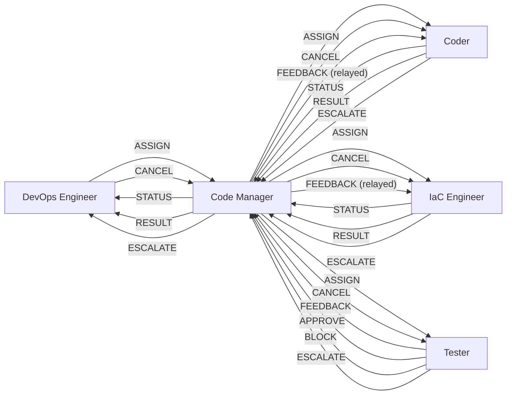

# Agent Protocol — Inter-Agent Communication Contract

This document defines the structured communication protocol between agentic personas in the Dark Factory governance pipeline. All inter-agent messages conform to this schema regardless of transport (single-session markers or multi-session file-based).

## Message Schema

Every inter-agent message must include these fields:

| Field | Type | Required | Description |
|-------|------|----------|-------------|
| `message_type` | enum | Yes | One of: ASSIGN, STATUS, RESULT, FEEDBACK, ESCALATE, APPROVE, BLOCK, CANCEL |
| `source_agent` | string | Yes | Sending persona: `devops-engineer`, `code-manager`, `coder`, `iac-engineer`, `tester` |
| `target_agent` | string | Yes | Receiving persona (same enum as source) |
| `correlation_id` | string | Yes | Issue/PR identifier linking all messages in a work unit (e.g., `issue-42`, `pr-108`) |
| `payload` | object | Yes | Message-type-specific structured data (see below) |
| `feedback` | object | No | Structured feedback from evaluator agents (FEEDBACK and BLOCK only) |

## Message Types

### ASSIGN

Delegates a work unit from an orchestrator to an executor.

| Field | Description |
|-------|-------------|
| `payload.task` | Description of the work to be done |
| `payload.context` | Relevant issue/PR metadata, acceptance criteria |
| `payload.constraints` | Boundaries: approved plan, time budget, scope limits |
| `payload.priority` | `P0`–`P4` or `urgent` |

**Valid senders:** DevOps Engineer → Code Manager, Code Manager → Coder, Code Manager → IaC Engineer, Code Manager → Tester

### STATUS

Progress update from an executor to its orchestrator.

| Field | Description |
|-------|-------------|
| `payload.phase` | Current phase of work |
| `payload.progress` | Description of what has been done |
| `payload.blockers` | Any blockers encountered (empty array if none) |

**Valid senders:** Coder → Code Manager, IaC Engineer → Code Manager, Code Manager → DevOps Engineer

### RESULT

Executor reports completion of assigned work.

| Field | Description |
|-------|-------------|
| `payload.summary` | What was implemented/evaluated |
| `payload.artifacts` | List of files changed, commits made, or emissions produced |
| `payload.test_results` | Test pass/fail summary (if applicable) |
| `payload.documentation_updated` | List of documentation files updated |

**Valid senders:** Coder → Code Manager, IaC Engineer → Code Manager, Code Manager → DevOps Engineer

### FEEDBACK

Evaluator provides structured feedback on submitted work.

| Field | Description |
|-------|-------------|
| `feedback.items` | Array of feedback items |
| `feedback.items[].file` | File path |
| `feedback.items[].line` | Line number (if applicable) |
| `feedback.items[].priority` | `must-fix`, `should-fix`, `nice-to-have` |
| `feedback.items[].description` | What needs to change and why |
| `feedback.cycle` | Current evaluation cycle (1–3) |

**Valid senders:** Tester → Code Manager (routed to Coder)

### ESCALATE

Agent cannot resolve an issue within its authority and escalates upward.

| Field | Description |
|-------|-------------|
| `payload.reason` | Why escalation is needed |
| `payload.attempts` | Number of attempts made before escalating |
| `payload.options` | Suggested resolution paths (if any) |

**Valid senders:** Coder → Code Manager, IaC Engineer → Code Manager, Tester → Code Manager, Code Manager → DevOps Engineer

### APPROVE

Evaluator approves submitted work for the next phase.

| Field | Description |
|-------|-------------|
| `payload.summary` | What was evaluated and found acceptable |
| `payload.conditions` | Any conditions on the approval (empty array if unconditional) |

**Valid senders:** Tester → Code Manager

### BLOCK

Evaluator rejects submitted work — must be addressed before proceeding.

| Field | Description |
|-------|-------------|
| `payload.reason` | Why the work is blocked |
| `feedback` | Structured feedback (same format as FEEDBACK) |

**Valid senders:** Tester → Code Manager

### CANCEL

Instructs an agent to stop current work gracefully or immediately. CANCEL is a session lifecycle message used to enforce context capacity limits, session caps, and user-initiated interrupts.

| Field | Description |
|-------|-------------|
| `payload.reason` | Why cancellation is needed (e.g., `context_capacity_80_percent`, `session_cap_reached`, `user_interrupt`) |
| `payload.context_signal` | Specific signal that triggered cancellation (e.g., `tool_calls > 80`, `chat_turns > 50`, `issues_completed >= N`) |
| `payload.graceful` | Boolean — `true` = finish current step then stop, `false` = stop immediately |

**Valid senders:** DevOps Engineer → Code Manager, Code Manager → Coder, Code Manager → IaC Engineer, Code Manager → Tester

**On receipt, the target agent must:**
1. Stop current work within one step (graceful) or immediately (non-graceful)
2. Commit any in-progress changes to avoid dirty state
3. Emit a partial RESULT (or partial APPROVE/BLOCK for Tester) with work completed so far
4. Stop processing — do not begin new work

## Protocol Enforcement Rules

### Cycle Limit Enforcement

- The Tester has a maximum of **3 evaluation cycles** per work unit. At cycle 3, the Tester must emit BLOCK (not FEEDBACK). Continued FEEDBACK after cycle 3 is a protocol violation.
- On BLOCK from cycle exhaustion, the Code Manager must emit ESCALATE to the DevOps Engineer with the unresolved items and cycle history.

### CANCEL Priority

- CANCEL supersedes all in-flight messages. On receipt, an agent must stop current work within one step regardless of what other messages are pending.
- If an agent receives both an ASSIGN and a CANCEL for the same `correlation_id`, CANCEL takes precedence.
- CANCEL does not require a response other than the partial RESULT (or partial APPROVE/BLOCK) described above.

### CANCEL Idempotency

- Multiple CANCEL messages for the same `correlation_id` are safe and must be deduplicated. An agent that has already processed a CANCEL for a given `correlation_id` ignores subsequent CANCEL messages for it.

### Context Capacity Signals

Concrete thresholds that trigger CANCEL propagation:

| Signal | Threshold | Action |
|--------|-----------|--------|
| Tool calls in session | > 80 | DevOps Engineer emits CANCEL to Code Manager |
| Chat turns (exchanges) | > 50 | DevOps Engineer emits CANCEL to Code Manager |
| Issues completed | >= N (`parallel_coders`) | DevOps Engineer emits CANCEL to Code Manager |
| User interrupt | Immediate | DevOps Engineer emits CANCEL with `graceful: false` |

## Message Guarantees

### Phase A / A+ (Single-Session, Current)

- **Best-effort ordering** within a single session. Messages are processed in the order they appear in the context window.
- **CANCEL is handled synchronously** — the receiving agent processes it before any subsequent messages.
- **No deduplication needed** — single-session execution inherently prevents duplicate delivery.

### Phase B (Multi-Session, Future)

- **At-least-once delivery** with deduplication by the tuple `(correlation_id, source_agent, target_agent, message_type)`. Duplicate messages with identical tuples are silently dropped.
- **CANCEL messages are prioritized** in the dispatch queue — they are processed before any other pending messages for the same `correlation_id`.
- **Message ordering guaranteed per `correlation_id`** — messages for the same work unit are delivered in the order they were emitted. Cross-correlation ordering is not guaranteed.

## Valid Transition Map



Agents must not send message types not listed in their valid transitions. The DevOps Engineer never communicates directly with Coder or Tester — all routing goes through Code Manager. CANCEL flows strictly downward: DevOps Engineer to Code Manager, and Code Manager to workers (Coder, IaC Engineer, Tester).

## Transport

### Phase A: Single-Session (Current — Claude Code, Copilot)

In single-session execution, all agents run sequentially within one context window. Messages are logged inline using markers:

```markdown
<!-- AGENT_MSG_START -->
{
  "message_type": "ASSIGN",
  "source_agent": "devops-engineer",
  "target_agent": "code-manager",
  "correlation_id": "issue-42",
  "payload": {
    "task": "Implement authentication middleware",
    "context": { "issue_number": 42, "priority": "P1" },
    "constraints": { "plan": "governance/plans/42-add-auth.md" },
    "priority": "P1"
  }
}
<!-- AGENT_MSG_END -->
```

These markers serve as structured logging — they document the handoff between persona phases for auditability. In single-session mode, the "sending" and "receiving" agent are the same AI model switching personas. The markers ensure that:

1. Each persona transition is explicit and traceable
2. The payload contract is enforced even without a transport layer
3. Checkpoint files can capture the last message for session resumption
4. Future multi-session transport can replay the message log

### Phase A+: Parallel Single-Session (Current — Claude Code Task Tool)

The Code Manager spawns multiple worker agents (Coder or IaC Engineer as appropriate) using the `Task` tool with `isolation: "worktree"`. Each worker runs in its own git worktree and context window, working on a single issue. The Code Manager remains in the main session and collects results as they arrive.

**Dispatch pattern:**
```
Task(
  subagent_type: "general-purpose",
  isolation: "worktree",
  run_in_background: true,
  prompt: "<Coder persona> + <plan content> + <issue details>"
)
```

**Key properties:**
- Each Coder agent gets its own git worktree (isolated copy of repo)
- Up to 5 Coder agents run concurrently in a single dispatching message
- The Code Manager is notified when each agent completes
- Worktrees are automatically cleaned up if no changes were made
- If changes were made, the worktree path and branch are returned in the result

**Message flow:**
- Code Manager → Coder: ASSIGN via `Task` tool prompt (contains full context)
- Coder → Code Manager: RESULT via `Task` tool return value (contains summary, branch, changes)
- No inline markers needed — the Task tool handles transport

**Conflict avoidance:**
- Each Coder works on a separate branch in a separate worktree
- The Code Manager creates branches before dispatching (in the main repo)
- Coders commit to their worktree branch; the Code Manager pushes from the main repo after evaluation

### Phase B: Multi-Session (Future — Phase 5d Runtime)

When a multi-agent orchestrator exists, messages are written to `.governance/state/agent-messages/`:

```
.governance/state/agent-messages/
  {correlation_id}/
    {timestamp}-{source}-{target}-{type}.json
```

Each file contains the full message schema as JSON. The orchestrator reads the directory to dispatch work and track state. This transport is defined but not yet implemented — it activates when the Phase 5d runtime becomes available.

## Graceful Degradation

The protocol supports three execution modes with identical semantics:

| Capability | Sequential (Fallback) | Parallel Single-Session (Default) | Multi-Session (Future) |
|------------|----------------------|----------------------------------|----------------------|
| Message logging | Inline markers | Task tool dispatch/return | File-based |
| Agent switching | Persona load within same context | Task tool with worktree isolation | Separate agent processes |
| Parallelism | Sequential (one issue at a time) | Up to 5 concurrent Coders | Fully concurrent |
| State sharing | Shared context window | Code Manager in main, Coders in worktrees | `.governance/state/` directory |
| Failure recovery | Checkpoint + resume | Code Manager retries or skips failed agents | Orchestrator retry with message replay |

The structured message format is identical in all modes — only the transport changes.
