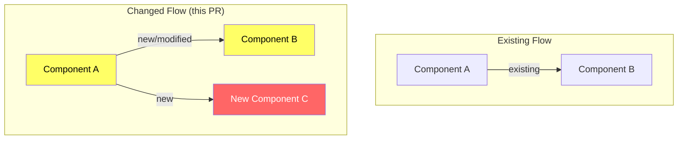
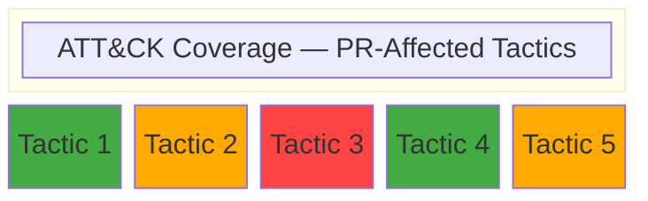
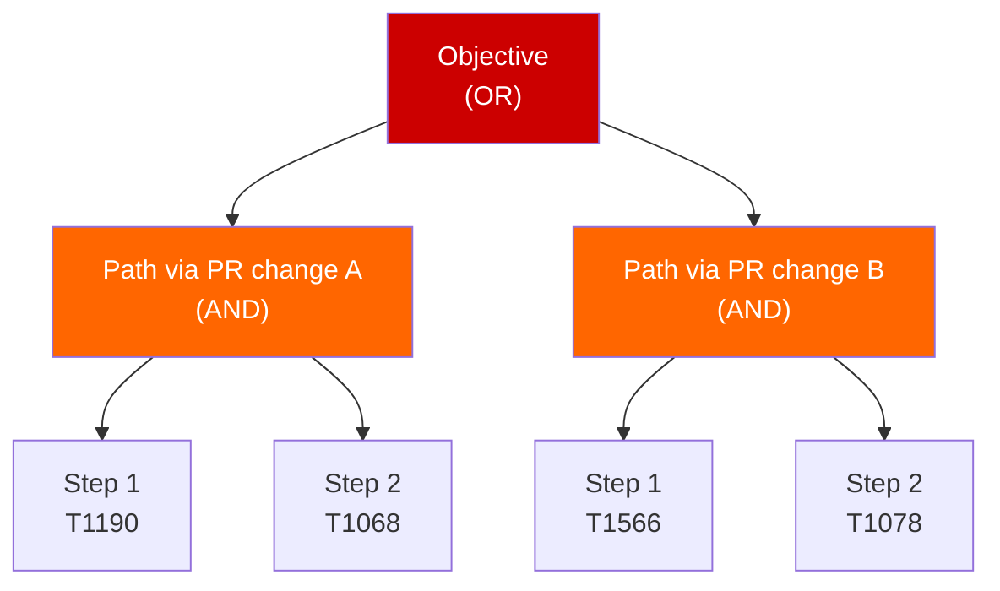
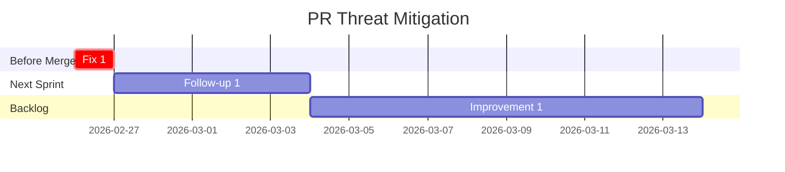
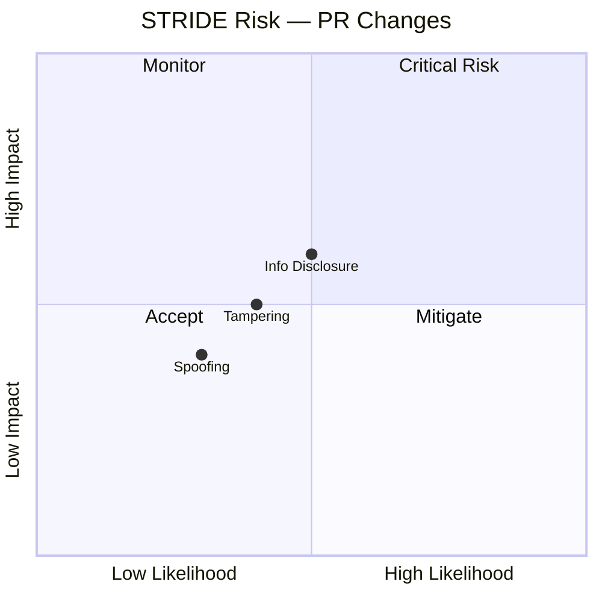

# Review: Threat Modeling

## Purpose

Systematic PR-level threat analysis mapping the attack surface introduced or modified by a pull request to MITRE ATT&CK, performing STRIDE analysis per affected trust boundary, validating attack paths, assessing detection coverage, and producing actionable mitigation strategies. This panel runs on every PR as part of the governance pipeline.

**Scope:** Analyze ONLY the changes introduced by this PR. Do not re-assess the entire system — focus on new/modified attack surface, changed trust boundaries, and affected data flows.

## Context

You are performing a **threat-modeling** review of a PR diff. Evaluate the provided code change from multiple security perspectives organized into 5 parallel review tracks. Each track has a sub-moderator coordinating its participants. The output must follow the standardized 15-section template exactly.

> **Baseline emission:** [`threat-modeling.json`](../../emissions/threat-modeling.json)

## Review Tracks and Participants

### Track 1: Infrastructure Security
**Sub-Moderator:** Infrastructure Security Engineer

| Participant | Focus |
|------------|-------|
| Systems Architect | Components affected by PR, changed data flows, modified trust boundaries |
| Infrastructure Engineer | Modified configurations, IAM changes, network exposure changes |

### Track 2: Supply Chain Security
**Sub-Moderator:** Supply Chain Security Specialist

| Participant | Focus |
|------------|-------|
| MITRE Analyst (ATT&CK) | Trust boundary crossings affected by PR, ATT&CK mapping for new attack surface |
| Security Auditor | New/changed dependencies, vulnerability classification for introduced code |

### Track 3: Application Security
**Sub-Moderator:** Application Security Engineer

| Participant | Focus |
|------------|-------|
| MITRE Analyst (STRIDE) | STRIDE catalog for trust boundaries affected by PR, attack trees for new paths |
| Red Team Engineer | Attack path validation for new/changed attack surface only |

### Track 4: DevSecOps & AI Safety
**Sub-Moderator:** DevSecOps & AI Safety Engineer

| Participant | Focus |
|------------|-------|
| Purple Team Engineer | ATT&CK coverage for techniques relevant to PR changes, detection gaps |
| Blue Team Engineer | Detection coverage for new attack surface, alerting gaps introduced |

### Track 5: Data Privacy & Compliance
**Sub-Moderator:** Data Privacy & Information Security

| Participant | Focus |
|------------|-------|
| Compliance Officer | Regulatory impact of changes (SOC 2, GDPR, NIST controls affected) |
| Security Auditor | Data classification impact, access control changes, audit trail completeness |

> **Shared perspectives:** Red Team Engineer, Blue Team Engineer, Purple Team Engineer, MITRE Analyst, Security Auditor, Infrastructure Engineer, Compliance Officer, and Systems Architect are defined in [`shared-perspectives.md`](../shared-perspectives.md).

---

## Process

### Phase 1: Parallel Analysis
All 5 tracks execute simultaneously. Each sub-moderator scopes analysis to ONLY the PR's changes.

### Phase 2: Per-Track Aggregation
Each sub-moderator consolidates findings, noting which are net-new vs. pre-existing.

### Phase 3: Overall Moderator Integration
Integrate all 5 track summaries, cross-reference findings, eliminate duplicates, distinguish PR-introduced risk from pre-existing risk.

### Phase 4: Hardening Rounds
Red Team challenges Blue Team detections for new attack surface. Purple Team validates coverage claims for changed components.

### Phase 5: Final Report Assembly
Assemble the 15-section output scoped to PR changes. Sections may be lighter than system-level but must all be present.

---

## Required Output Template

Your output **MUST** follow this exact 15-section template structure. Use `N/A — [reason]` for non-applicable sections rather than omitting them. Every section must be present. **Scope every section to the PR's changes.**

````markdown
# Threat Model — [PR Title / Change Description]

**Panel:** threat-modeling v2.0.0
**Date:** [ISO 8601 date, e.g., 2026-02-26T14:30:00Z]
**Policy Profile:** [active policy profile name, e.g., default, fin_pii_high]
**Repository:** [owner/repo]
**PR:** #[number]
**Triggered by:** [ci | manual | drift_detection | incident_response | scheduled]

---

## 1. Systems Architect: Architecture Presentation

> Scope: Components and data flows affected by this PR only.

### 1.1 Component Inventory (Affected by PR)

| Component | Type | Technology | Change Type | Exposure Impact | Data Sensitivity Impact |
|-----------|------|------------|-------------|-----------------|------------------------|
| [Component] | [Type] | [Tech] | [New/Modified/Removed] | [Increased/Unchanged/Decreased] | [Increased/Unchanged/Decreased] |

### 1.2 Data Flow Changes



> Yellow = modified, Red = new. Show only flows affected by this PR.

### 1.3 Trust Boundary Impact

| Boundary ID | Name | Impact | Description |
|-------------|------|--------|-------------|
| TB-XX | [Boundary] | [New/Modified/Unaffected] | [What changed at this boundary] |

### 1.4 New External Dependencies

| Dependency | Type | Data Shared | Introduced By |
|-----------|------|-------------|---------------|
| [Dependency] | [Type] | [Data] | [File/commit in this PR] |

(If no new dependencies: `N/A — No new external dependencies introduced by this PR.`)

### 1.5 Agentic System Specifics

> Include ONLY if this PR modifies AI agent behavior, LLM integrations, tool definitions, or prompt content. Otherwise: `N/A — PR does not modify agentic components.`

#### OWASP LLM Top 10 — Changes Introduced

| ID | Threat | Affected by PR? | Change Description | Risk Delta |
|----|--------|-----------------|-------------------|------------|
| LLM01 | Prompt Injection | [Yes/No] | [What changed] | [Increased/Unchanged/Decreased] |
| [Only include rows where Affected = Yes] |

#### Agent-Specific Impact

| Dimension | Before PR | After PR | Risk Delta |
|-----------|----------|----------|------------|
| [Only include dimensions changed by this PR] |

---

## 2. MITRE Analyst: Trust Boundary Crossings

> Scope: Only trust boundary crossings affected (new, modified, or removed) by this PR.

### Crossing Inventory (PR-Affected)

| Crossing ID | Boundary | Source | Destination | Change Type | Data Types | New/Changed Protections |
|-------------|----------|--------|-------------|-------------|------------|------------------------|
| TBC-XX | TB-XX | [Source] | [Dest] | [New/Modified/Removed] | [Data] | [Protections added/changed] |

### Per-Crossing Analysis

#### TBC-XX: [Crossing Name]

- **Change description:** [What this PR changes about this crossing]
- **Data in transit (new/modified):** [New or changed data crossing this boundary]
- **New protections added:** [What this PR adds]
- **Remaining gaps:** [Gaps not addressed by this PR]
- **Applicable ATT&CK techniques:** [Txxxx — Name for techniques enabled/affected by this change]

(If no trust boundary crossings affected: `N/A — PR does not affect any trust boundary crossings.`)

---

## 3. MITRE Analyst: STRIDE Threat Catalog

> Scope: STRIDE analysis ONLY for trust boundaries affected by this PR.

### Per-Boundary STRIDE Analysis (PR-Affected Boundaries)

#### TB-XX: [Boundary Name] — [Change Description]

| STRIDE Category | Threat (Introduced/Modified by PR) | ATT&CK Technique | Likelihood | Impact | Risk | PR Controls |
|----------------|-----------------------------------|-------------------|------------|--------|------|-------------|
| **S**poofing | [Threat introduced or changed by this PR] | [Txxxx] | [L/M/H] | [L/M/H/C] | [L/M/H/C] | [Controls added in this PR] |
| **T**ampering | [Threat introduced or changed by this PR] | [Txxxx] | [L/M/H] | [L/M/H/C] | [L/M/H/C] | [Controls added in this PR] |
| **R**epudiation | [Threat introduced or changed by this PR] | [Txxxx] | [L/M/H] | [L/M/H/C] | [L/M/H/C] | [Controls added in this PR] |
| **I**nformation Disclosure | [Threat introduced or changed by this PR] | [Txxxx] | [L/M/H] | [L/M/H/C] | [L/M/H/C] | [Controls added in this PR] |
| **D**enial of Service | [Threat introduced or changed by this PR] | [Txxxx] | [L/M/H] | [L/M/H/C] | [L/M/H/C] | [Controls added in this PR] |
| **E**levation of Privilege | [Threat introduced or changed by this PR] | [Txxxx] | [L/M/H] | [L/M/H/C] | [L/M/H/C] | [Controls added in this PR] |

[Repeat for each affected trust boundary]

(If no trust boundaries affected: `N/A — PR does not affect any trust boundaries. No STRIDE analysis required.`)

### STRIDE Summary (PR-Introduced Threats)

| STRIDE Category | New Threats | Modified Threats | Mitigated by PR |
|----------------|-------------|-----------------|-----------------|
| Spoofing | [n] | [n] | [n] |
| Tampering | [n] | [n] | [n] |
| Repudiation | [n] | [n] | [n] |
| Information Disclosure | [n] | [n] | [n] |
| Denial of Service | [n] | [n] | [n] |
| Elevation of Privilege | [n] | [n] | [n] |

---

## 4. Red Team Engineer: Attack Path Validation

> Scope: Attack paths that are NEW or CHANGED due to this PR only.

### ATK-01: [Attack Path Name]

- **Introduced by:** [File(s) and change(s) in this PR that enable this path]
- **Objective:** [What the attacker aims to achieve]
- **Prerequisites:** [Required access, knowledge, or tooling]
- **ATT&CK Techniques:** [Txxxx → Tyyyy → Tzzzz (chain)]
- **Steps:**
  1. [Step description with technique mapping]
  2. [Step description with technique mapping]
- **Impact:** [Confidentiality/Integrity/Availability impact and scope]
- **Likelihood:** [Low/Medium/High with justification]
- **Feasibility:** [Tooling availability, skill level required, time estimate]
- **Current Detection:** [What would detect this attack path]
- **Detection Gaps:** [What would NOT be detected]

[Continue for all PR-introduced attack paths]

(If no new attack paths: `N/A — PR does not introduce new attack paths or modify existing ones.`)

### Attack Path Summary

| ID | Name | Introduced By | Likelihood | Impact | Detection Coverage |
|----|------|--------------|------------|--------|-------------------|
| ATK-01 | [Name] | [PR file/change] | [L/M/H] | [L/M/H/C] | [Full/Partial/None] |

---

## 5. Infrastructure Engineer: Configuration Assessment

> Scope: Only configurations modified by this PR.

### INFRA-01: [Configuration Finding]

- **File:** [File path changed in this PR]
- **Current State (before PR):** [Previous configuration]
- **New State (this PR):** [Changed configuration]
- **Risk:** [What could go wrong with this change]
- **Severity:** [Critical/High/Medium/Low/Info]
- **Recommendation:** [Specific remediation if needed]

[Continue for all configuration findings]

(If no infrastructure configuration changes: `N/A — PR does not modify infrastructure configuration.`)

### Infrastructure Assessment Summary

| ID | File | Risk | Severity | Recommendation |
|----|------|------|----------|----------------|
| INFRA-01 | [File] | [Risk summary] | [Severity] | [Action] |

---

## 6. Blue Team Engineer: Detection & Response Coverage

> Scope: Detection needs introduced by this PR's changes.

### Detection Coverage for PR Changes

| ATT&CK Technique | Relevant to PR Because | Detection Source | Detection Rule | Confidence |
|-------------------|----------------------|-----------------|----------------|------------|
| [Txxxx — Name] | [Why this technique is relevant to PR changes] | [Source or "None"] | [Rule or "None"] | [H/M/L/None] |

### New Alerting Gaps

| Gap ID | ATT&CK Technique | Introduced By | Gap Type | Remediation Priority |
|--------|-------------------|--------------|----------|---------------------|
| GAP-01 | [Txxxx] | [PR change] | [No detection / Insufficient] | [Immediate/Short-term] |

(If no new alerting gaps: `N/A — PR does not introduce new alerting gaps.`)

### Detection Coverage Summary (PR Scope)

| Metric | Value |
|--------|-------|
| New techniques requiring detection | [n] |
| Techniques with existing detection | [n] |
| Techniques with no detection | [n] |
| New Sigma rules recommended | [n] |

---

## 7. Purple Team Engineer: MITRE ATT&CK Mapping

> Scope: ATT&CK techniques relevant to changes in this PR.

### Technique Coverage (PR-Relevant)

| ATT&CK Technique | Tactic | Relevant to PR Because | Prevention | Detection | Gap |
|-------------------|--------|----------------------|------------|-----------|-----|
| [Txxxx — Name] | [Tactic] | [Why relevant] | [Control or None] | [Control or None] | [Gap or "Covered"] |

### Coverage Heat Map (PR-Affected Tactics)



> Show only tactics affected by this PR. Legend: Green = covered, Orange = partial, Red = uncovered.

(If PR does not affect ATT&CK coverage: `N/A — PR does not change ATT&CK technique coverage.`)

---

## 8. Security Auditor: Vulnerability Classification

> Scope: Vulnerabilities introduced or exposed by this PR only.

### VULN-01: [Vulnerability Title]

- **CVSS 3.1 Vector:** `CVSS:3.1/AV:[N/A/L/P]/AC:[L/H]/PR:[N/L/H]/UI:[N/R]/S:[U/C]/C:[N/L/H]/I:[N/L/H]/A:[N/L/H]`
- **CVSS Score:** [0.0-10.0] ([Critical/High/Medium/Low/None])
- **CWE:** CWE-[number] — [CWE Name]
- **OWASP Category:** [OWASP Top 10 category]
- **Introduced by:** [File:line in this PR]
- **Description:** [Vulnerability description with evidence from PR diff]
- **Remediation:** [Specific fix]
- **Remediation Effort:** [Low/Medium/High]

[Continue for all vulnerabilities]

(If no vulnerabilities found: `N/A — No vulnerabilities introduced by this PR.`)

### Vulnerability Summary

| Severity | Count | Introduced By |
|----------|-------|--------------|
| Critical | [n] | [Files] |
| High | [n] | [Files] |
| Medium | [n] | [Files] |
| Low | [n] | [Files] |
| Info | [n] | [Files] |

---

## 9. MITRE Analyst: Threat Actor Profiles

> Include ONLY if this PR introduces new external-facing surface. Otherwise: `N/A — PR does not introduce new external-facing surface. No new threat actor profiles required.`

### Threat Actor: [Actor Name/Category]

- **Type:** [Nation-state / Organized crime / Hacktivist / Insider / Opportunistic / Automated]
- **Motivation:** [Financial / Espionage / Disruption / Ideology]
- **Relevance to PR:** [Why this actor would target the new surface introduced by this PR]
- **Relevant TTPs:** [Txxxx — Technique Name]
- **Attack Scenario:** [Narrative specific to the PR's changes]

---

## 10. MITRE Analyst: Attack Trees

> Include ONLY if this PR introduces attack paths complex enough to warrant tree decomposition. Otherwise: `N/A — PR changes do not warrant attack tree decomposition.`

### Attack Tree: [Objective]



---

## 11. Compliance Officer: Regulatory Impact

> Scope: Regulatory impact of this PR's changes only.

### Regulatory Assessment

| Framework | Control(s) Affected | PR Impact | Compliance Status | Action Required |
|-----------|--------------------|-----------|--------------------|-----------------|
| SOC 2 Type II | [CC reference] | [What this PR changes] | [Met/Partial/Not Met] | [Action or "None"] |
| GDPR | [Article reference] | [What this PR changes] | [Compliant/Partial/N/A] | [Action or "None"] |
| NIST 800-53 | [Control family] | [What this PR changes] | [Met/Partial/Not Met] | [Action or "None"] |

(If no regulatory impact: `N/A — PR does not affect regulatory compliance posture.`)

---

## 12. Prioritized Threat Register

| Rank | ID | Title | CVSS | ATT&CK | STRIDE | Introduced By | Status |
|------|----|-------|------|--------|--------|---------------|--------|
| 1 | VULN-XX | [Title] | [Score] | [Txxxx] | [S/T/R/I/D/E] | [File:line] | [Open/Mitigated] |

[All findings from this PR, ranked by CVSS score descending]

(If no findings: threat register is empty — note `No threats introduced by this PR.`)

---

## 13. Mitigation Roadmap

### Remediation Plan

#### Immediate — Before Merge

| Finding | Remediation | Effort |
|---------|-------------|--------|
| [Finding ref] | [Action — must be completed before merge] | [Hours] |

#### Short-term — Next Sprint

| Finding | Remediation | Effort |
|---------|-------------|--------|
| [Finding ref] | [Action — follow-up work] | [Days] |

#### Medium-term — Backlog

| Finding | Remediation | Effort |
|---------|-------------|--------|
| [Finding ref] | [Action — longer-term improvement] | [Days/Weeks] |

(If no mitigations needed: `N/A — No mitigations required for this PR.`)

### Roadmap Timeline



---

## 14. Residual Risk Summary

### Risk Assessment After PR Merge

| Finding | Risk if Merged As-Is | Risk After Immediate Fixes | Acceptable? |
|---------|---------------------|---------------------------|-------------|
| [Finding] | [Risk level] | [Risk level] | [Yes/No — justification] |

### Residual Risk Statement

[1-2 paragraph assessment: If this PR is merged (with immediate fixes applied), what risk remains? Is it acceptable? What monitoring should be in place?]

---

## 15. Threat Posture Assessment

### Verdict

| Metric | Value | Threshold | Status |
|--------|-------|-----------|--------|
| Confidence score | [0.XX] | >= 0.75 | [PASS/FAIL] |
| Critical findings | [n] | 0 | [PASS/FAIL] |
| High findings | [n] | 0 | [PASS/FAIL] |
| Aggregate verdict | [approve/request_changes] | approve | [PASS/FAIL] |
| Compliance score | [0.XX] | >= 0.85 | [PASS/FAIL] |

### Finding Summary

| Severity | Count | Description |
|----------|-------|-------------|
| Critical | [n] | [Summary] |
| High | [n] | [Summary] |
| Medium | [n] | [Summary] |
| Low | [n] | [Summary] |
| Info | [n] | [Summary] |

### PR Security Impact Statement

[1-2 sentences: Does this PR increase, decrease, or maintain the system's security posture? What is the net effect?]

---

## Appendix A: STRIDE Risk Heat Map

> Include if PR affects 3+ trust boundaries. Otherwise: `N/A — PR scope too narrow for meaningful STRIDE heat map.`



---

## Appendix B: Sigma Detection Rules

> Include only for NEW detection needs introduced by this PR.

### Rule 1: [Detection Name]

```yaml
title: [Detection name]
id: [UUID]
status: experimental
description: [What this rule detects — tied to PR change]
author: threat-modeling
date: [YYYY-MM-DD]
references:
  - [ATT&CK technique URL]
logsource:
  category: [Category]
  product: [Product]
detection:
  selection:
    [field]: [value]
  condition: selection
falsepositives:
  - [Known false positive scenarios]
level: [critical/high/medium/low/informational]
tags:
  - attack.[tactic]
  - attack.t[xxxx]
```

(If no new detection rules needed: `N/A — No new Sigma rules required for this PR.`)

---

## Appendix C: Purple Team Validation Exercises

> Include only if PR introduces attack surface warranting validation.

| Exercise | ATT&CK Technique | Procedure | Expected Detection | Success Criteria | Status |
|----------|-------------------|-----------|-------------------|------------------|--------|
| PTV-01 | [Txxxx] | [Procedure] | [Expected alert] | [Success criteria] | [Planned] |

(If no validation exercises needed: `N/A — PR changes do not warrant Purple Team validation exercises.`)
````

---

## Scoring

Confidence score calculation:

| Parameter | Value |
|-----------|-------|
| Base confidence | 0.90 |
| Per critical finding | -0.30 |
| Per high finding | -0.20 |
| Per medium finding | -0.05 |
| Per low finding | -0.01 |
| Floor | 0.0 |

**Formula:** `confidence = max(0.0, 0.90 - (critical * 0.30) - (high * 0.20) - (medium * 0.05) - (low * 0.01))`

## Pass/Fail Criteria

| Criterion | Threshold |
|-----------|-----------|
| Confidence score | >= 0.75 |
| Critical findings | 0 |
| High findings | 0 |
| Aggregate verdict | `approve` |
| Compliance score | >= 0.85 |

If **any** criterion fails, the aggregate verdict must be `request_changes`. Critical or high findings block merge unconditionally. A threat model that cannot achieve 0.75 confidence indicates the change has unresolved security concerns requiring redesign or additional controls.

## Data Sensitivity and Redaction

When producing threat model findings, apply these redaction rules:

1. **Never include raw secrets** — API keys, tokens, passwords, or credentials discovered during analysis must be redacted. Use `[REDACTED]` placeholder and describe the type of secret (e.g., "AWS access key found in config.py:42")
2. **Redact PII** — Personal identifiable information (emails, names, addresses, SSNs) must be replaced with `[PII-REDACTED]`
3. **Sanitize file paths** — If file paths reveal infrastructure details (server names, internal network paths), generalize them
4. **Describe attack techniques generically** — Reference ATT&CK technique IDs and describe attack vectors at a conceptual level. Do not include working exploit code, payloads, or step-by-step exploitation instructions in the emission
5. **Threat scenarios over exploit recipes** — Threat models should describe *what* an attacker could achieve and *why* it matters, not provide a cookbook for reproducing the attack
6. **Set data_classification** — Include the `data_classification` block in your structured emission:
   - `"public"` — No sensitive content in findings
   - `"internal"` — Contains internal file paths, architecture details
   - `"confidential"` — Contains vulnerability evidence, security configurations, ATT&CK mappings with specific system details
   - `"restricted"` — Contains credential exposure evidence, PII findings, or detailed kill chain analysis of production systems

---

## Execution Trace

To provide evidence of actual code evaluation, include an `execution_trace` object in your structured emission:

- **`files_read`** (required) — List every file you read during this review. Include the full relative path for each file (e.g., `src/auth/login.ts`, `infrastructure/main.bicep`). Do not omit files — this is the audit record of what was actually evaluated.
- **`diff_lines_analyzed`** — Count the total number of diff lines (added + removed + modified) you analyzed.
- **`analysis_duration_ms`** — Approximate wall-clock time spent on the analysis in milliseconds.
- **`grounding_references`** — For each finding, link it to a specific code location. Each entry must include `file` (file path) and `finding_id` (matching the finding's persona or a unique identifier). Include `line` (line number) when the finding maps to a specific line.

The `execution_trace` field is optional in the schema but **strongly recommended** for auditability. When present, it provides verifiable evidence that the panel agent actually read and analyzed the code rather than producing a generic assessment.

## Grounding Requirement

**Grounding Requirement**: Every finding with severity 'medium' or above MUST include an `evidence` block containing the file path, line range, and a code snippet (max 200 chars) from the actual code. Findings without evidence may be treated as hallucinated and discarded. If the review produces zero findings, you must still demonstrate analysis by populating `execution_trace.grounding_references` with at least one file+line reference showing what was examined.

## Structured Emission

All output must include a JSON block between emission markers, validated against [`governance/schemas/panel-output.schema.json`](../../schemas/panel-output.schema.json).

Wrap the JSON in these markers:

```
<!-- STRUCTURED_EMISSION_START -->
{ ... }
<!-- STRUCTURED_EMISSION_END -->
```

### Example Emission

<!-- STRUCTURED_EMISSION_START -->
```json
{
  "panel_name": "threat-modeling",
  "panel_version": "1.0.0",
  "confidence_score": 0.65,
  "risk_level": "high",
  "compliance_score": 0.7,
  "policy_flags": [
    {
      "flag": "unauthenticated_admin_endpoint",
      "severity": "high",
      "description": "New /admin/config endpoint accepts PUT requests without authentication middleware, allowing unauthorized configuration changes.",
      "remediation": "Add authentication middleware to the admin router: `router.use('/admin', authMiddleware.requireRole('admin'))`.",
      "auto_remediable": true
    },
    {
      "flag": "insecure_deserialization",
      "severity": "medium",
      "description": "Config payload is deserialized from JSON without schema validation, enabling potential injection of unexpected fields.",
      "remediation": "Add JSON schema validation before deserialization using the existing `validateSchema()` utility.",
      "auto_remediable": true
    }
  ],
  "requires_human_review": false,
  "timestamp": "2026-02-25T12:00:00Z",
  "findings": [
    {
      "persona": "security/threat-modeler",
      "verdict": "request_changes",
      "confidence": 0.9,
      "rationale": "Admin endpoint lacks authentication. STRIDE analysis: Spoofing (high) and Elevation of Privilege (high) threats identified.",
      "findings_count": {
        "critical": 0,
        "high": 1,
        "medium": 0,
        "low": 0,
        "info": 0
      }
    },
    {
      "persona": "security/attack-surface-analyst",
      "verdict": "request_changes",
      "confidence": 0.85,
      "rationale": "Attack surface expanded by unauthenticated admin endpoint. Deserialization without validation adds injection vector.",
      "findings_count": {
        "critical": 0,
        "high": 0,
        "medium": 1,
        "low": 0,
        "info": 0
      }
    },
    {
      "persona": "compliance/security-auditor",
      "verdict": "approve",
      "confidence": 0.8,
      "rationale": "Existing endpoints maintain proper authentication. Only the new admin endpoint is affected.",
      "findings_count": {
        "critical": 0,
        "high": 0,
        "medium": 0,
        "low": 1,
        "info": 0
      }
    }
  ],
  "aggregate_verdict": "request_changes",
  "execution_context": {
    "repository": "example/repo",
    "branch": "feat/admin-config",
    "commit_sha": "abc123def456abc123def456abc123def456abc1",
    "pr_number": 83,
    "policy_profile": "default",
    "triggered_by": "ci"
  }
}
```
<!-- STRUCTURED_EMISSION_END -->

## Constraints

- **Scope to PR changes** — This is a PR-level threat model. Do not re-assess the entire system. Focus on attack surface introduced, modified, or removed by this PR.
- **Every threat must reference a specific ATT&CK technique** — Generic threat descriptions without ATT&CK mapping are incomplete. Use technique IDs (e.g., T1190, T1078) and full names.
- **STRIDE analysis is per affected trust boundary** — Only analyze trust boundaries that this PR touches. Use `N/A` for boundaries not affected.
- **Distinguish PR-introduced risk from pre-existing risk** — If a finding existed before this PR, note it as pre-existing context, not a PR-introduced issue.
- **CVSS vectors must be complete** — Use the full CVSS 3.1 vector string. Do not estimate scores without the vector.
- **Sigma rules only for new detection needs** — Only recommend Sigma rules for attack surface introduced by this PR.
- **Mermaid diagrams must render** — Test diagram syntax. Use quoted strings for labels with special characters.
- **Distinguish prevention vs detection controls** — A threat with prevention but no detection is a blind spot.
- **Use `N/A — [reason]` for non-applicable sections** — Never omit a section from the template. Many PR-level reviews will have several `N/A` sections, and that is expected.
- **Treat the threat model as a living document** — Note what should be re-evaluated when the system changes further.
