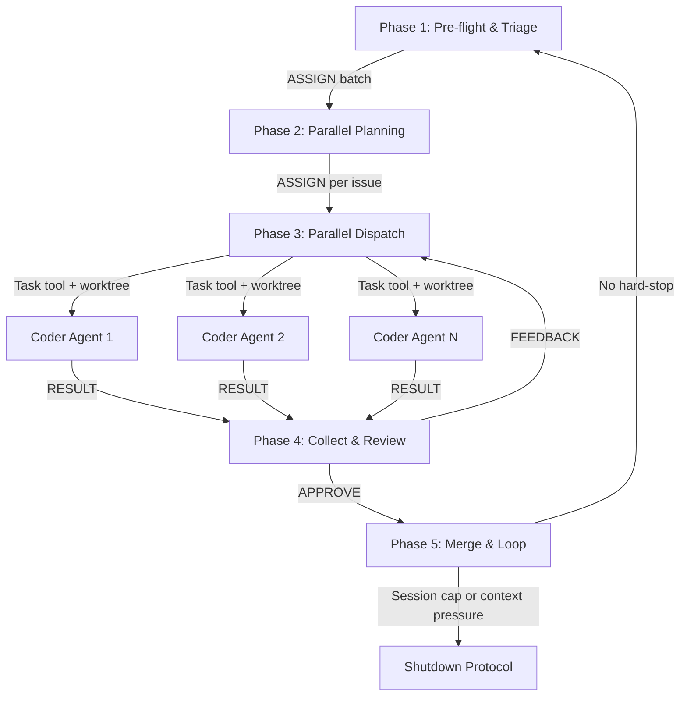

# Startup: Agentic Improvement Loop

Execute this on agent launch. This prompt chains four agentic personas through a structured pipeline. Each phase loads a specific persona and delegates work via the agent protocol (`governance/prompts/agent-protocol.md`).

<!-- ANCHOR: This instruction must survive context resets -->

## Context Capacity — MANDATORY (Read First)

**This section overrides all other work. If context is under pressure, stop and checkpoint.**

### Detection Signals

Watch for these signals that context is filling up:

1. **Token count warnings** — Claude Code shows token usage in verbose mode (right side). Copilot surfaces similar warnings. When total tokens exceed 80% of the model's context window, stop immediately.
2. **System warnings** — The runtime emits warnings when approaching context limits. These are non-negotiable stop signals.
3. **Conversation length heuristic** — If you have completed N issues (where N = `governance.parallel_coders`), or made more than 80 tool calls, or the conversation exceeds ~150 exchanges, assume you are at or near 80% regardless of other signals.
4. **Degraded recall** — If you find yourself re-reading files you already read, forgetting earlier decisions, or producing inconsistent output, context pressure is likely the cause.

### Hard Limits

- **Maximum N issues per session** (where N = `governance.parallel_coders` from `project.yaml`, default 5) — parallel dispatch means Coder subagents use their own context, not the main session's
- **Checkpoint only on hard-stop** — checkpoints are written only when a session cap or context pressure triggers the Shutdown Protocol, not between batches
- **Two-tier capacity threshold**: at ~70%, do not dispatch new Coder agents (wait for in-flight ones to complete, merge, checkpoint, request `/clear`); at ~80%, stop immediately and execute the full shutdown protocol regardless of current step

### When Triggered

Execute the **Context Capacity Shutdown Protocol** (see end of this file). Do not start the next issue. Do not finish the current step. Stop, clean, checkpoint, report.

<!-- /ANCHOR -->

## In-Session Work

When the user provides work directly (bug reports, feature requests, feedback, or tasks) that does not correspond to an existing GitHub issue:

1. **Create a GitHub issue first** — capture the work as a trackable issue with acceptance criteria
2. **Then enter Phase 2** (Intent Validation) with that issue
3. Never execute work without a corresponding issue — issues are the audit trail

When the user identifies a problem with a previously-created PR (e.g., failing checks, unresolved Copilot recommendations):

1. Check out the existing branch for that PR
2. Enter **Phase 4** (Review & Merge) for that PR

## Issue State Validation (Checkpoint Restore)

When resuming from a checkpoint (`.governance/checkpoints/` in consuming repos, `governance/checkpoints/` in ai-submodule), **before continuing any work**:

1. For each issue listed in `current_issue` and `issues_remaining`, verify it is still open:
   ```bash
   gh issue view <number> --json state --jq '.state'
   ```
2. If `current_issue` is **closed**, do not resume work on it. Remove it from the work queue and proceed to the next remaining issue.
3. If any `issues_remaining` are closed, remove them from the queue.
4. If all issues are closed, proceed to Phase 1 for a fresh scan.

Closed issues represent a user decision. Continuing work on them wastes compute and creates noise.

---

## Pipeline Overview



| Phase | Persona | Pattern | Responsibility |
|-------|---------|---------|---------------|
| 1 | DevOps Engineer | Routing | Pre-flight, triage, issue routing |
| 2 | Code Manager | Orchestrator | Validate intent and create plans for **all** selected issues |
| 3 | Code Manager | Parallelization | Spawn up to N worker agents (Coder/IaC Engineer) via `Task` tool with `isolation: "worktree"` (N = `governance.parallel_coders`, default 5) |
| 4 | Code Manager + Tester | Evaluator-Optimizer | Collect results as each Coder finishes; evaluate, push PR, monitor CI |
| 5 | Code Manager + DevOps Engineer | — | Merge all PRs, retrospective, loop or shutdown |

---

## Phase 1: Pre-flight & Triage

**Persona:** DevOps Engineer (`governance/personas/agentic/devops-engineer.md`)

### 1a: Update .ai Submodule

1. **Detect submodule context:**
   ```bash
   git submodule status .ai 2>/dev/null
   ```
   If not a submodule (e.g., running inside the ai-submodule repo), skip this section.

2. **Check for submodule pin** in `project.yaml` (project root):
   ```yaml
   governance:
     ai_submodule_pin: "abc1234"  # SHA, tag, or branch
   ```
   If `governance.ai_submodule_pin` is set and non-null, **do not auto-update**. Verify the current `.ai` HEAD matches the pin. If it does not match, warn: "`.ai` submodule is at {current} but project.yaml pins {pin}." Do not change the submodule — the pin is intentional. Skip to 1b.

3. **Check for dirty state:**
   ```bash
   if [ -n "$(git -C .ai status --porcelain)" ]; then
     echo "Warning: .ai has uncommitted changes; skipping update."
   fi
   ```

4. **Fetch and update** (only if clean and not pinned):
   ```bash
   git -C .ai fetch origin main --quiet 2>/dev/null
   LOCAL_SHA=$(git -C .ai rev-parse HEAD)
   REMOTE_SHA=$(git -C .ai rev-parse origin/main)
   ```
   If behind: `git submodule update --remote .ai` → commit pointer change.
   All failures are non-blocking — warn and continue.

### 1b: Repository Configuration

Verify the repository supports the agentic workflow. All checks are **non-blocking** — warn and continue.

1. `allow_auto_merge` enabled: `gh api repos/{owner}/{repo} --jq '.allow_auto_merge'`
2. CODEOWNERS present: `test -s CODEOWNERS && echo "OK" || echo "MISSING"`
3. Governance workflow present, enabled, and healthy:
   - File exists: `test -f .github/workflows/dark-factory-governance.yml`
   - Workflow active: `gh api repos/{owner}/{repo}/actions/workflows --jq '.workflows[] | select(.path == ".github/workflows/dark-factory-governance.yml") | .state'`
   - Recent health (last 5 runs): at least 1 success = healthy; all 5 failures = warn; no runs = note first PR will trigger
4. If any check fails: suggest `bash .ai/bin/init.sh`, continue

### 1c: Resolve Open PRs

**All open PRs must be resolved before new issues.** Each resolved PR counts toward the 3-issue session cap.

```bash
gh pr list --state open --json number,title,author,headRefName,createdAt,reviews --limit 20
```

- **Agent PRs** (`itsfwcp/*/*`): enter Phase 4 review loop through merge
- **Non-agent PRs**: evaluate through review classification only; post summary comment, do not merge
- Process oldest first. Return to `main` after each PR.

### 1d: Scan, Filter, Prioritize Issues

```bash
gh issue list --state open --json number,title,labels,assignees,body --limit 50
```

An issue is **actionable** if:
- No branch matching `itsfwcp/*/*` or `feature/*`
- Not labeled `blocked`, `wontfix`, `duplicate`
- Not assigned to a human
- Not updated in last 24 hours by a human

**Re-evaluate `refine` issues:** Query current state from API (never cache). If a human updated the issue since `refine` was applied, re-read and re-evaluate. If clarification is sufficient, remove `refine`. Never re-add `refine` to an issue where a human removed it.

**Prioritize:** P0 > P1 > P2 > P3 > P4, then creation date. Bugs take precedence over enhancements at the same priority.

### 1e: Route to Code Manager

Emit an ASSIGN message per `governance/prompts/agent-protocol.md` for **all actionable issues up to the session cap** (max N, where N = `governance.parallel_coders`). If no actionable issues remain, fall back to GOALS.md (see Phase 5 fallback).

---

## Phase 2: Parallel Planning

**Persona:** Code Manager (`governance/personas/agentic/code-manager.md`)

The Code Manager receives the full batch of prioritized issues and plans **all of them** before any implementation begins. This front-loads the planning work in the main context window (where the Code Manager has full codebase visibility) before dispatching to parallel Coder agents.

### 2a: Ensure `project.yaml`

Before any work, verify the project has a valid `project.yaml` in the project root.

1. **If `project.yaml` exists:** Analyze the current repository contents (scan for languages, frameworks, IaC files, API definitions, documentation) and compare with the `project.yaml` configuration. If the repo has evolved (e.g., new language, IaC introduced, API endpoints added), update `project.yaml` to reflect current state. Commit the update.

2. **If `project.yaml` does not exist:** Check if the repository has existing code:
   - **Has code:** Analyze the repo to detect languages, frameworks, test tools, and conventions. Generate `project.yaml` from the most appropriate template in `governance/templates/` (e.g., `python/project.yaml`, `go/project.yaml`). Commit the new file.
   - **Empty/new repo:** Prompt the developer: "What kind of work will live in this repository?" Use the answer to select the appropriate template and generate `project.yaml`.

This ensures `project.yaml` always reflects the actual repository composition. Developers should not need to manually copy templates.

### 2b: Validate Intent

1. **Verify issue is still open:**
   ```bash
   gh issue view <number> --json state --jq '.state'
   ```
   If closed, skip and return to Phase 1 for the next issue.
2. Read the issue body. Validate clear acceptance criteria.
3. If unclear: label `refine`, comment explaining what needs clarification, return to Phase 1.
4. If clear: proceed to 2c (Select Review Panels).

### 2c: Select Review Panels

Analyze the codebase and change type to determine which reviews to invoke:

- **Always required** (per active policy profile): security-review, threat-modeling, cost-analysis, documentation-review, data-governance-review
- **Context-specific** (selected based on change type):
  - Documentation-only changes → documentation-review (primary), skip code-review
  - API endpoint changes → API review, security-review (enhanced)
  - Infrastructure/IaC changes → cost-analysis (enhanced), infrastructure review
  - Data model changes → data-governance-review (enhanced)
  - UI changes → accessibility review (if panel exists)

If a needed review panel or persona does not exist, create a GitHub issue in the ai-submodule repository describing the gap, using `governance/prompts/cross-repo-escalation-workflow.md`.

### 2d: Create Plans (for all issues)

**Repeat for each issue in the batch:**

1. Create branch: `itsfwcp/{type}/{number}/{name}`
2. Write plan using `governance/prompts/templates/plan-template.md`
3. Save to `.governance/plans/{number}-{description}.md` (consuming repos) or `governance/plans/{number}-{description}.md` (ai-submodule)
4. High risk → comment plan on issue, wait for approval before dispatching

After all plans are written, proceed to Phase 3 (Parallel Dispatch).

---

## Phase 3: Parallel Dispatch

**Persona:** Code Manager (`governance/personas/agentic/code-manager.md`)

The Code Manager spawns **parallel worker agents** (Coder or IaC Engineer) using the `Task` tool with `isolation: "worktree"`. Each worker runs in its own git worktree with its own context window, working on a single issue independently.

### 3a: Spawn Worker Agents

Read `governance.parallel_coders` from `project.yaml` (default: 5) to determine the maximum number of concurrent worker agents.

For each planned issue, determine the appropriate worker persona:
- **IaC Engineer** (`governance/personas/agentic/iac-engineer.md`) — when the issue involves infrastructure: Bicep, Terraform, ARM templates, cloud resource provisioning, networking, or identity configuration
- **Coder** (`governance/personas/agentic/coder.md`) — for all other implementation work

Spawn a background Task agent per issue:

```
Task(
  subagent_type: "general-purpose",
  isolation: "worktree",
  run_in_background: true,
  prompt: <full worker persona prompt with plan, acceptance criteria, and constraints>
)
```

**The worker prompt must include:**
1. The full persona instructions (Coder or IaC Engineer as appropriate)
2. The plan content (from `.governance/plans/{number}-{description}.md` in consuming repos, or `governance/plans/{number}-{description}.md` in ai-submodule)
3. The issue body and acceptance criteria
4. Branch name to use
5. Instructions to commit, run tests/validation, and report results — but NOT push (the Code Manager pushes)

**Dispatch rules:**
- Spawn up to N Coder agents concurrently (N = `governance.parallel_coders` from `project.yaml`, default 5)
- All independent issues are dispatched in a **single message** with multiple Task tool calls
- Each agent gets `run_in_background: true` so they execute concurrently
- The Code Manager continues to the next phase without waiting

### 3b: Monitor Progress

After dispatching, the Code Manager is notified as each Coder agent completes. As each result arrives, the Code Manager immediately enters Phase 4 for that issue. There is no need to wait for all Coders to finish — results are processed as they arrive.

If a Coder agent fails or times out:
- Log the failure
- Create a follow-up issue or retry in the next session
- Continue processing other completed agents

### 3c: Sequential Fallback

If the `Task` tool with `isolation: "worktree"` is unavailable (e.g., not in a git repo, worktree creation fails), fall back to sequential execution: process one issue at a time through Phases 3-5 before starting the next.

---

## Phase 3-Sequential: Implementation (Fallback)

**Persona:** Coder (`governance/personas/agentic/coder.md`)

Used only when parallel dispatch is unavailable. The Coder receives an ASSIGN message from the Code Manager and executes the approved plan in the main session.

### 3s-a: Implement

1. Implement the plan following project conventions
2. Write tests meeting coverage targets
3. **Update documentation (mandatory)** — check each category:
   - `GOALS.md`, `CLAUDE.md` (root + `.ai/`), `README.md`, `DEVELOPER_GUIDE.md`
   - `docs/**/*.md`, schema files, policy files, `instructions/*.md`
   - If no docs affected, note in commit message: `Docs: no updates required — [reason]`
4. Commit with conventional commit messages (Git Commit Isolation)

### 3s-b: Test Coverage Gate

**Run before every push.** Execute `governance/prompts/test-coverage-gate.md`:
- All tests must pass
- Coverage must meet 80% minimum
- If gate blocks after 3 attempts, ESCALATE to Code Manager

### 3s-c: Emit RESULT

Return a structured RESULT to Code Manager with summary, artifacts, test results, and documentation updates per the agent protocol.

---

## Phase 4: Collect, Evaluate & Review

**Personas:** Code Manager (orchestrator), Tester (`governance/personas/agentic/tester.md`)

The Code Manager processes Coder results **as they arrive** from background agents. For each completed Coder:

1. Read the worktree result (branch name, changes made)
2. Cherry-pick or merge the Coder's commits onto the correct branch in the main repo
3. Run the evaluation pipeline (4a-4f below)
4. Push PR and enter monitoring loop

Multiple PRs can be in-flight simultaneously. The Code Manager tracks each one independently.

### 4a: Tester Evaluation

Code Manager routes Coder RESULT to Tester via ASSIGN. The Tester:

1. Evaluates implementation against acceptance criteria and plan
2. Runs the Test Coverage Gate independently
3. Verifies documentation completeness
4. Emits one of:
   - **APPROVE** → proceed to 4b
   - **FEEDBACK** → Code Manager relays to Coder (return to Phase 3); max 3 cycles, then ESCALATE
   - **BLOCK** → Code Manager escalates to human

### 4b: Security Review

After Tester APPROVE, the Code Manager invokes the security-review panel (`governance/prompts/reviews/security-review.md`).

- **Always produces a structured JSON report** per `governance/schemas/panel-output.schema.json`
- If critical/high findings: create GitHub issues for each, ASSIGN fixes to Coder (return to Phase 3)
- If no findings: proceed to 4c

### 4c: Context-Specific Reviews

The Code Manager invokes the panels selected in Phase 2c. Each review:

- Must produce a structured JSON emission between `<!-- STRUCTURED_EMISSION_START -->` and `<!-- STRUCTURED_EMISSION_END -->` markers
- Critical/high findings → create GitHub issues, ASSIGN to Coder
- All reviews must complete before proceeding

### 4d: Push PR & Monitoring Loop

1. Push the branch
2. Create PR:
   ```bash
   gh pr create --title "<type>: <description>" --body "Closes #<issue-number>\n\n## Summary\n<description>\n\n## Plan\nSee .governance/plans/<number>-<description>.md"
   ```
3. Comment on issue: `gh issue comment <number> --body "PR #<pr-number> created. Entering monitoring loop."`

### 4e: CI & Copilot Review Loop

1. **Poll CI checks:** `gh pr checks <pr-number> --watch --fail-fast`
   - If checks fail: ASSIGN fix to Coder, push, re-poll
2. **Fetch Copilot recommendations** from all three sources (inline, reviews, issue comments) with diagnostic pre-fetch and the standard jq filter. Minimum 2 polling attempts separated by 2+ minutes before confirming absence.
3. **Classify and decide** per `governance/prompts/reviews/copilot-review.md`: critical/high = must fix, medium = should fix, low/info = acknowledge
4. **Implement or dismiss** each recommendation (ASSIGN to Coder for fixes)
5. **Update issue** with review cycle summary
6. **Re-push and re-poll** if changes were made (max 3 review cycles, then escalate)

### 4f: Pre-Merge Thread Verification

**Safety net — must pass before merge.** Uses GraphQL `reviewThreads` query to catch all unresolved threads regardless of author:

```bash
gh api graphql -f query='
  query($owner: String!, $repo: String!, $pr: Int!) {
    repository(owner: $owner, name: $repo) {
      pullRequest(number: $pr) {
        reviewThreads(first: 100) {
          nodes { isResolved isOutdated comments(first: 1) { nodes { author { login } body } } }
        }
      }
    }
  }
' -f owner='{owner}' -f repo='{repo}' -F pr={pr_number}
```

- Zero active unresolved threads → proceed to Phase 5
- Non-zero → classify, fix, return to 4e
- Query fails → block merge, escalate

---

## Phase 5: Merge & Loop

**Personas:** Code Manager (merge), DevOps Engineer (checkpoint)

### 5a: Merge

1. Verify branch is up to date: `git fetch origin main && git merge origin/main`
2. Final push if merge was needed
3. Wait for final governance run
4. Merge: `gh pr merge <pr-number> --squash --delete-branch`
5. Close issue: `gh issue close <number> --comment "Merged via PR #<pr-number>. All governance checks passed."`

### 5b: Retrospective

Per `governance/prompts/retrospective.md`:

1. Evaluate planning accuracy, review cycle count, token cost
2. **Verify documentation completeness** — check `GOALS.md`, `README.md`, `DEVELOPER_GUIDE.md`, `CLAUDE.md` for consistency. If gaps found, create a follow-up `docs` issue.
3. Post findings on closed issue
4. Update plan status to `completed`

### 5c: Loop or Shutdown

After all parallel work from this batch is merged, decide whether to **continue** or **stop**:

1. **Check hard-stop conditions** (any one triggers Shutdown Protocol):
   - N or more issues/PRs completed this session (cumulative across all batches), where N = `governance.parallel_coders`
   - Any context pressure signal (see Detection Signals above)
2. **If a hard-stop condition is met**: execute the Shutdown Protocol — checkpoint, clean git, report, and tell the user to run `/clear`. The next `/startup` will auto-restore from the checkpoint. Do not ask the user to "restart the loop" or take any other action beyond `/clear`.
3. **If NO hard-stop condition is met**: **return to Phase 1 immediately**. Do not write a checkpoint. Do not request `/clear`. Do not pause for user input. Do not summarize or ask permission to continue. Just loop — the agent keeps working autonomously until a hard-stop condition or exit condition is reached.

### 5d: GOALS.md Fallback

If no actionable issues remain after Phase 1d:

1. Scan `GOALS.md` for unchecked items
2. Filter out items with existing open issues
3. Prioritize by phase (4b before 5)
4. Create a GitHub issue for the highest-priority actionable item
5. Enter Phase 2 with the new issue
6. If no items are actionable, exit the loop

---

## Constraints

- **Resolve all open PRs before new issues** — Phase 1c is mandatory
- **Parallel execution by default** — spawn up to N Coder agents concurrently (N = `governance.parallel_coders`, default 5) via `Task` tool with `isolation: "worktree"`. Fall back to sequential only if worktree creation fails.
- **Plan before code** — always (plans are written by Code Manager in main session before dispatch)
- **Documentation with every change** — mandatory
- **Issue for every work item** — issues are the audit trail
- **Maximum N issues per session** (where N = `governance.parallel_coders`, default 5) — parallel execution is more context-efficient since Coder subagents have their own context windows
- **Maximum 3 review cycles per PR** — then escalate
- **Checkpoint only on hard-stop** — checkpoints are written only when a session cap or context pressure triggers the Shutdown Protocol, not between batches
- **Context capacity is a hard constraint** — shutdown immediately on any signal
- **Security review always produces a report** — even when no findings exist
- **Context-specific reviews based on codebase** — Code Manager selects panels dynamically
- **Coder agents do not push** — they commit to their worktree branch; the Code Manager pushes after evaluation

## Context Capacity Shutdown Protocol

**Mandatory. Violating this causes irrecoverable loss of instructions and context.**

**Trigger conditions** (any one is sufficient):
- Token count at or above 80% of context window
- System warning about context limits
- N issues completed this session (where N = `governance.parallel_coders`)
- Conversation exceeds ~150 exchanges or ~80 tool calls
- Degraded recall or inconsistent output

When triggered:

1. **Stop immediately** — do not start the next issue or step
2. **Clean git state** — commit pending changes, abort in-progress merges, ensure clean working tree
3. **Write checkpoint** — save to `.governance/checkpoints/{timestamp}-{branch}.json` (consuming repos) or `governance/checkpoints/{timestamp}-{branch}.json` (ai-submodule):
   ```json
   {
     "timestamp": "ISO-8601",
     "branch": "current branch name",
     "issues_completed": ["#N", "#M"],
     "prs_resolved": ["#P", "#Q"],
     "issues_remaining": ["#X", "#Y"],
     "prs_remaining": ["#R"],
     "current_issue": "#Z or null",
     "current_step": "Phase N description",
     "git_state": "clean",
     "pending_work": "description of what remains",
     "prs_created": ["#A", "#B"],
     "manifests_written": ["manifest-id-1"],
     "review_cycle": "current review cycle number if in Phase 4"
   }
   ```
4. **Report to user** — summarize completed work, remaining work, checkpoint location
5. **Request context reset** — tell the user to run `/clear` and reference the checkpoint path

**Never allow context to reach compaction.** Compaction with uncommitted changes, merge conflicts, or in-progress operations destroys instructions that cannot be recovered.

## Exit Conditions

Stop the loop when:
- No open PRs **and** no actionable issues **and** no GOALS.md items can be converted to issues
- **N issues/PRs completed** (where N = `governance.parallel_coders`) — shutdown protocol, checkpoint, request `/clear`
- **Any context pressure signal** — shutdown protocol immediately
- A human sends a message (human input takes priority)
